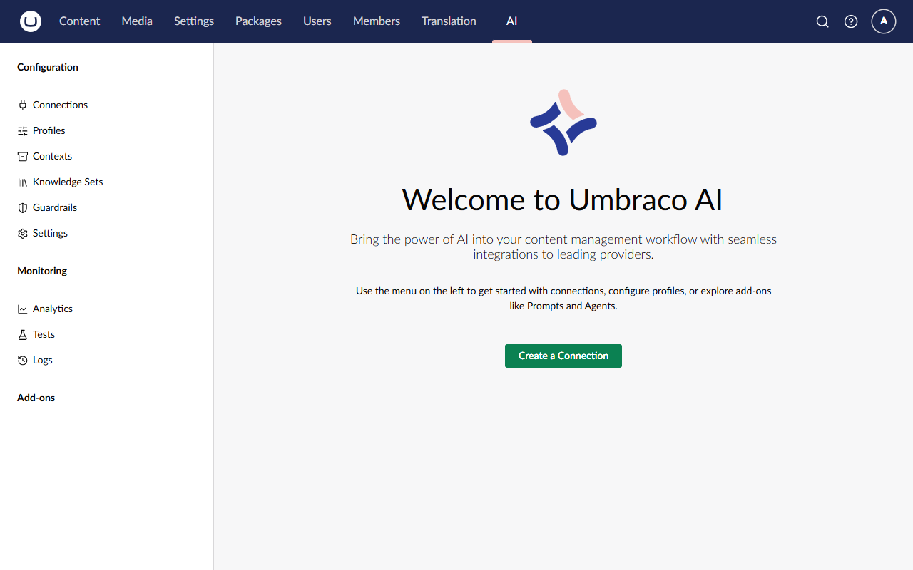
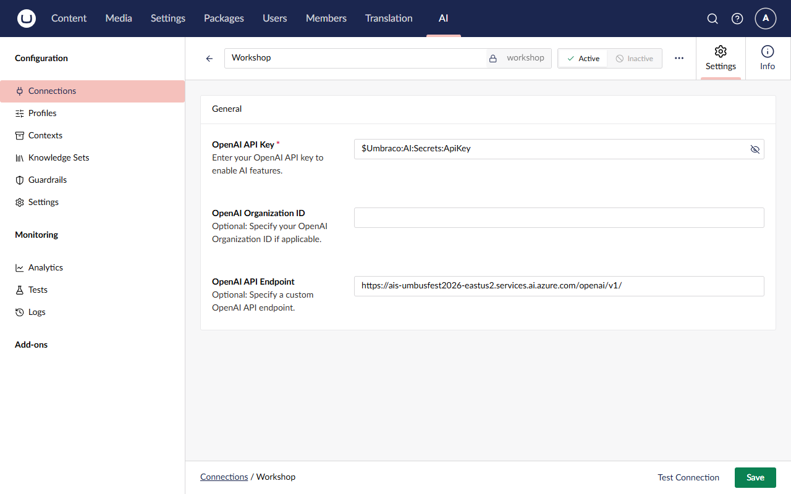
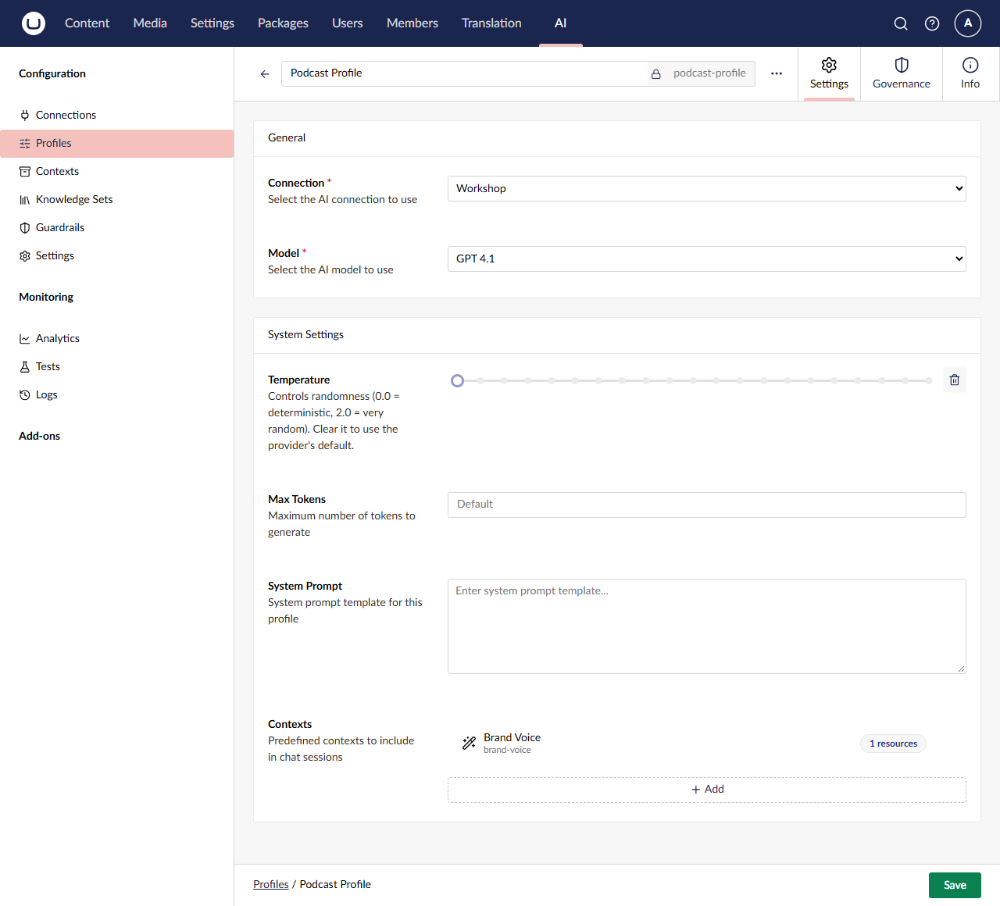
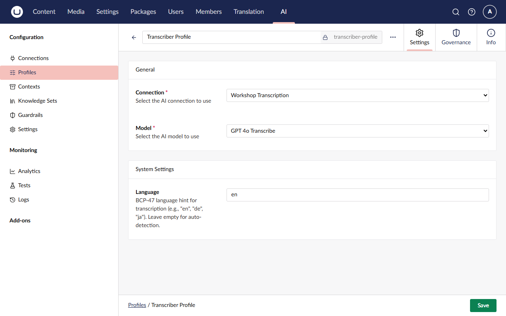
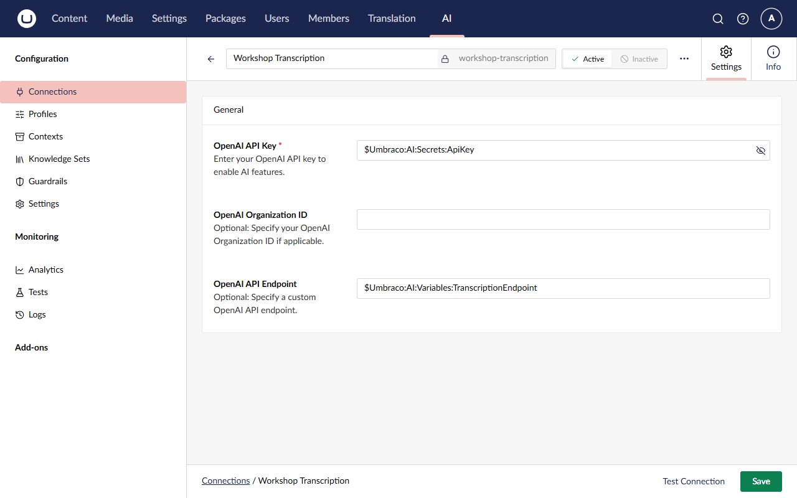
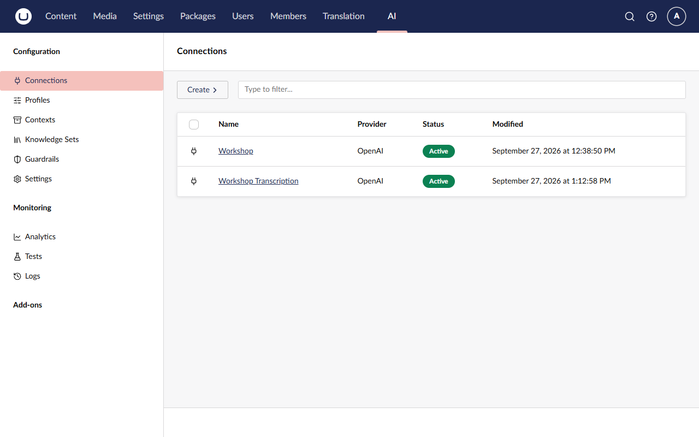
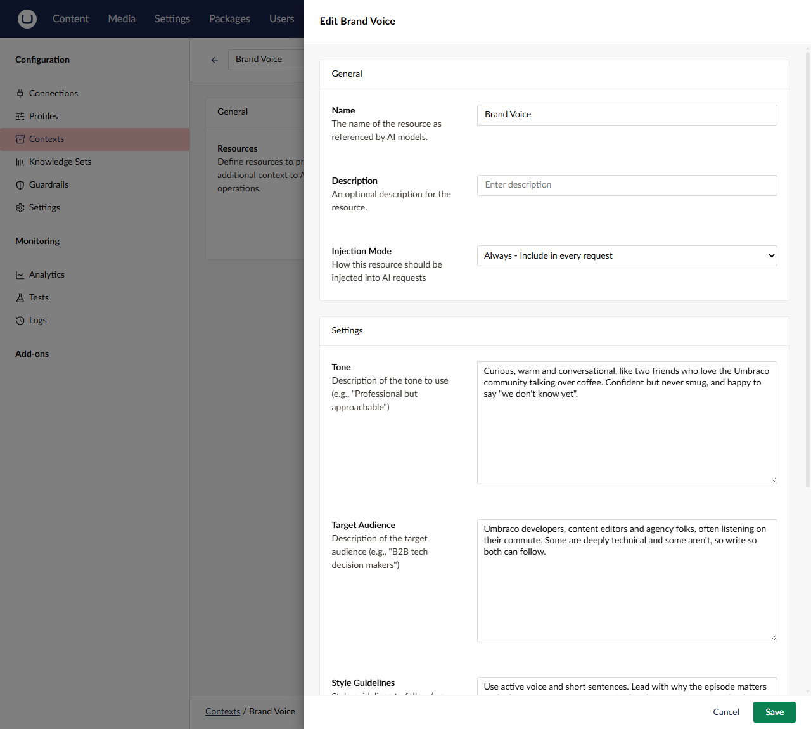
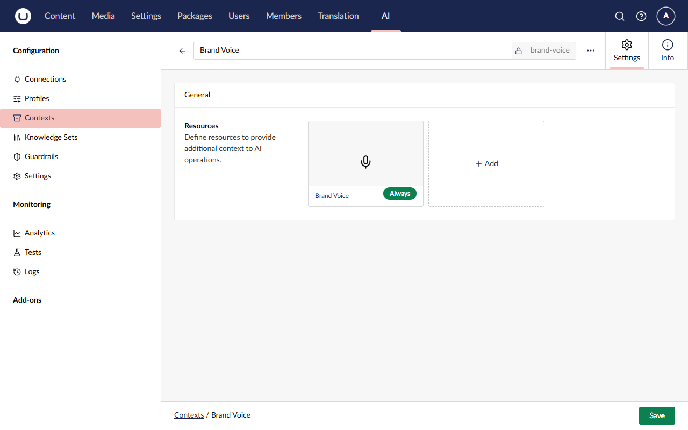

# Lesson 1: Install & configure Umbraco AI

> ⏱️ **Timebox: ~17 minutes** · Starting branch: `init` · Finished branch: `lesson-1-end`

> [!TRACKER]
> ⬜ Transcribe podcast audio · ⬜ Generate a summary and show notes · ⬜ Cross-link mentioned episodes · ⬜ Validate guest details

## Objective

Install Umbraco AI into The Rabbit Hole and set up the building blocks the rest of the workshop depends on:

- a **connection** to your AI provider: OpenAI or Microsoft Foundry
- a **chat profile** and a **speech-to-text profile**
- a **Brand Voice** context so everything the AI writes sounds like the show

No C# yet (apart from one line in a project file). This lesson is all about the concepts from Lecture 2:
**Connection → Profile → Context**, with your code asking for a profile **by alias**.

## What you'll change

- `src/TheRabbitHole.Web/TheRabbitHole.Web.csproj`: add the `Umbraco.AI` and `Umbraco.AI.OpenAI` packages
- `src/TheRabbitHole.Core/TheRabbitHole.Core.csproj`: add `Umbraco.AI.Core` and suppress `MEAI001`
- **User secrets:** check the API key and two endpoints you saved in Lesson 0
- **Backoffice → AI:** two connections, two profiles, one context, and one setting

## Steps

### Step 1: Stop the site

If the site is running from Lesson 0, press **Ctrl+C** in its terminal. You can't add packages while it's running.

### Step 2: Add the Umbraco AI packages

The web project gets the Umbraco AI **core** package (backoffice section, database, services) plus a **provider** package that
knows how to talk to a particular AI service. Run these from the repo root:

```bash
dotnet add src/TheRabbitHole.Web package Umbraco.AI --version 17.3.5
```

```bash
dotnet add src/TheRabbitHole.Web package Umbraco.AI.OpenAI --version 17.2.1
```

Our own code lives in the `TheRabbitHole.Core` class library. It only needs the core abstractions (the services and base
classes we'll code against), so it gets the lighter `Umbraco.AI.Core` package:

```bash
dotnet add src/TheRabbitHole.Core package Umbraco.AI.Core --version 17.3.5
```

> [!NOTE]
> **Why the OpenAI provider?** Umbraco AI is provider-agnostic, but providers differ in what they can do. Today only the
> OpenAI provider supports **speech-to-text**, which we need in Lesson 2. It also isn't limited to api.openai.com: it
> works with any OpenAI-compatible endpoint, including Microsoft Foundry's. So the same provider serves both
> [key paths](../ai-key.md): OpenAI and Microsoft Foundry.

### Step 3: Suppress the experimental speech-to-text warning

Umbraco AI is built on **Microsoft.Extensions.AI**, which marks its speech-to-text types as *experimental* (diagnostic
`MEAI001`). Using them without opting in is a build **error**, so opt in once for the class library.

Open **`src/TheRabbitHole.Core/TheRabbitHole.Core.csproj`** and add the `NoWarn` line to the `PropertyGroup`:

```xml
    <PropertyGroup>
        <TargetFramework>net10.0</TargetFramework>
        <ImplicitUsings>enable</ImplicitUsings>
        <Nullable>enable</Nullable>
        <!-- Serve wwwroot/App_Plugins/... at /App_Plugins/... instead of /_content/<Assembly>/... -->
        <StaticWebAssetBasePath>/</StaticWebAssetBasePath>
        <!-- Microsoft.Extensions.AI marks its speech-to-text types as experimental (MEAI001). -->
        <NoWarn>$(NoWarn);MEAI001</NoWarn>
    </PropertyGroup>
```

### Step 4: Check your key and endpoints

In [Lesson 0, Step 8](lesson-0.md#8-save-your-key-and-endpoints-as-user-secrets) you saved three user secrets. Here's
why they're set up the way they are.

API keys never go in the repo or the database. Umbraco AI connection settings can instead **reference configuration**
with a `$` prefix, for example `$Umbraco:AI:Secrets:ApiKey`, and resolve the real value at runtime from appsettings,
environment variables, a key vault, or (for local development) **.NET user secrets**.

We use references for three values. The **API key** goes under `Umbraco:AI:Secrets`, because it's sensitive. The two
**endpoints** go under `Umbraco:AI:Variables`. They aren't secret, but they differ from person to person: yours point at
OpenAI or at a Foundry resource. Keeping them in configuration means the same backoffice setup works for everyone, and
it's why every lesson branch's database snapshot works on your machine, whichever provider you use.

Check all three are there:

```bash
dotnet user-secrets list --project src/TheRabbitHole.Web
```

You should see `Umbraco:AI:Secrets:ApiKey`, `Umbraco:AI:Variables:ChatEndpoint` and
`Umbraco:AI:Variables:TranscriptionEndpoint`. Missing one? Go back to
[Lesson 0, Step 8](lesson-0.md#8-save-your-key-and-endpoints-as-user-secrets) and pick your path.

> [!IMPORTANT]
> These values **must** live under `Umbraco:AI:Secrets` or `Umbraco:AI:Variables`. For security, Umbraco AI only resolves
> `$` references under those allowed prefixes. Any other path fails with *"Configuration key … is not permitted"*.

User secrets are stored in your user profile, not in the repo. So they stay with you when you switch lesson branches, and
they can never be committed by accident.

### Step 5: Run the site and meet the AI section

```bash
dotnet run --project src/TheRabbitHole.Web
```

On first start, Umbraco AI creates its database tables and gives the **Administrators** group access to a new **AI** section.
Open https://localhost:44339/umbraco (reload it if it was already open) and click **AI** in the top navigation.



Take a moment to look around. The tree is grouped into:

- **Configuration:**
  - **Connections:** credentials and an endpoint for one provider
  - **Profiles:** a model plus settings for exactly one capability
  - **Contexts:** reusable knowledge you layer onto profiles
  - **Knowledge Sets:** searchable content for retrieval
  - **Guardrails:** rules that block, warn or redact
  - **Settings:** defaults such as the default speech-to-text profile
- **Monitoring:** **Analytics** (usage and tokens), **Tests** (automated evaluations) and **Logs** (every AI request, in detail).
- **Add-ons:** where extra packages such as Agents appear. We'll add that in Lesson 5.

### Step 6: Create the connection

A **connection** holds the credentials and endpoint for one provider. Profiles use connections, and connections are never
referenced from code, so you can rotate keys or switch environments without touching a line of C#.

1. Go to **AI → Connections**, click **Create**, and choose **OpenAI**. The menu lists every provider package you've
   installed.
2. In the name box at the top, type `Workshop`. The alias fills itself in as `workshop`.
3. Fill in the settings:
   - **OpenAI API Key:** `$Umbraco:AI:Secrets:ApiKey` *(type exactly this, including the `$`. It's a reference to your user
     secret, not the key itself)*
   - **OpenAI Organization ID:** leave empty
   - **OpenAI API Endpoint:** replace the default with another reference:
     ```text
     $Umbraco:AI:Variables:ChatEndpoint
     ```
4. Click **Save**.
5. Click **Test Connection**, which appears after the first save. You should see **Connection test successful**, which
   proves Umbraco found your secrets and reached the provider.



> [!NOTE]
> Nothing in this connection says *which* provider you're using. Your `ChatEndpoint` secret decides whether it talks to
> openai.com or to a Foundry resource. Foundry serves OpenAI's API shape, so Umbraco's OpenAI provider works with either
> without knowing the difference.

### Step 7: Create the Podcast Profile (chat)

A **profile** pairs a connection with a model and its settings, for exactly one capability. Our code will ask for this one by its
alias, `podcast-profile`, to write summaries and show notes.

1. Go to **AI → Profiles**, click **Create**, and choose **Chat**.
2. In the name box, type `Podcast Profile`. Check the alias is `podcast-profile`.
3. **Connection:** `Workshop`
4. **Model:** **GPT 4.1**

   > [!IMPORTANT]
   > The model list can be long. OpenAI lists every model your account can use, and Foundry lists every model in its
   > catalog, not just the ones you've deployed. Pick the entry named exactly **GPT 4.1**, not *GPT 4.1 Mini*,
   > *GPT 4.1 Nano* or a dated version such as *GPT 4.1 2025 04 14*. On Foundry, anything else fails later with a
   > "deployment not found" error.

5. Leave the **System Settings** alone for now, and click **Save**.



> [!WARNING]
> **The alias matters.** Our C# refers to `podcast-profile`. If yours differs, the code won't find it.

### Step 8: Create the transcription connection and the Transcriber Profile

On OpenAI, one endpoint does everything. Microsoft Foundry serves **chat** through the
OpenAI-compatible endpoint you just used, but serves **transcription** only through a URL that points straight at the
transcription deployment. That's your `TranscriptionEndpoint` secret.

That URL has a catch: it can't *list* models, and Umbraco needs a model list to fill the profile's **Model** dropdown. So
everyone sets transcription up in the same order, whatever their provider: create the connection on the chat endpoint,
build the profile, then switch the connection to the transcription endpoint. On OpenAI the switch changes nothing, because
both secrets hold the same URL.

> [!NOTE]
> This is a real-world lesson in itself. Providers have quirks, and **connections** are where you absorb them. The profile,
> and every line of code that uses it, never needs to know.

**8a. Create the connection (on the chat endpoint for now)**

1. **AI → Connections → Create → OpenAI**.
2. Name it `Workshop Transcription` (alias `workshop-transcription`).
3. **OpenAI API Key:** `$Umbraco:AI:Secrets:ApiKey`
4. **OpenAI API Endpoint:** the chat endpoint reference, as before:
   ```text
   $Umbraco:AI:Variables:ChatEndpoint
   ```
5. Click **Save**.

**8b. Create the Transcriber Profile**

1. **AI → Profiles → Create**, and choose **Speech to Text**.
2. Name it `Transcriber Profile` (alias `transcriber-profile`).
3. **Connection:** `Workshop Transcription`
4. **Model:** **GPT 4o Transcribe** (exactly that entry, not *GPT 4o Mini Transcribe*, *GPT 4o Transcribe Diarize* or
   *GPT Transcribe*)
5. **Language:** `en`. It's a hint that improves accuracy; leave it empty to auto-detect.
6. Click **Save**.



**8c. Switch the connection to the transcription endpoint**

1. Open **AI → Connections → Workshop Transcription**.
2. Replace the **OpenAI API Endpoint** with:
   ```text
   $Umbraco:AI:Variables:TranscriptionEndpoint
   ```
3. Click **Save**.



> [!WARNING]
> **On Foundry, Test Connection now fails on Workshop Transcription. That's expected.** The test
> works by listing models, which the deployment URL can't do. Transcription itself works, and you'll prove it in Lesson 2.
> The **Workshop** connection's test should still succeed. (On OpenAI, both tests succeed.)
>
> Also, don't change the Transcriber Profile's connection after this step. On Foundry, the model list would come back
> empty and the profile wouldn't save. If you ever need to, switch the connection back to `ChatEndpoint` first.

You now have two connections:



### Step 9: Create the Brand Voice context

A **context** is reusable knowledge that Umbraco AI injects into the prompt whenever a profile that uses it is called. The
built-in **Brand Voice** resource type captures tone, audience and style, so every piece of generated copy sounds like
*us*.

1. Go to **AI → Contexts** and click **Create**.
2. In the name box, type `Brand Voice` (alias `brand-voice`).
3. Under **Resources**, click **+ Add**. In **Select Resource Type**, choose **Brand Voice**. It sits alongside **Text**,
   the other built-in type. You'll add your own type to this list in Lesson 3.
4. The **Add Brand Voice** dialog opens. Leave **Name** as `Brand Voice` and **Injection Mode** as **Always - Include in every
   request**, then fill in the **Settings**:

   **Tone:**
   ```text
   Curious, warm and conversational, like two friends who love the Umbraco community talking over coffee. Confident but never smug, and happy to say "we don't know yet".
   ```

   **Target audience:**
   ```text
   Umbraco developers, content editors and agency folks, often listening on their commute. Some are deeply technical and some aren't, so write so both can follow.
   ```

   **Style guidelines:**
   ```text
   Use active voice and short sentences. Lead with why the episode matters to the listener. Use sentence case for headings. Refer to guests by their full name on first mention. Use bullet points for lists of three or more items.
   ```

   **Patterns to Avoid:**
   ```text
   Marketing buzzwords (leverage, synergy, game-changing), clickbait, exclamation marks, emoji, and filler phrases such as "in today's episode".
   ```

   

5. Click **Add** to close the dialog, then **Save** the context. The resource card shows an **Always** badge: its text will be
   injected into every request that uses this context. You'll meet the alternative, On-Demand, in Lesson 3.



### Step 10: Attach Brand Voice to the Podcast Profile

Contexts only take effect when a profile uses them.

1. Open **AI → Profiles → Podcast Profile**.
2. Scroll to **Contexts** at the bottom of **System Settings** and click **+ Add**.
3. In **Select AI Context**, choose **Brand Voice**, then click **Select**.
4. Click **Save**.

### Step 11: Set the default speech-to-text profile

In Lesson 2 our transcription code won't name a profile. It'll use whatever the site's **default** speech-to-text profile is.

1. Go to **AI → Settings**.
2. Under **Default Speech to Text Profile**, click **+ Add**, choose **Transcriber Profile**, and click **Save**.


> [!TIP]
> Each capability has its own default. We don't set a default chat profile, because our code always names
> `podcast-profile` explicitly. Being explicit is a good habit when several features share one site.

## ✅ Checkpoint

- ⬜ **Connections** lists **Workshop** and **Workshop Transcription**. Both API keys show `$Umbraco:AI:Secrets:ApiKey` (not
  the real key), the endpoints show `$Umbraco:AI:Variables:ChatEndpoint` and `$Umbraco:AI:Variables:TranscriptionEndpoint`,
  and **Test Connection** succeeds on **Workshop**.
- ⬜ **Profiles** lists **Podcast Profile** (`podcast-profile`, Chat, Workshop connection) and **Transcriber Profile**
  (`transcriber-profile`, Speech to Text, Workshop Transcription connection).
- ⬜ **Contexts** lists **Brand Voice**, and it's attached to the Podcast Profile.
- ⬜ **Settings** has the Transcriber Profile as the default speech-to-text profile.

## 🔍 Under the hood

Notice what *isn't* anywhere in the backoffice: your API key, or even which provider you use. The connections store
references, and Umbraco AI resolves them from configuration every time it builds a client. That's why the database
snapshot in each lesson branch can be shared safely and works for every attendee's provider, and why you could point
production at Azure Key Vault without changing any settings.

The two prefixes do different jobs. `Umbraco:AI:Secrets` is for sensitive values, and Umbraco AI only lets you use it in
sensitive fields such as the API key. `Umbraco:AI:Variables` is for ordinary values that change between environments,
like our endpoints, and works in any field.

Notice too how the layers stack up. Our code will say "use `podcast-profile`". The profile decides the connection, model
and contexts. The connection decides the credentials. Swap any layer in the backoffice, and the code doesn't change.

## 🧯 Troubleshooting

<details>
<summary><strong>"Configuration key '…' is not permitted in settings"</strong></summary>

A `$` reference points outside the allowed prefixes. Use exactly the references shown in Steps 6 and 8, and make sure
your user secrets were saved under the same names:

```bash
dotnet user-secrets list --project src/TheRabbitHole.Web
```

</details>

<details>
<summary><strong>The model dropdown is empty or shows an authentication error</strong></summary>

The connection couldn't list models. Check that:

- all three user secrets are set: `dotnet user-secrets list --project src/TheRabbitHole.Web` shows
  `Umbraco:AI:Secrets:ApiKey`, `Umbraco:AI:Variables:ChatEndpoint` and `Umbraco:AI:Variables:TranscriptionEndpoint`
- you **restarted** the site after setting them. User secrets are read at startup.
- your `ChatEndpoint` ends in `/v1/` (`https://api.openai.com/v1/` or `https://<resource>.services.ai.azure.com/openai/v1/`)
- the key belongs to that provider. An OpenAI key won't work against a Foundry endpoint, or the other way round.

</details>

<details>
<summary><strong>OpenAI says "You exceeded your current quota"</strong></summary>

Your OpenAI account has no credit. API usage is billed separately from ChatGPT. Add credit under **Settings → Billing**
on [platform.openai.com](https://platform.openai.com), wait a minute, and try again. See
[Bring your AI key](../ai-key.md).

</details>

<details>
<summary><strong>Foundry says "deployment not found" (DeploymentNotFound)</strong></summary>

Foundry looks for a deployment with the same name as the model. Check your deployments are named exactly `gpt-4.1` and
`gpt-4o-transcribe`, that the Podcast Profile uses **GPT 4.1** (not a dated or Mini version), and that your
`TranscriptionEndpoint` contains `/deployments/gpt-4o-transcribe`. A brand-new deployment can take a minute or two to
start answering.

</details>

<details>
<summary><strong>Test Connection fails on Workshop Transcription</strong></summary>

Expected after Step 8c on Foundry. See the warning in that step. Only worry if **Workshop** fails too.

</details>

<details>
<summary><strong>The Transcriber Profile's Model dropdown is empty and disabled</strong></summary>

Its connection is already using the transcription endpoint, which can't list models on Foundry. Temporarily set
**Workshop Transcription**'s endpoint back to `$Umbraco:AI:Variables:ChatEndpoint`, fix the profile, then redo Step 8c.

</details>

<details>
<summary><strong>I don't see the AI section</strong></summary>

Make sure the site restarted after you added the packages, and that you're logged in as `admin@example.com` (an
Administrator). If you use another user, add the **AI** section to its user group under **Users → User Groups**.

</details>

<details>
<summary><strong>The build fails with MEAI001</strong></summary>

The `NoWarn` line from Step 3 is missing or in the wrong project. It belongs in `src/TheRabbitHole.Core/TheRabbitHole.Core.csproj`.

</details>

<details>
<summary><strong>A NU1903 warning about Microsoft.OpenApi</strong></summary>

That's a security advisory on a transitive dependency. It's a warning, not an error, and it's safe to ignore today.

</details>

## 🆘 Stuck?

Jump to the finished state of this lesson. Stop the site first (**Ctrl+C**), then:

```bash
git stash -u
```

```bash
git checkout lesson-1-end
```

```bash
dotnet run --project src/TheRabbitHole.Web
```

The branch includes the packages *and* the backoffice configuration for this lesson (it's in the site's database). You
still need your user secrets from [Lesson 0, Step 8](lesson-0.md#8-save-your-key-and-endpoints-as-user-secrets), because your key and endpoints live outside the repo. Once they're set, the branch
works whichever provider you use.

## 🚀 Stretch goals

- **Explore Guardrails.** Create a guardrail that blocks a word of your choice, attach it to the Podcast Profile, and see
  what happens in Lesson 2. *(Remember to detach it afterwards.)*
- **A second context.** Create a "Show Facts" context with a Text resource (host names, release schedule) and layer it
  onto the Podcast Profile.
- **Read the docs:** [Umbraco AI concepts](https://docs.umbraco.com/ai-in-umbraco), especially how profiles, contexts and
  settings resolve.
