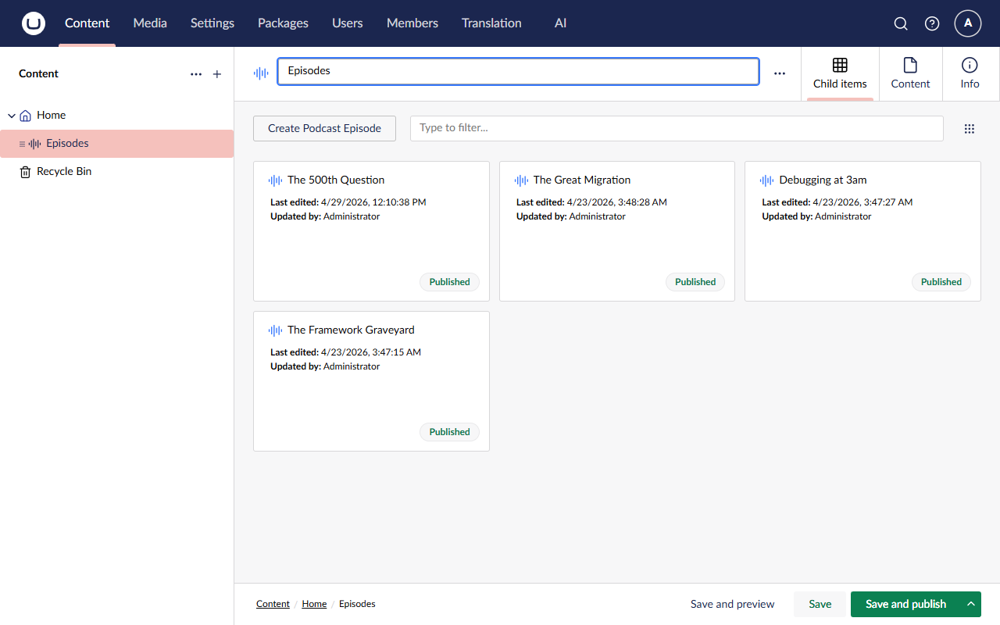
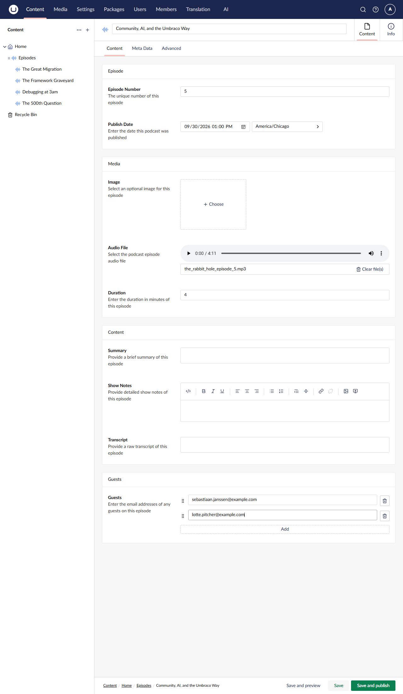
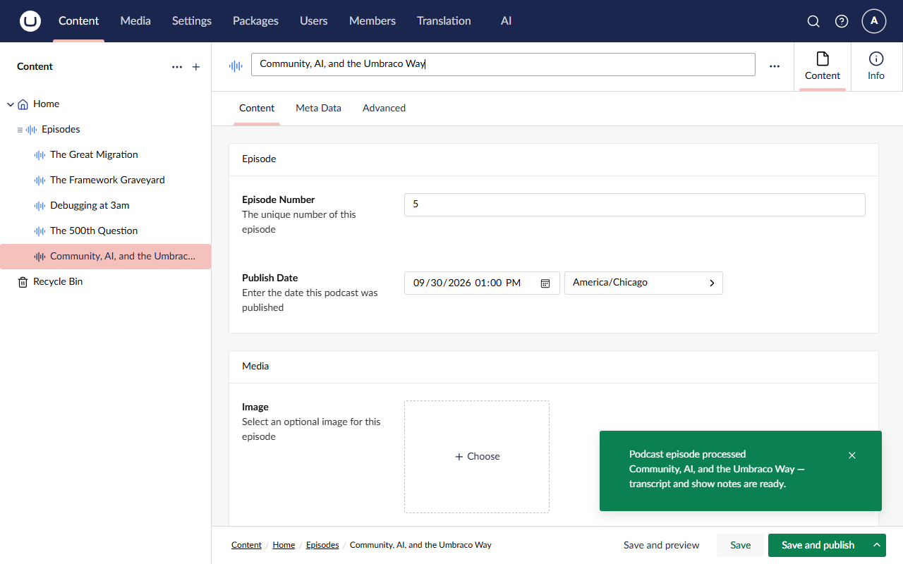
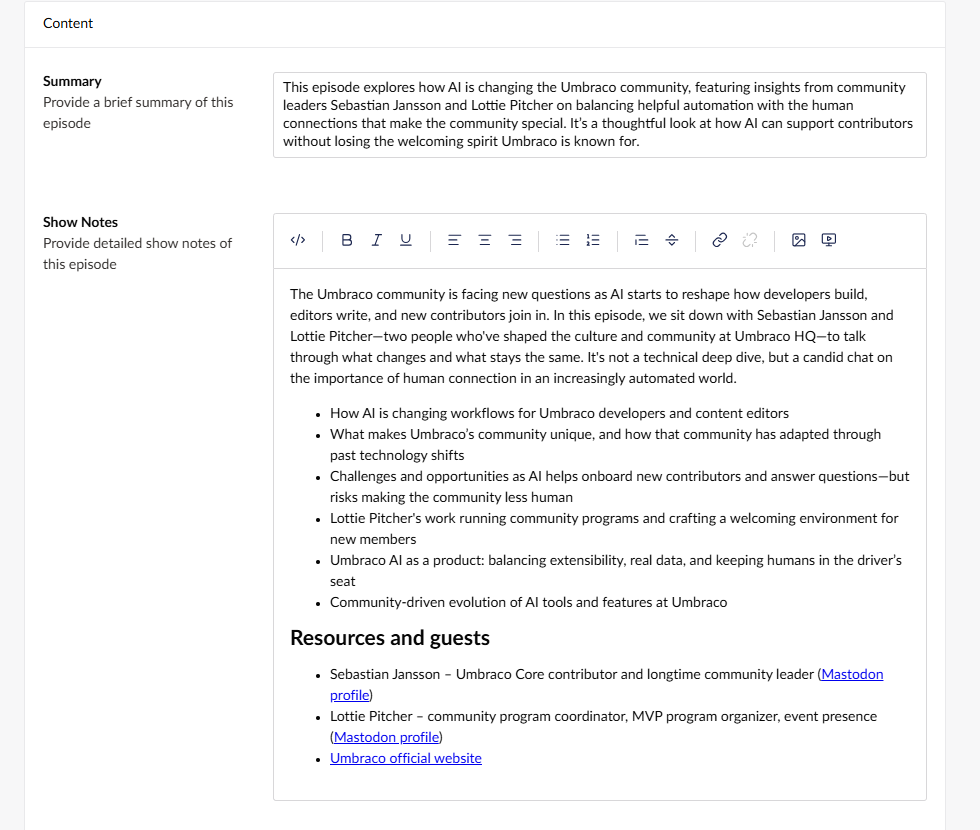
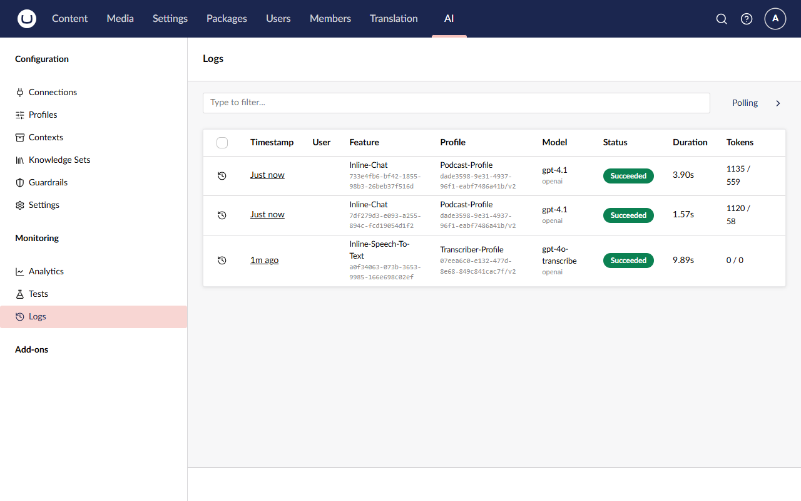
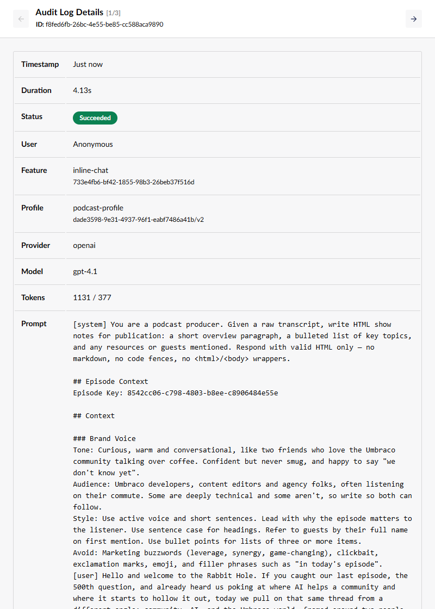
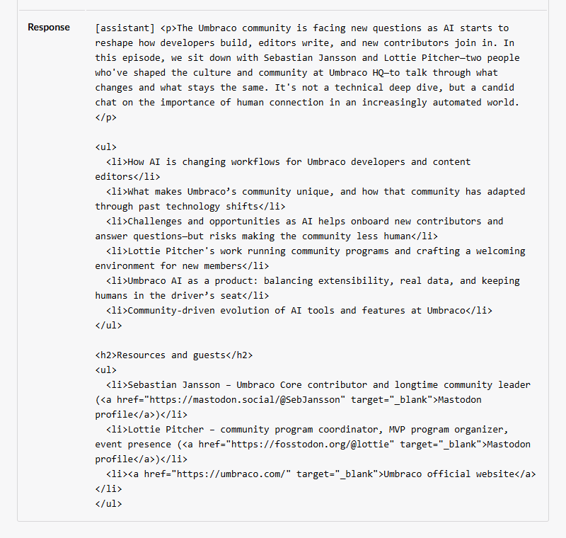

# Lesson 2: Transcribe, summarise, write show notes

> ⏱️ **Timebox: ~27 minutes** · Starting branch: `lesson-1-end` · Finished branch: `lesson-2-end`

> [!TRACKER]
> ✅ Transcribe podcast audio · ✅ Generate a summary and show notes · ⬜ Cross-link mentioned episodes · ⬜ Validate guest details

## Objective

Make The Rabbit Hole produce its own episodes. When an editor saves an episode with an audio file, the site will:

1. transcribe the audio with **`IAISpeechToTextService`**
2. write a short summary and HTML show notes with **`IAIChatService`**
3. save all three back to the episode and pop up a toast in the backoffice

These are the two core services from Lecture 3. By the end of the lesson the first two requirements are ticked, and you'll
have spotted two bugs that the rest of Part 1 and Part 2 will fix.

## What you'll change

- `src/TheRabbitHole.Core/PodcastEpisodeTranscriber.cs`: three `using` lines and the body of the empty `ProcessManualAsync`
  method
- **Backoffice → Content:** create episode 5, *Community, AI, and the Umbraco Way*
- **Backoffice → AI → Logs:** read-only, to see what was actually sent to the model

## Steps

### Step 1: Tour the provided transcriber

Nothing to type in this step. Open **`src/TheRabbitHole.Core/PodcastEpisodeTranscriber.cs`** and get your bearings, because
the client's site already has all the plumbing from Lecture 3:

1. An editor saves an episode. **`PodcastEpisodeSavedHandler`** (a `ContentSavedNotification` handler) checks it's a
   `podcastEpisode` with an audio file, writes its key to **`PodcastEpisodeQueue`**, and returns straight away. The save
   is never kept waiting for AI.
2. **`PodcastEpisodeTranscriber`** is a `BackgroundService` that reads keys from the queue for as long as the site runs
   (the `ExecuteAsync` loop below).
3. For each key, `ProcessAsync` calls **`ProcessManualAsync`**, which is empty. That's your job today. (The extra hop
   exists because Lesson 5 adds an agent-based alternative next to it.)

Here's the loop, already in the file:

**`src/TheRabbitHole.Core/PodcastEpisodeTranscriber.cs`** (already there, don't type it)

```csharp
    protected override async Task ExecuteAsync(CancellationToken stoppingToken)
    {
        // Continuously read from the queue until the service is stopped.
        // Each content key represents a podcast episode to process.
        await foreach (var contentKey in queue.Reader.ReadAllAsync(stoppingToken))
        {
            // Mark the episode as in-flight so the save-notification handler ignores any saves
            // that happen during processing (otherwise every save we make would re-enqueue it).
            if (!queue.BeginProcessing(contentKey))
                continue;

            try
            {
                // Run the processing logic in an isolated context to avoid any AsyncLocal state
                // (like logging scopes) from flowing into the background work.
                await RunIsolated(() => ProcessAsync(contentKey, stoppingToken));
            }
            catch (Exception ex)
            {
                logger.LogError(ex, "Failed to process podcast episode {Id}", contentKey);
            }
            finally
            {
                queue.EndProcessing(contentKey);
            }
        }
    }
```

A few details worth noticing:

- **Loop prevention.** At the end of processing we save the episode, which raises *another* `ContentSavedNotification`.
  `BeginProcessing` puts the key in an in-flight set, and the saved handler skips any key in that set, so our own save
  doesn't queue the episode again. `EndProcessing` removes it in the `finally`.
- **Errors never kill the loop.** Anything that goes wrong is logged as `Failed to process podcast episode`, and the
  worker moves on to the next key. Remember that message: it's the first thing to search for when something breaks.
- **`IsRichTextEmpty`** (at the bottom of the file) exists because the Show Notes field is a Tiptap rich text editor. Clear
  it in the backoffice and it's *still not empty*: Umbraco stores a small JSON envelope with `<p></p>` markup. A plain
  `string.IsNullOrWhiteSpace` check would think there are show notes, and "clear the field and save to regenerate" would
  never work.

<details>
<summary>Deep dive: why <code>RunIsolated</code>?</summary>

The saved handler runs inside the editor's request, which carries *ambient* state in `AsyncLocal` values (logging
scopes, Umbraco scopes and so on). `ExecutionContext.SuppressFlow()` stops that state leaking into the background work,
so each episode is processed with a clean slate, as if it were its own little request.

</details>

### Step 2: Add the AI usings

At the top of **`PodcastEpisodeTranscriber.cs`**, replace the whole `using` block with this one. Three lines are new:
`Microsoft.Extensions.AI`, `Umbraco.AI.Core.Chat` and `Umbraco.AI.Core.SpeechToText`.

**`src/TheRabbitHole.Core/PodcastEpisodeTranscriber.cs`**

```csharp
using System.Net;
using Microsoft.AspNetCore.SignalR;
using Microsoft.Extensions.AI;
using Microsoft.Extensions.DependencyInjection;
using Microsoft.Extensions.Hosting;
using Microsoft.Extensions.Logging;
using Umbraco.AI.Core.Chat;
using Umbraco.AI.Core.SpeechToText;
using Umbraco.Cms.Core.IO;
using Umbraco.Cms.Core.PropertyEditors;
using Umbraco.Cms.Core.Serialization;
using Umbraco.Cms.Core.Services;
using Umbraco.Extensions;
```

What's happening:

- `Umbraco.AI.Core.SpeechToText` and `Umbraco.AI.Core.Chat` give you the two Umbraco AI services.
- `Microsoft.Extensions.AI` gives you `ChatMessage` and `ChatRole`. As Lecture 1 said, Umbraco AI is built on
  Microsoft.Extensions.AI, so the message types are standard .NET, not something Umbraco invented.

### Step 3: Create a scope and resolve the services

Find the empty `ProcessManualAsync` method and replace the whole method (including the `// Lesson 2` comment and
`await Task.CompletedTask;`) with:

**`src/TheRabbitHole.Core/PodcastEpisodeTranscriber.cs`**

```csharp
    private async Task ProcessManualAsync(Guid contentKey, CancellationToken ct)
    {
        // Create a new scope to resolve services for this unit of work, ensuring we have a clean context
        // for Umbraco services and AI clients.
        using var scope = scopeFactory.CreateScope();
        var sp = scope.ServiceProvider;
        var contentService = sp.GetRequiredService<IContentService>();
        var mediaFileManager = sp.GetRequiredService<MediaFileManager>();
        var stt = sp.GetRequiredService<IAISpeechToTextService>();
        var chat = sp.GetRequiredService<IAIChatService>();
        var jsonSerializer = sp.GetRequiredService<IJsonSerializer>();
    }
```

What's happening:

- **Why a scope?** A `BackgroundService` is a *singleton*: one instance for the life of the site. Many Umbraco and Umbraco
  AI services are *scoped* (one per request). Injecting a scoped service into a singleton's constructor would either throw
  at startup or quietly keep one instance alive forever. So we do what ASP.NET Core does for every request: create a scope
  for this unit of work, resolve what we need from it, and let `using` dispose everything when the method ends.
- `IContentService` loads and saves the editable (draft) version of content.
- `MediaFileManager` opens files from Umbraco's media file system, which is where the uploaded MP3 lives.
- `IAISpeechToTextService` and `IAIChatService` are the two stars of Lecture 3.
- `IJsonSerializer` is what `IsRichTextEmpty` needs to read the Tiptap JSON.

> [!NOTE]
> The next five snippets all go **inside this method**, one below the other. Each step tells you which line to add it
> under. There's a "full file" at the end of Step 8 so you can check your work.

### Step 4: Load the episode

Directly below the `var jsonSerializer = …` line, add:

```csharp
        // Load the content item to process. We have the content key from the queue, but we need to load the full item
        var content = contentService.GetById(contentKey);
        if (content is null)
            return;

        bool contentHasChanged = false;
```

What's happening:

- The queue only carries a `Guid`, which keeps it small and cheap. Here we load the full, current episode. The episode
  might have been deleted while it sat in the queue, hence the `null` check.
- `contentHasChanged` implements a habit from Lecture 3: **save once, notify once.** Each step below flips it to `true`
  when it fills a field. If nothing needed doing, we don't save and don't send a toast.

### Step 5: Transcribe the audio

Directly below `bool contentHasChanged = false;`, add:

```csharp
        // Check if the episode has already been processed (e.g. if a transcript already exists) to avoid duplicate work.
        string transcript = content.GetValue<string>("transcript") ?? string.Empty;
        if (string.IsNullOrWhiteSpace(transcript))
        {
            var audioPath = content.GetValue<string>("audioFile");
            if (string.IsNullOrWhiteSpace(audioPath))
                return;

            logger.LogInformation("Transcribing podcast episode {Id}", contentKey);

            await using var audio = mediaFileManager.FileSystem.OpenFile(audioPath);
            var sttResponse = await stt.TranscribeAsync(
                b => b.WithAlias("podcast-episode-transcription"),
                audio, ct);
            transcript = sttResponse.Text;

            content.SetValue("transcript", transcript);
            contentHasChanged = true;
        }

        if (string.IsNullOrWhiteSpace(transcript))
            return;
```

What's happening:

- **Only fill what's empty.** If the episode already has a transcript, we skip the slowest and most expensive call
  entirely. This rule is what lets you clear a field later and regenerate *just that part*.
- The `audioFile` upload field stores a media path such as `/media/abc123/episode.mp3`. `MediaFileManager.FileSystem`
  opens it as a stream, and it works the same whether media lives on disk or in blob storage.
- **`TranscribeAsync(builder, stream, ct)`**, as on the Lecture 3 slide. The builder lambda describes the request:
  - **`WithAlias("podcast-episode-transcription")`** is required. It names this *call site*, not a profile. It's the
    breadcrumb that ties an entry in the AI logs back to this line of code.
  - **There's no `WithProfile(...)`**, so Umbraco AI uses the **default speech-to-text profile** from **AI → Settings**.
    That's the Transcriber Profile you set in [Lesson 1, Step 11](lesson-1.md#step-11-set-the-default-speech-to-text-profile).
- The final guard stops here if transcription came back empty. There's nothing to summarise.

### Step 6: Write the summary

Directly below that final `if (string.IsNullOrWhiteSpace(transcript)) return;` guard, add:

```csharp
        var summary = content.GetValue<string>("summary") ?? string.Empty;
        if (string.IsNullOrWhiteSpace(summary))
        {
            string summaryPrompt =
                "You are a podcast producer. Given a raw transcript, write a concise 1–2 sentence summary of the episode " +
                "suitable for a listing card. Respond with plain text only — no markdown, no HTML, no quotes.\n" +
                "\n" +
                "## Episode Context\n" +
                $"Episode Key: {contentKey}";

            var summaryResponse = await chat.GetChatResponseAsync(
                b => b.WithAlias("podcast-episode-summary")
                    .WithProfile("podcast-profile"),
                [
                    new ChatMessage(ChatRole.System, summaryPrompt),
                    new ChatMessage(ChatRole.User, transcript)
                ], ct);

            summary = summaryResponse.Text;
            content.SetValue("summary", summary);
            contentHasChanged = true;
        }
```

What's happening:

- **The prompt** is the job description and the rules, and it spells out the format: *plain text only, no markdown, no
  HTML, no quotes*. Models happily add all three if you don't say so.
- The **`Episode Key`** line isn't used yet. It pays off in Lesson 4, when the model needs the episode's key to look up
  its guests with a tool.
- **`GetChatResponseAsync(builder, messages, ct)`** has the same shape as speech-to-text, with two builder calls this
  time:
  - `WithAlias("podcast-episode-summary")`: a different alias for a different call site.
  - `WithProfile("podcast-profile")`: *which* model and settings to use. Mixing up the call alias and the profile alias is
    the classic mistake from Lecture 3.
- **The messages** are standard Microsoft.Extensions.AI `ChatMessage`s in a C# collection expression. The **System**
  message holds the job and the rules; the **User** message holds the material, which is the transcript.
- Notice what *isn't* here: the Brand Voice. The Podcast Profile carries that context, so Umbraco AI injects it for you.
  You'll see it with your own eyes in Under the hood.
- `summaryResponse.Text` is the model's answer as a string.

### Step 7: Write the show notes

Directly below the summary block's closing `}`, add:

```csharp
        var showNotes = content.GetValue<string>("showNotes") ?? string.Empty;
        if (IsRichTextEmpty(showNotes, jsonSerializer))
        {
            string showNotesPrompt =
                "You are a podcast producer. Given a raw transcript, write HTML show notes for publication: " +
                "a short overview paragraph, a bulleted list of key topics, and any resources or guests mentioned. " +
                "Respond with valid HTML only — no markdown, no code fences, no <html>/<body> wrappers.\n" +
                "\n" +
                "## Episode Context\n" +
                $"Episode Key: {contentKey}";

            var showNotesResponse = await chat.GetChatResponseAsync(
                b => b.WithAlias("podcast-episode-show-notes")
                    .WithProfile("podcast-profile"),
                [
                    new ChatMessage(ChatRole.System, showNotesPrompt),
                    new ChatMessage(ChatRole.User, transcript)
                ], ct);

            showNotes = showNotesResponse.Text;
            content.SetValue("showNotes", showNotes);
            contentHasChanged = true;
        }
```

What's happening:

- Same pattern, three differences:
  - The emptiness check is **`IsRichTextEmpty`**, because Show Notes is a rich text field (see Step 1).
  - The prompt asks for **HTML**, and explicitly says *no code fences*. Without that, many models wrap their HTML in
    Markdown code fences, and you'd see the fence characters on your page.
  - It gets its own alias, **`podcast-episode-show-notes`**. That's the entry you'll open in the logs shortly.
- We send the transcript *again*. Each call is independent: the model doesn't remember the summary call. Keep that in
  mind for Lecture 6, when we compare this step-by-step approach with an agent.

### Step 8: Save and notify the editor

Directly below the show notes block's closing `}`, as the last thing in the method, add:

```csharp
        // Save the transcript, summary and show notes back to the content item.
        if (contentHasChanged)
        {
            contentService.Save(content);
            logger.LogInformation("Podcast episode {Id} transcribed, summarised and show notes saved", contentKey);

            // Notify any connected backoffice clients that this episode has been processed,
            // so they can update the UI in real time if needed.
            await hub.Clients.All.SendAsync("episodeProcessed", contentKey, content.Name, ct);
        }
```

What's happening:

- **One save** for everything that changed. This save raises `ContentSavedNotification` again, and loop prevention from
  Step 1 makes the handler ignore it.
- It's a plain **save**, not a publish. The AI's work lands as a draft, so an editor can review it before it goes live.
- `SendAsync("episodeProcessed", …)` pushes a SignalR message to every connected backoffice. The provided
  `podcast-notifications.js` listens for it and shows the toast.

<details>
<summary>Full file so far</summary>

**`src/TheRabbitHole.Core/PodcastEpisodeTranscriber.cs`**

```csharp
using System.Net;
using Microsoft.AspNetCore.SignalR;
using Microsoft.Extensions.AI;
using Microsoft.Extensions.DependencyInjection;
using Microsoft.Extensions.Hosting;
using Microsoft.Extensions.Logging;
using Umbraco.AI.Core.Chat;
using Umbraco.AI.Core.SpeechToText;
using Umbraco.Cms.Core.IO;
using Umbraco.Cms.Core.PropertyEditors;
using Umbraco.Cms.Core.Serialization;
using Umbraco.Cms.Core.Services;
using Umbraco.Extensions;

namespace TheRabbitHole.Core;

// Background service that processes podcast episodes from the queue: transcribes the audio, generates show notes
// using AI, and saves the results back to Umbraco.
public class PodcastEpisodeTranscriber(PodcastEpisodeQueue queue, IServiceScopeFactory scopeFactory,
    IHubContext<PodcastHub> hub, ILogger<PodcastEpisodeTranscriber> logger) : BackgroundService
{
    protected override async Task ExecuteAsync(CancellationToken stoppingToken)
    {
        // Continuously read from the queue until the service is stopped.
        // Each content key represents a podcast episode to process.
        await foreach (var contentKey in queue.Reader.ReadAllAsync(stoppingToken))
        {
            // Mark the episode as in-flight so the save-notification handler ignores any saves
            // that happen during processing (otherwise every save we make would re-enqueue it).
            if (!queue.BeginProcessing(contentKey))
                continue;

            try
            {
                // Run the processing logic in an isolated context to avoid any AsyncLocal state
                // (like logging scopes) from flowing into the background work.
                await RunIsolated(() => ProcessAsync(contentKey, stoppingToken));
            }
            catch (Exception ex)
            {
                logger.LogError(ex, "Failed to process podcast episode {Id}", contentKey);
            }
            finally
            {
                queue.EndProcessing(contentKey);
            }
        }
    }

    // Isolate the worker from producer-thread AsyncLocal state (e.g. ambient scopes).
    private static Task RunIsolated(Func<Task> action)
    {
        using (ExecutionContext.SuppressFlow())
            return Task.Run(action);
    }

    // The main processing logic: transcribe the audio, generate show notes, save to Umbraco, and notify clients via SignalR.
    private async Task ProcessAsync(Guid contentKey, CancellationToken ct)
    {
        await ProcessManualAsync(contentKey, ct);
    }

    private async Task ProcessManualAsync(Guid contentKey, CancellationToken ct)
    {
        // Create a new scope to resolve services for this unit of work, ensuring we have a clean context
        // for Umbraco services and AI clients.
        using var scope = scopeFactory.CreateScope();
        var sp = scope.ServiceProvider;
        var contentService = sp.GetRequiredService<IContentService>();
        var mediaFileManager = sp.GetRequiredService<MediaFileManager>();
        var stt = sp.GetRequiredService<IAISpeechToTextService>();
        var chat = sp.GetRequiredService<IAIChatService>();
        var jsonSerializer = sp.GetRequiredService<IJsonSerializer>();

        // Load the content item to process. We have the content key from the queue, but we need to load the full item
        var content = contentService.GetById(contentKey);
        if (content is null)
            return;

        bool contentHasChanged = false;

        // Check if the episode has already been processed (e.g. if a transcript already exists) to avoid duplicate work.
        string transcript = content.GetValue<string>("transcript") ?? string.Empty;
        if (string.IsNullOrWhiteSpace(transcript))
        {
            var audioPath = content.GetValue<string>("audioFile");
            if (string.IsNullOrWhiteSpace(audioPath))
                return;

            logger.LogInformation("Transcribing podcast episode {Id}", contentKey);

            await using var audio = mediaFileManager.FileSystem.OpenFile(audioPath);
            var sttResponse = await stt.TranscribeAsync(
                b => b.WithAlias("podcast-episode-transcription"),
                audio, ct);
            transcript = sttResponse.Text;

            content.SetValue("transcript", transcript);
            contentHasChanged = true;
        }

        if (string.IsNullOrWhiteSpace(transcript))
            return;

        var summary = content.GetValue<string>("summary") ?? string.Empty;
        if (string.IsNullOrWhiteSpace(summary))
        {
            string summaryPrompt =
                "You are a podcast producer. Given a raw transcript, write a concise 1–2 sentence summary of the episode " +
                "suitable for a listing card. Respond with plain text only — no markdown, no HTML, no quotes.\n" +
                "\n" +
                "## Episode Context\n" +
                $"Episode Key: {contentKey}";

            var summaryResponse = await chat.GetChatResponseAsync(
                b => b.WithAlias("podcast-episode-summary")
                    .WithProfile("podcast-profile"),
                [
                    new ChatMessage(ChatRole.System, summaryPrompt),
                    new ChatMessage(ChatRole.User, transcript)
                ], ct);

            summary = summaryResponse.Text;
            content.SetValue("summary", summary);
            contentHasChanged = true;
        }

        var showNotes = content.GetValue<string>("showNotes") ?? string.Empty;
        if (IsRichTextEmpty(showNotes, jsonSerializer))
        {
            string showNotesPrompt =
                "You are a podcast producer. Given a raw transcript, write HTML show notes for publication: " +
                "a short overview paragraph, a bulleted list of key topics, and any resources or guests mentioned. " +
                "Respond with valid HTML only — no markdown, no code fences, no <html>/<body> wrappers.\n" +
                "\n" +
                "## Episode Context\n" +
                $"Episode Key: {contentKey}";

            var showNotesResponse = await chat.GetChatResponseAsync(
                b => b.WithAlias("podcast-episode-show-notes")
                    .WithProfile("podcast-profile"),
                [
                    new ChatMessage(ChatRole.System, showNotesPrompt),
                    new ChatMessage(ChatRole.User, transcript)
                ], ct);

            showNotes = showNotesResponse.Text;
            content.SetValue("showNotes", showNotes);
            contentHasChanged = true;
        }

        // Save the transcript, summary and show notes back to the content item.
        if (contentHasChanged)
        {
            contentService.Save(content);
            logger.LogInformation("Podcast episode {Id} transcribed, summarised and show notes saved", contentKey);

            // Notify any connected backoffice clients that this episode has been processed,
            // so they can update the UI in real time if needed.
            await hub.Clients.All.SendAsync("episodeProcessed", contentKey, content.Name, ct);
        }
    }

    // The Tiptap rich-text editor persists even a manually cleared field as a JSON envelope
    // with "<p></p>" markup and empty block collections, so a plain IsNullOrWhiteSpace check
    // will report it as non-empty.
    private bool IsRichTextEmpty(string? value, IJsonSerializer jsonSerializer)
    {
        if (string.IsNullOrWhiteSpace(value))
            return true;

        if (!RichTextPropertyEditorHelper.TryParseRichTextEditorValue(value, jsonSerializer, logger, out var rte))
            return false;

        if (rte.Blocks?.ContentData is { Count: > 0 })
            return false;

        var stripped = WebUtility.HtmlDecode(rte.Markup?.StripHtml() ?? string.Empty);
        return string.IsNullOrWhiteSpace(stripped);
    }
}
```

</details>

### Step 9: Run the site

If the site is still running from Lesson 1, stop it with **Ctrl+C**. Then start it again, which also builds your changes:

```bash
dotnet run --project src/TheRabbitHole.Web
```

Wait for `Now listening on: https://localhost:44339`. If the build fails, check the Troubleshooting section below.

### Step 10: Create episode 5

Time to give the pipeline some work. Open https://localhost:44339/umbraco and go to the **Content** section.

1. Expand **Home** and click **Episodes**. It opens on its **Child items** view, with the four existing episodes shown as
   cards.
2. Click **Create Podcast Episode**, above the cards.



3. In the name field at the top, enter `Community, AI, and the Umbraco Way`.
4. The editor has three tabs: **Content**, **Meta Data** and **Advanced**. Everything you need is on **Content**, grouped
   under **Episode**, **Media**, **Content** and **Guests**. Fill in:
   - **Episode Number:** `5`
   - **Publish Date:** today's date. Any time is fine. Leave the time zone picker next to it as it is.
   - **Image:** leave it empty. The site falls back to the show's artwork.
   - **Audio File:** click the **Click to upload** area and pick `assets/audio/the_rabbit_hole_episode_5.mp3` from the
     folder where you cloned the repo. Wait until an audio player and the file name (with **Clear file(s)** next to it)
     appear before moving on.
   - **Duration:** `4`
   - **Summary**, **Show Notes** and **Transcript:** leave them **empty**. That's the AI's job.
   - **Guests:** click **Add** to get one row per email, and enter `sebastiaan.janssen@example.com` and
     `lotte.pitcher@example.com`.
5. Leave the **Meta Data** and **Advanced** tabs as they are.

> [!IMPORTANT]
> **Don't skip the guests.** The audio only *says* their names. In Lesson 4 the model looks these email addresses up in
> the CRM to get the names right, so without them Lesson 4 has nothing to work with.



6. Click **Save and publish**.

Why publish, not just save? Either one triggers our pipeline, because publishing saves too. Publishing also puts episode 5
on the live site (it shows up under **Recent Episodes** on the homepage), and later lessons rely on it being published:
Lesson 3's context reads *published* episodes, and in Lesson 6 Umbraco Automate reads published content.

### Step 11: Wait for the toast, then refresh

Transcribing four minutes of audio plus two chat calls takes **about 20 seconds** (up to a minute when everyone is doing
it at once). Transcription is most of that, around 15 seconds. Watch the terminal running the site. You should see
`Transcribing podcast episode …`, and later `Podcast episode … transcribed, summarised and show notes saved`. Then a green
toast appears in the backoffice: **Podcast episode processed**, *"Community, AI, and the Umbraco Way — transcript and show
notes are ready."*



Now **refresh the page** (F5). The editor loaded the episode *before* the background job saved it, so until you refresh
you're looking at the old, empty fields.

> [!WARNING]
> Don't click Save before you refresh. The editor would save the empty fields it's still showing over the AI's work, and
> the whole pipeline would run again.

After the refresh, **Transcript**, **Summary** and **Show Notes** are filled in.



Remember that the background job only *saved* (Step 8), so the new text is a draft. To see it on the site, click **Save
and publish** once more. Nothing is regenerated, because all three fields are already filled. Then open
https://localhost:44339 and click through to the episode.

## ✅ Checkpoint

- ⬜ The **Podcast episode processed** toast appeared, about 20 seconds after you saved.
- ⬜ After a refresh, episode 5 has a **Transcript**, a short plain-text **Summary**, and HTML **Show Notes** with an
  overview paragraph and a bulleted list of topics.
- ⬜ After publishing again, the episode page on the site shows the summary, the notes and the transcript.
- ⬜ You've read the summary and the show notes carefully, looking for mistakes.

### Spot the two bugs

The client would send this back. Read what the show notes say about **the previous episode**, and how they spell **the
guests' names**. Compare them with the Episodes list in the backoffice and with the guest emails you entered. While
you're there, check any **links** the show notes contain.

<details>
<summary>Reveal the two bugs</summary>

1. **The previous episode.** The hosts mention their last episode, episode #4, **"The 500th Question"**. The model has no
   idea what that is, so it gets it wrong in one way or another. It varies from run to run: the episode is left out
   altogether, mislabelled as "the 500th episode", or mentioned but not linked, because the model doesn't know the URL.
2. **The guests' names.** In the dry run the model wrote **"Sebastian Jansson"** (or "Sebastian Janssen") and **"Lottie
   Pitcher"**. The correct spellings are **Sebastiaan Janssen** and **Lotte Pitcher**. Speech-to-text writes what it
   hears, and the model believes the transcript.

Your wording will differ, because LLM output varies from run to run.

Both bugs have the same root cause: **the model only knows what's in the transcript.** Bug 1 needs *knowledge* about our
show, which is a context (Lesson 3, next). Bug 2 needs the *ability* to look something up, which is a tool (Lesson 4, after
the break).

**Bonus: a hallucination.** In the dry run, the show notes gave both guests a **Mastodon profile** link, with
plausible-looking URLs. The transcript only says the guests are "on Mastodon". The model invented the addresses. That's a
hallucination: confident, well-formatted and wrong. Check yours, and keep an eye on those links in Lesson 3.

</details>

## 🔍 Under the hood

Where did the Brand Voice come in? You never mentioned it in C#. Let's look at what was actually sent to the model.

1. Go to **AI → Logs**. The run created three entries, newest first:
   - the **show notes** chat call: Feature **Inline-Chat**, Profile **Podcast-Profile**, Model `gpt-4.1`
   - the **summary** chat call: also **Inline-Chat** on the Podcast Profile
   - the **transcription**: Feature **Inline-Speech-To-Text**, Profile **Transcriber-Profile**, Model `gpt-4o-transcribe`

   You can't search the list for your call aliases. Instead, under each Feature name there's an **ID that Umbraco AI
   derives from your call alias**, so every call from the same `WithAlias(...)` line always gets the same ID. In the dry
   run the show notes call was `733e4fb6…` and the summary `7df279d3…`. Make a note of yours: they stay the same for the
   rest of the workshop. You can also tell the two chat calls apart by **Tokens** (input / output): the show notes call has
   far more output tokens (the dry run had about 1,100 / 380 for the show notes against 1,100 / 64 for the summary).



2. Look at the transcription entry's **Profile**: the Transcriber Profile. Your code never named it. That's the default
   from Settings at work.
3. Click the **timestamp** of the show notes entry (the newest one, with the most output tokens). The **Audit Log
   Details** panel opens, with Timestamp, Duration, Status, User, Feature, Profile, Provider, Model and Tokens at the top.
   **User** says **Anonymous**, because the work ran on a background service, not in anyone's request. Scroll down to the
   **Prompt**:
   - It starts with `[system]` and **your `showNotesPrompt`**, word for word, including the `## Episode Context` section
     from your code.
   - Below that is a **`## Context`** section that you didn't write, with a **`### Brand Voice`** heading (or whatever
     you named the resource in Lesson 1) and lines starting `Tone:`, `Audience:`, `Style:` and `Avoid:`. That's the Brand
     Voice context from Lesson 1. The Podcast Profile carries it, and Umbraco AI appended it to your system message on the
     way out.
   - Then comes `[user]` and **the transcript**. Look for "Sebastian", "Lottie" and "500th question". The two bugs start
     right here.



4. Scroll further to the **Response**. It starts with `[assistant]`, followed by the HTML that ended up in Show Notes.
   If your run invented Mastodon links, you'll see the made-up URLs right there in the `href`s. Then look back at
   **Tokens** (input / output): almost all of the input tokens are the transcript.



> [!TIP]
> The counter (**1/3**) and the arrows at the top of **Audit Log Details** step through the entries in the list, so you
> can move from the show notes call to the summary call without closing the panel.

This is Lecture 2's mental model made visible: code asks for a profile **by alias**, and the profile brings its model,
settings and **contexts**. Change the Brand Voice in the backoffice, and the next call picks it up with no deployment.

<details>
<summary>Deep dive: how the Brand Voice text is produced</summary>

Every context resource has a **resource type**, and the resource type decides how its data is written into the prompt.
The built-in Brand Voice type turns its four fields into short `Label: value` lines. It doesn't send raw JSON. Umbraco AI
then adds every "Always" resource under `## Context`, one `### <resource name>` heading each.

Hold on to that picture. In Lesson 3 you'll write your own resource type, with your own formatting, and see it show up
right next to Brand Voice.

</details>

## 🧯 Troubleshooting

<details>
<summary><strong>No toast after two minutes</strong></summary>

Look at the terminal running the site and search for `Failed to process podcast episode`. The exception underneath
tells you what went wrong. The usual suspects:

- **No default speech-to-text profile.** The transcription call doesn't name a profile, so it needs a default. Set
  **Transcriber Profile** in **AI → Settings** ([Lesson 1, Step 11](lesson-1.md#step-11-set-the-default-speech-to-text-profile)).
- **The transcription connection.** Transcription goes through the **Workshop Transcription** connection, whose endpoint
  must be `$Umbraco:AI:Variables:TranscriptionEndpoint`
  ([Lesson 1, Step 8](lesson-1.md#step-8-create-the-transcription-connection-and-the-transcriber-profile)). On Foundry
  or the workshop key, that user secret must be the transcription **deployment** URL, not the `/openai/v1/` endpoint.
- **A user secret is missing.** Check the key is stored under exactly `Umbraco:AI:Secrets:ApiKey` and both endpoints
  under `Umbraco:AI:Variables`, then restart the site. (This prints your key, so not on a shared screen.)

  ```bash
  dotnet user-secrets list --project src/TheRabbitHole.Web
  ```

- **A profile alias typo.** The code asks for `podcast-profile`. Check the alias on your Podcast Profile.

Then clear the fields that are still empty (they probably all are), and **Save** again. See also
[Nothing happens after I save an episode](../troubleshooting.md#nothing-happens-after-i-save-an-episode).

</details>

<details>
<summary><strong>401 or 403 errors from the provider</strong></summary>

- **401 Unauthorized** means the provider didn't accept the key. The user secret is missing or wrong, or you set it after
  starting the site. User secrets are read at startup, so restart after changing them. Also check that the **OpenAI API
  Key** field on both connections, **Workshop** and **Workshop Transcription**, is exactly `$Umbraco:AI:Secrets:ApiKey`.
- **403 Forbidden** means the key works but isn't allowed to use that model or deployment. Check the model on both
  profiles. On OpenAI, check your project's model permissions; on your own Foundry, check both deployments exist.
- **429 Too Many Requests** on OpenAI with *"You exceeded your current quota"* means the account has no credit. Add some
  under **Settings → Billing**. Any other 429 is a rate limit: wait a few seconds, clear the fields and save again.

</details>

<details>
<summary><strong>Nothing at all in the terminal, not even "Transcribing podcast episode"</strong></summary>

The episode was never processed. Most likely it has **no audio file**: the saved handler skips episodes without one, and
so does `ProcessManualAsync`. Check the upload finished (an audio player and the file name show under **Audio File**),
then save again.

The other possibility: the transcript was already filled in, so transcription was skipped. See the next item.

</details>

<details>
<summary><strong>I saved again and nothing happened</strong></summary>

That's by design. The code only generates what's missing, so if the transcript, summary and show notes are all filled
in, there's nothing to do: no save, no toast. **Clear** the fields you want regenerated and save again. Clear the Show
Notes editor completely; `IsRichTextEmpty` copes with the empty `<p></p>` it leaves behind.

</details>

<details>
<summary><strong>The show notes contain code fences or Markdown, or look odd</strong></summary>

LLM output varies from run to run, and sometimes the model ignores an instruction. Clear **Show Notes** and save to
regenerate just that field. If it keeps happening, try tightening the prompt. That's the first stretch goal.

</details>

<details>
<summary><strong>The values appeared, but I never saw a toast</strong></summary>

The toast script loads the SignalR client from the internet (`esm.sh`). If that's blocked, the pipeline still works, but
the backoffice never hears about it. Open your browser's developer console and look for `[TheRabbitHole] Could not
connect to podcast hub`. You can carry on without the toast: wait a minute after saving, then refresh.

</details>

<details>
<summary><strong>Build error: <code>MEAI001</code></strong></summary>

Microsoft.Extensions.AI marks its speech-to-text types as experimental. Add
`<NoWarn>$(NoWarn);MEAI001</NoWarn>` to `src/TheRabbitHole.Core/TheRabbitHole.Core.csproj`, as in
[Lesson 1, Step 3](lesson-1.md#step-3-suppress-the-experimental-speech-to-text-warning).

</details>

<details>
<summary><strong>Build error: <code>IAIChatService</code>, <code>ChatMessage</code> or <code>ChatRole</code> could not be found</strong></summary>

One of the three `using` lines from Step 2 is missing. If `Umbraco.AI` itself can't be found, the `Umbraco.AI.Core`
package reference from Lesson 1 is missing from `src/TheRabbitHole.Core/TheRabbitHole.Core.csproj`.

</details>

## 🆘 Stuck?

Jump to the finished state of this lesson. Stop the site first (**Ctrl+C**), then:

```bash
git stash -u
```

```bash
git checkout lesson-2-end
```

```bash
dotnet run --project src/TheRabbitHole.Web
```

The branch includes the code *and* the backoffice state for this lesson (it's in the site's database), including episode 5
(published, with its generated transcript, summary and show notes saved as a draft on top), so you can carry straight on
with the next lesson. Your API key lives in user-secrets, so it comes with you.

More detail: [How to jump to a lesson's end branch](../troubleshooting.md#how-to-jump-to-a-lessons-end-branch).

## 🚀 Stretch goals

- **Tweak the summary prompt and compare.** For example, ask for "exactly one sentence, under 25 words". Restart, clear
  only **Summary**, save, and open the old and new summary entries in the logs side by side. *Hint: both entries share
  the same Feature ID, because they come from the same alias.*
- **Change the temperature on the profile.** Open **AI → Profiles → Podcast Profile**, set
  **Temperature** to `0.2`, save, then regenerate the summary. Try `1.2` next. *Hint: no code change or restart is needed.
  That's the point of profiles. If your model rejects a temperature, clear the field again.*
- **See where the tokens go.** Open **AI → Analytics** and look at the **By Profile** and **By Model** breakdowns. *Hint:
  the transcript is sent twice (summary and show notes), so input tokens dwarf output tokens. Remember this number for
  Lesson 5.*
