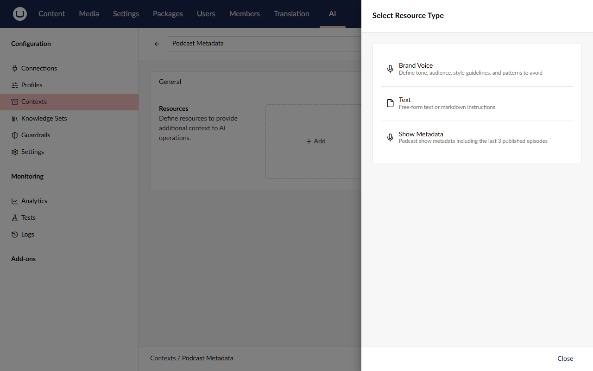
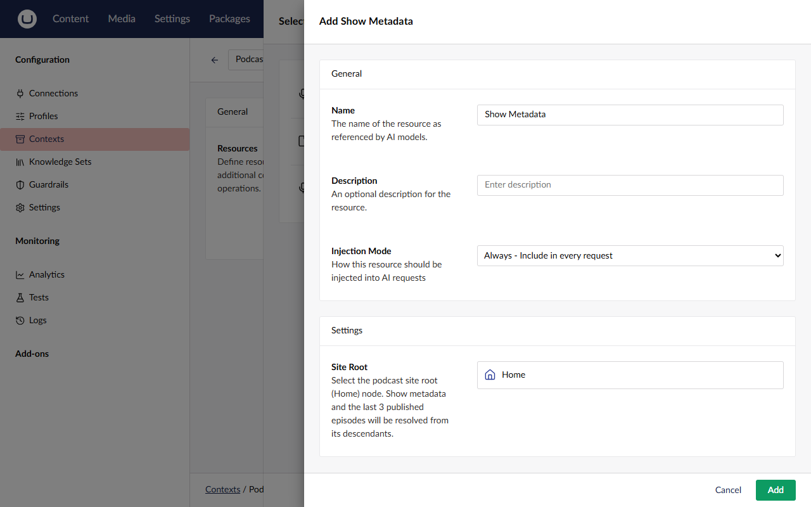
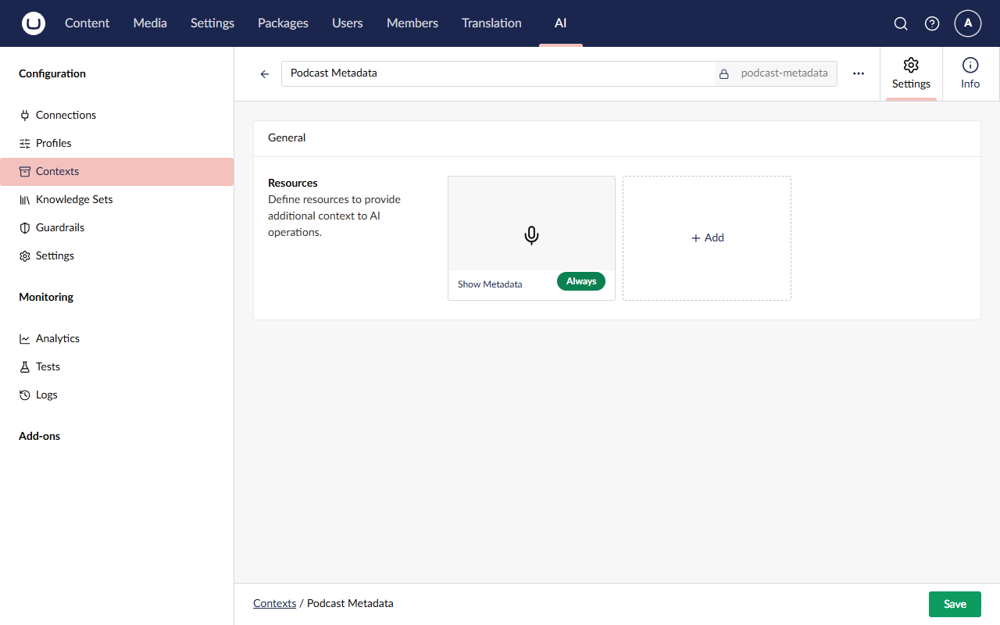
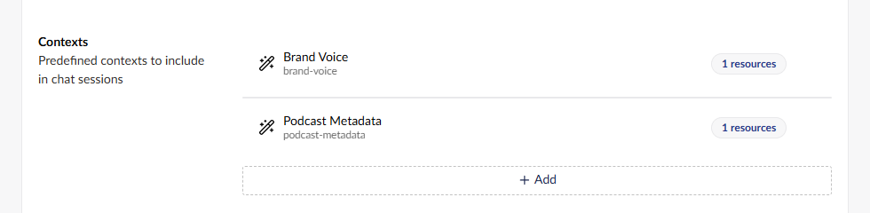
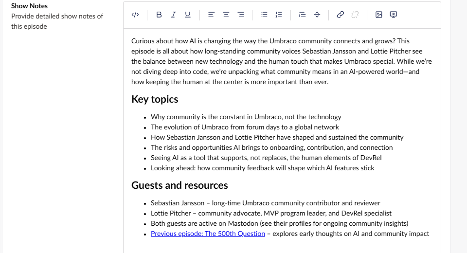
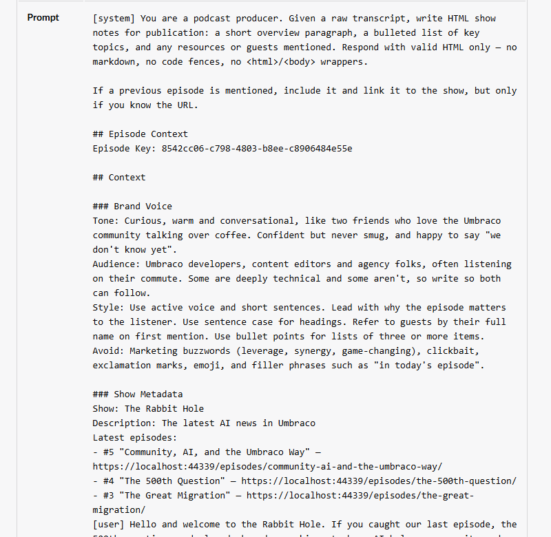

# Lesson 3: Show Metadata context

> ⏱️ **Timebox: ~25 minutes** · Starting branch: `lesson-2-end` · Finished branch: `lesson-3-end`

> [!TRACKER]
> ✅ Transcribe podcast audio · ✅ Generate a summary and show notes · ✅ Cross-link mentioned episodes · ⬜ Validate guest details

## Objective

Fix the first bug from Lesson 2. The show notes get episode #4 wrong (they leave it out, call it "the 500th episode", or
mention it without a link), because the model only knows what's in the transcript. You'll teach it about the show's back catalogue by writing a **custom context
resource type**, **Show Metadata**, which reads the show's name and its three latest episodes (number, title and URL)
live from Umbraco's published content. Then you'll plug it in without touching the chat call:

**compile** (the type is discovered) → **context** (the type is used) → **profile** (the context is attached) → **prompt**
(one line tells the model what to do with it)

By the end, the regenerated show notes mention **The 500th Question** by its real title and link to its page.

> [!NOTE]
> Custom context resource types aren't in the official Umbraco AI documentation yet, so the API could change in a later
> version. This lesson was written against Umbraco.AI 17.3.5.

## What you'll change

- New folder `src/TheRabbitHole.Core/ContextResources/` with three files:
  - `ShowMetadataResourceSettings.cs`: what an editor fills in
  - `ShowMetadataResourceOutput.cs`: the data we resolve
  - `ShowMetadataResourceType.cs`: the resource type that ties them together
- `src/TheRabbitHole.Core/PodcastEpisodeTranscriber.cs`: one new line in the show notes prompt
- **Backoffice → AI:** a new **Podcast Metadata** context, attached to the **Podcast Profile** next to Brand Voice

## Steps

### Step 1: How a resource type fits together

Nothing to type yet. Lecture 4's one-liner: resource types are **like document types, but for context**. You define the
shape once in code, and editors create as many instances as they like in the backoffice. A resource type has three parts:

| Part | Think of it as… | Ours |
|---|---|---|
| **Settings model** | The properties an editor fills in when they add the resource to a context | `ShowMetadataResourceSettings`: a Site Root picker |
| **Output model** | The data you fetch each time the context is used | `ShowMetadataResourceOutput`: show name, description, latest episodes |
| **Resource type** | The class that fetches (`ResolveDataAsync`) and writes it for the model (`FormatDataForLlm`) | `ShowMetadataResourceType` |

You've already used one: **Brand Voice** is a built-in resource type with four settings fields and its own formatting.

### Step 2: Create the settings model

Create a new folder **`src/TheRabbitHole.Core/ContextResources`**, then create a new file
**`src/TheRabbitHole.Core/ContextResources/ShowMetadataResourceSettings.cs`** and add:

```csharp
using Umbraco.AI.Core.EditableModels;

namespace TheRabbitHole.Core.ContextResources;

public sealed class ShowMetadataResourceSettings
{
    public Guid? SiteRootId { get; set; }
}
```

What's happening:

- This is what gets stored on each resource that uses our type. We only need one thing: *which* node is the site root.
- It's a `Guid?` because a document picker stores the picked document's **key**, and "nothing picked yet" is `null`.

### Step 3: Turn the property into a document picker

Replace the property with an attributed version, so the whole file looks like this:

**`src/TheRabbitHole.Core/ContextResources/ShowMetadataResourceSettings.cs`**

```csharp
using Umbraco.AI.Core.EditableModels;

namespace TheRabbitHole.Core.ContextResources;

public sealed class ShowMetadataResourceSettings
{
    [AIField(
        Label = "Site Root",
        Description = "Select the podcast site root (Home) node. Show metadata and the last 3 published episodes will be resolved from its descendants.",
        EditorUiAlias = "Umb.PropertyEditorUi.DocumentPicker",
        SortOrder = 10)]
    public Guid? SiteRootId { get; set; }
}
```

What's happening:

- **`[AIField]` generates the backoffice UI for you.** Umbraco AI reads the settings class and builds a form with one field
  per attributed property. There are no Lit components, manifests or frontend build.
- **`EditorUiAlias`** picks the property editor UI. `Umb.PropertyEditorUi.DocumentPicker` is the same document picker you
  use on content, so editors get a real content tree to pick from.
- **`Label`**, **`Description`** and **`SortOrder`** control how the field appears. It's the same attribute provider
  settings use (Lecture 4), so you'll see it all over Umbraco AI.

### Step 4: Create the output model

Create a new file **`src/TheRabbitHole.Core/ContextResources/ShowMetadataResourceOutput.cs`** and add:

```csharp
namespace TheRabbitHole.Core.ContextResources;

public sealed class ShowMetadataResourceOutput
{
    public string? ShowName { get; set; }

    public string? ShowDescription { get; set; }

    public IReadOnlyList<EpisodeSummary> LatestEpisodes { get; set; } = Array.Empty<EpisodeSummary>();
}

public sealed record EpisodeSummary(int Number, string Name, string Summary, string Url);
```

What's happening:

- This is the data your resource type resolves: any shape you like, from any source (content, an API, a database). The
  base class only requires a class with a parameterless constructor.
- `EpisodeSummary` holds everything the model needs to cite an episode properly: its **number**, its real **title** and its
  **URL**. It carries the episode's `Summary` too; we won't send that to the model yet (see Stretch goals).

### Step 5: Scaffold the resource type

Create a new file **`src/TheRabbitHole.Core/ContextResources/ShowMetadataResourceType.cs`** and add this bare scaffold. It
already has every `using` you'll need, so the next steps only touch the class.

```csharp
using System.Text;
using TheRabbitHole.Core.Models;
using Umbraco.AI.Core.Contexts.ResourceTypes;
using Umbraco.Cms.Core.Models.PublishedContent;
using Umbraco.Cms.Core.Web;
using Umbraco.Extensions;

namespace TheRabbitHole.Core.ContextResources;

public sealed class ShowMetadataResourceType
    : AIContextResourceTypeBase<ShowMetadataResourceSettings, ShowMetadataResourceOutput>
{
    private readonly IUmbracoContextFactory _umbracoContextFactory;

    public ShowMetadataResourceType(
        IAIContextResourceTypeInfrastructure infrastructure,
        IUmbracoContextFactory umbracoContextFactory)
        : base(infrastructure)
    {
        _umbracoContextFactory = umbracoContextFactory;
    }

    public override Task<ShowMetadataResourceOutput?> ResolveDataAsync(
        ShowMetadataResourceSettings settings,
        CancellationToken cancellationToken = default)
    {
        return Task.FromResult<ShowMetadataResourceOutput?>(null);
    }

    protected override string FormatDataForLlm(ShowMetadataResourceOutput data)
    {
        return string.Empty;
    }
}
```

What's happening:

- **`AIContextResourceTypeBase<TSettings, TOutput>`** is the base class, typed with your two models. When an editor
  fills in a Show Metadata resource in the backoffice (Step 11), Umbraco saves those settings with the context. Before
  each AI call, the base class turns the saved values back into a `ShowMetadataResourceSettings` object and hands it to
  your `ResolveDataAsync`, so you never parse anything yourself.
- **The constructor** passes `IAIContextResourceTypeInfrastructure` to the base (it's what builds the backoffice form from
  your `[AIField]`s) and takes our own dependency, `IUmbracoContextFactory`. Resource types are created by dependency
  injection and live for the whole life of the site, so we inject a factory and create what we need per call.
- **`ResolveDataAsync`** fetches the data. **`FormatDataForLlm`** turns it into prompt text. For now they return nothing.

> [!WARNING]
> **Don't run the site yet.** The base class constructor throws if the class is missing its `[AIContextResourceType]`
> attribute. You'll add it in the very next step.

### Step 6: Add the `[AIContextResourceType]` attribute

Add the attribute directly above the class declaration, so the top of the class looks like this:

**`src/TheRabbitHole.Core/ContextResources/ShowMetadataResourceType.cs`**

```csharp
namespace TheRabbitHole.Core.ContextResources;

[AIContextResourceType("show-metadata", "Show Metadata",
    Description = "Podcast show metadata including the last 3 published episodes",
    Icon = "icon-mic")]
public sealed class ShowMetadataResourceType
    : AIContextResourceTypeBase<ShowMetadataResourceSettings, ShowMetadataResourceOutput>
```

What's happening:

- **`"show-metadata"`** is the type's ID. It's saved with every resource that uses this type, so don't change it once
  you've created contexts with it.
- **`"Show Metadata"`**, **`Description`** and **`Icon`** are what editors see in the backoffice when they pick a
  resource type.
- **Discovery is automatic.** Umbraco scans your code on startup and finds the class by its attribute, the same way it
  finds your composers. There's no registration code: compile, restart, and it's there. Tools work the same way in
  Lesson 4.

### Step 7: Resolve the data, part 1: find the site root

Replace the `ResolveDataAsync` method with:

```csharp
    public override Task<ShowMetadataResourceOutput?> ResolveDataAsync(
        ShowMetadataResourceSettings settings,
        CancellationToken cancellationToken = default)
    {
        if (settings.SiteRootId is null || settings.SiteRootId == Guid.Empty)
            return Task.FromResult<ShowMetadataResourceOutput?>(null);

        using var umbracoContext = _umbracoContextFactory.EnsureUmbracoContext();

        var root = umbracoContext.UmbracoContext?.Content.GetById(settings.SiteRootId.Value);
        if (root is null)
            return Task.FromResult<ShowMetadataResourceOutput?>(null);

        return Task.FromResult<ShowMetadataResourceOutput?>(null);
    }
```

What's happening:

- **Returning `null` means "nothing to inject".** No site root picked, or the node can't be found? Then the model gets no
  Show Metadata block at all, rather than an empty one.
- **`EnsureUmbracoContext()`** matters here. `ResolveDataAsync` runs *inside the chat call*. For us, that's on the
  background worker from Lesson 2, where there's no HTTP request and therefore no Umbraco context. This creates one (or
  reuses the current request's), and `using` disposes it.
- **`Content`** is the *published* content cache. It's fast, and it only contains published content, which is why you
  published episode 5 in Lesson 2.
- The last `return` is temporary, so the method compiles. You'll replace it next.

### Step 8: Resolve the data, part 2: the latest three episodes

Replace the whole `ResolveDataAsync` method again, this time with the finished version. Everything after
`if (root is null)` is new:

```csharp
    public override Task<ShowMetadataResourceOutput?> ResolveDataAsync(
        ShowMetadataResourceSettings settings,
        CancellationToken cancellationToken = default)
    {
        if (settings.SiteRootId is null || settings.SiteRootId == Guid.Empty)
            return Task.FromResult<ShowMetadataResourceOutput?>(null);

        using var umbracoContext = _umbracoContextFactory.EnsureUmbracoContext();

        var root = umbracoContext.UmbracoContext?.Content.GetById(settings.SiteRootId.Value);
        if (root is null)
            return Task.FromResult<ShowMetadataResourceOutput?>(null);

        var home = root as Home;
        var episodes = root.Children<PodcastEpisodes>().First();
        var latestEpisodes = episodes
            .Children<PodcastEpisode>()
            .OrderByDescending(e => e.PublishDate ?? DateTimeOffset.MinValue)
            .Take(3)
            .Select(e => new EpisodeSummary(
                e.EpisodeNumber,
                e.Name,
                e.Summary ?? string.Empty,
                e.Url(mode: UrlMode.Absolute)))
            .ToList();

        var data = new ShowMetadataResourceOutput
        {
            ShowName = home?.SiteName ?? root.Name,
            ShowDescription = home?.SiteDescription,
            LatestEpisodes = latestEpisodes,
        };

        return Task.FromResult<ShowMetadataResourceOutput?>(data);
    }
```

What's happening:

- **`root as Home`** gives us the ModelsBuilder model, so we can read the show's **Name** and **Description** fields
  (on Home's *Site* tab) as typed properties.
- **`Children<PodcastEpisodes>().First()`** finds the Episodes node under Home, then we take its three newest episodes by
  publish date. That's #5 (the episode you created), #4 and #3.
- **`Url(mode: UrlMode.Absolute)`** gives full URLs such as `https://localhost:44339/episodes/the-500th-question/`, so the
  model can write a link that works anywhere. The host comes from the site's configured application URL.
- **It runs on every call**, so the data is never stale. Publish a new episode, and the very next call knows about it.

### Step 9: Format the data for the model

Replace the `FormatDataForLlm` method with:

```csharp
    protected override string FormatDataForLlm(ShowMetadataResourceOutput data)
    {
        var sb = new StringBuilder();

        if (!string.IsNullOrWhiteSpace(data.ShowName))
            sb.AppendLine($"Show: {data.ShowName}");

        if (!string.IsNullOrWhiteSpace(data.ShowDescription))
            sb.AppendLine($"Description: {data.ShowDescription}");

        if (data.LatestEpisodes.Count > 0)
        {
            sb.AppendLine("Latest episodes:");
            foreach (var episode in data.LatestEpisodes)
                sb.AppendLine($"- #{episode.Number} \"{episode.Name}\" — {episode.Url}");
        }

        return sb.ToString().TrimEnd();
    }
```

This produces something like:

```text
Show: The Rabbit Hole
Description: The latest AI news in Umbraco
Latest episodes:
- #5 "Community, AI, and the Umbraco Way" — https://localhost:44339/episodes/community-ai-and-the-umbraco-way/
- #4 "The 500th Question" — https://localhost:44339/episodes/the-500th-question/
- #3 "The Great Migration" — https://localhost:44339/episodes/the-great-migration/
```

What's happening:

- **If you don't override this method, the base class serialises your output to JSON.** That works, but short,
  Markdown-style text works better (Lecture 4): fewer tokens spent on braces and quotes, clearer for the model, and
  readable when you open the logs.
- It's the same approach the built-in Brand Voice type takes with its `Tone:`, `Audience:`… lines, which you saw in the
  Lesson 2 logs.
- Look at what the model now has: episode 4's **real title** and a **real URL** to link to.

<details>
<summary>Full file so far</summary>

**`src/TheRabbitHole.Core/ContextResources/ShowMetadataResourceType.cs`**

```csharp
using System.Text;
using TheRabbitHole.Core.Models;
using Umbraco.AI.Core.Contexts.ResourceTypes;
using Umbraco.Cms.Core.Models.PublishedContent;
using Umbraco.Cms.Core.Web;
using Umbraco.Extensions;

namespace TheRabbitHole.Core.ContextResources;

[AIContextResourceType("show-metadata", "Show Metadata",
    Description = "Podcast show metadata including the last 3 published episodes",
    Icon = "icon-mic")]
public sealed class ShowMetadataResourceType
    : AIContextResourceTypeBase<ShowMetadataResourceSettings, ShowMetadataResourceOutput>
{
    private readonly IUmbracoContextFactory _umbracoContextFactory;

    public ShowMetadataResourceType(
        IAIContextResourceTypeInfrastructure infrastructure,
        IUmbracoContextFactory umbracoContextFactory)
        : base(infrastructure)
    {
        _umbracoContextFactory = umbracoContextFactory;
    }

    public override Task<ShowMetadataResourceOutput?> ResolveDataAsync(
        ShowMetadataResourceSettings settings,
        CancellationToken cancellationToken = default)
    {
        if (settings.SiteRootId is null || settings.SiteRootId == Guid.Empty)
            return Task.FromResult<ShowMetadataResourceOutput?>(null);

        using var umbracoContext = _umbracoContextFactory.EnsureUmbracoContext();

        var root = umbracoContext.UmbracoContext?.Content.GetById(settings.SiteRootId.Value);
        if (root is null)
            return Task.FromResult<ShowMetadataResourceOutput?>(null);

        var home = root as Home;
        var episodes = root.Children<PodcastEpisodes>().First();
        var latestEpisodes = episodes
            .Children<PodcastEpisode>()
            .OrderByDescending(e => e.PublishDate ?? DateTimeOffset.MinValue)
            .Take(3)
            .Select(e => new EpisodeSummary(
                e.EpisodeNumber,
                e.Name,
                e.Summary ?? string.Empty,
                e.Url(mode: UrlMode.Absolute)))
            .ToList();

        var data = new ShowMetadataResourceOutput
        {
            ShowName = home?.SiteName ?? root.Name,
            ShowDescription = home?.SiteDescription,
            LatestEpisodes = latestEpisodes,
        };

        return Task.FromResult<ShowMetadataResourceOutput?>(data);
    }

    protected override string FormatDataForLlm(ShowMetadataResourceOutput data)
    {
        var sb = new StringBuilder();

        if (!string.IsNullOrWhiteSpace(data.ShowName))
            sb.AppendLine($"Show: {data.ShowName}");

        if (!string.IsNullOrWhiteSpace(data.ShowDescription))
            sb.AppendLine($"Description: {data.ShowDescription}");

        if (data.LatestEpisodes.Count > 0)
        {
            sb.AppendLine("Latest episodes:");
            foreach (var episode in data.LatestEpisodes)
                sb.AppendLine($"- #{episode.Number} \"{episode.Name}\" — {episode.Url}");
        }

        return sb.ToString().TrimEnd();
    }
}
```

</details>

### Step 10: Run the site

Stop the site with **Ctrl+C** if it's running, then start it again so the new resource type is compiled and discovered:

```bash
dotnet run --project src/TheRabbitHole.Web
```

### Step 11: Create the Podcast Metadata context

Compiling made the type *available*. Nothing uses it until a context does.

1. Go to **AI → Contexts** and click **Create**. The context editor opens straight away.
2. In the name box, type `Podcast Metadata`. The alias fills itself in as `podcast-metadata`.
3. Under **Resources**, click **+ Add**. The **Select Resource Type** dialog lists the two built-in types you met in
   Lesson 1, **Brand Voice** and **Text**, and now a third: **Show Metadata**, with the icon and description from your
   Step 6 attribute (*"Podcast show metadata including the last 3 published episodes"*). Pick **Show Metadata**.



4. The **Add Show Metadata** dialog opens, with two groups:
   - **General**, which every resource has:
     - **Name:** leave it as `Show Metadata`. This becomes the resource's heading in the prompt.
     - **Description:** leave it empty.
     - **Injection Mode:** leave it as **Always - Include in every request**.
   - **Settings**, which comes from *your* settings class:
     - **Site Root:** click **Choose**, pick **Home** in the content tree, and click **Choose** again. This is the
       document picker your `[AIField]` generated, with your label and description.
5. Click **Add** to close the dialog.



6. **Save** the context. The Show Metadata resource card shows an **Always** badge.



**Always or On-Demand?** From Lecture 4:

- **Always** puts the resource straight into the system prompt on every call. It's predictable, but it costs tokens every
  time. That's right for small facts that are always relevant, like ours.
- **On-Demand** only tells the model the resource exists, and the model fetches it with a tool if it decides it needs it.
  That suits big reference material that's only sometimes relevant, at the cost of an extra round trip, and the risk that
  the model doesn't bother. You can try it in the Stretch goals.

### Step 12: Attach it to the Podcast Profile

A context only reaches a model when a profile (or agent) uses it.

1. Go to **AI → Profiles** and open **Podcast Profile**.
2. Scroll to **Contexts** at the bottom of **System Settings**, where Brand Voice is already listed, and click **+ Add**.
3. In **Select AI Context**, choose **Podcast Metadata**, then click **Select**.
4. Click **Save**.



The profile now carries **two layered contexts**: Brand Voice (how to sound) and Podcast Metadata (what's true about the
show).

> [!WARNING]
> Attach it to the **Podcast Profile**, the *chat* profile our show notes call uses. Not the Transcriber Profile:
> speech-to-text profiles don't use contexts.

### Step 13: Nudge the show notes prompt

Knowledge alone isn't enough. The model also needs to know what you want done with it. In
**`src/TheRabbitHole.Core/PodcastEpisodeTranscriber.cs`**, find `string showNotesPrompt =` inside `ProcessManualAsync` and
replace the whole statement with:

**`src/TheRabbitHole.Core/PodcastEpisodeTranscriber.cs`**

```csharp
            string showNotesPrompt =
                "You are a podcast producer. Given a raw transcript, write HTML show notes for publication: " +
                "a short overview paragraph, a bulleted list of key topics, and any resources or guests mentioned. " +
                "Respond with valid HTML only — no markdown, no code fences, no <html>/<body> wrappers.\n" +
                "\n" +
                "If a previous episode is mentioned, include it and link it to the show, but only if you know the URL.\n" +
                "\n" +
                "## Episode Context\n" +
                $"Episode Key: {contentKey}";
```

What's happening:

- Two new lines: the instruction, and a blank line to separate it from the Episode Context section.
- **"Only if you know the URL"** gives the model permission to link *and* a condition. Without the condition, models
  happily invent plausible-looking episode URLs. With it, they link only episodes they've actually been given URLs for,
  like the ones in the Show Metadata block.
- As Lecture 4 put it: knowledge plus a clear instruction fixes the bug. Either one on its own is less reliable.
- The summary prompt stays as it is. It's plain text for a listing card, with no links.

### Step 14: Regenerate the show notes

Stop the site (**Ctrl+C**) and start it again, so your prompt change is compiled:

```bash
dotnet run --project src/TheRabbitHole.Web
```

Then, in the backoffice:

1. In **Content → Home → Episodes**, open **Community, AI, and the Umbraco Way**.
2. On the **Content** tab, clear **only the Show Notes** field: click into the editor, select everything (**Ctrl+A**, or
   **Cmd+A** on a Mac), and delete it. Leave the Transcript and Summary alone, so only the show notes call runs. There's
   no transcription this time, so it's faster and cheaper.
3. Click **Save and publish**.
4. Wait for the toast. It's much quicker than in Lesson 2: about 10 seconds. Then **refresh the page**.

The new show notes should mention **The 500th Question** by its real title, with a link to its page. Where it appears
and how it's worded varies. When we tested this lesson, it was a *"Previous episode: The 500th Question"* line at the end. Hover over
the link (or click it on the site) to check it goes to `https://localhost:44339/episodes/the-500th-question/`.



The guest *names* are probably still wrong. That's Lesson 4.

As in Lesson 2, the background job only saved a draft. Click **Save and publish** again to put the new show notes live.

## ✅ Checkpoint

- ⬜ **AI → Contexts** lists **Podcast Metadata** (`podcast-metadata`), with one **Show Metadata** resource that has an
  **Always** badge, and Site Root set to **Home**.
- ⬜ The **Podcast Profile** has two contexts: **Brand Voice** and **Podcast Metadata**.
- ⬜ The regenerated show notes mention **The 500th Question** and link to `…/episodes/the-500th-question/`.
- ⬜ The guest names are probably still wrong ("Sebastian", "Lottie"). That's expected: Lesson 4 fixes them.

LLM output varies. If this run didn't link the episode, clear the Show Notes and save again. Troubleshooting has more.

## 🔍 Under the hood

Open **AI → Logs**. There's just one new entry this time: an **Inline-Chat** call with the same ID as Lesson 2's show
notes call (`733e4fb6…` when we built this workshop), because it comes from the same `WithAlias("podcast-episode-show-notes")` line.
Click its timestamp to open **Audit Log Details**. In the **Prompt**:

- **Your system prompt**, now with the new *"If a previous episode is mentioned…"* line.
- A **`## Context`** section with *two* blocks: **`### Brand Voice`**, as in Lesson 2, and right after it **`### Show
  Metadata`**. The Show Metadata block is **exactly the text your `FormatDataForLlm` produced**: the `Show:` line, the
  `Description:` line and the `Latest episodes:` #5, #4 and #3 with their URLs. The heading is the resource name you left
  in Step 11.
- In the **Response**, an `<a href="https://localhost:44339/episodes/the-500th-question/">` link.



Notice that episode 5 lists *itself* under "Latest episodes". It's published, so it's one of the three newest. That's
harmless: when we tested this lesson, the model simply ignored it and linked only The 500th Question.

That one screen shows the whole chain from Lecture 4: your class was **discovered** at startup, the **context** used it,
the **profile** attached the context, and the **prompt** told the model what to do with it. `ResolveDataAsync` ran during
this very call, on the background worker, which is why it needed `EnsureUmbracoContext()`.

One more thing to notice: **Always means always.** Every call through the Podcast Profile now carries the Show Metadata
block, including summary calls that don't need it. Compare **Tokens** with Lesson 2's show notes entry: when we built this
workshop, the input went from about 1,130 to about 1,260 tokens, so the block (plus your new prompt line) costs roughly 130 tokens per
call. That's small here, but it's the cost of Always, and the reason On-Demand exists.

## 🧯 Troubleshooting

<details>
<summary><strong>Show Metadata isn't in the Select Resource Type list</strong></summary>

- Did you **restart** the site after adding the files? Types are discovered at startup.
- Did the build succeed? Check the terminal for compile errors.
- Is the `[AIContextResourceType("show-metadata", "Show Metadata", …)]` attribute on the class (Step 6), and is the class
  `public`?

</details>

<details>
<summary><strong>An error mentioning <code>missing required [AIContextResourceType] attribute</code></strong></summary>

The base class constructor checks for the attribute and throws an `InvalidOperationException` without it. Add the
attribute from Step 6, then restart.

</details>

<details>
<summary><strong>The Site Root field is missing, or it isn't a document picker</strong></summary>

Check the `[AIField]` in `ShowMetadataResourceSettings.cs` (Step 3), especially the spelling of
`EditorUiAlias = "Umb.PropertyEditorUi.DocumentPicker"`, then restart.

</details>

<details>
<summary><strong>The show notes don't change, and there's no Show Metadata block in the logs</strong></summary>

The context isn't reaching the call:

- Is **Podcast Metadata** attached to the **Podcast Profile**, and did you save the profile? It must be the chat profile,
  not the Transcriber Profile.
- Is **Site Root** set on the resource? With no site root, `ResolveDataAsync` returns `null` and nothing is injected.

</details>

<details>
<summary><strong><code>Failed to process podcast episode</code> with "Sequence contains no elements"</strong></summary>

`root.Children<PodcastEpisodes>().First()` found no Episodes node under the site root. You probably picked the wrong node
(for example **Episodes** instead of **Home**). Edit the Show Metadata resource, pick **Home**, and save the context.

</details>

<details>
<summary><strong>The links point at the wrong address</strong></summary>

Absolute URLs use the site's configured application URL, `https://localhost:44339` (in
`src/TheRabbitHole.Web/appsettings.Development.json`). If you're running on a different port, the links will point at
44339. Switch back to the standard port, or update `Umbraco:CMS:WebRouting:UmbracoApplicationUrl` to match and restart.

</details>

<details>
<summary><strong>It still says "500th episode", or doesn't link it</strong></summary>

- **LLM output varies.** Clear the Show Notes and save again. One unlucky run doesn't mean it's broken.
- Open the logs and check the show notes call's prompt contains the **Show Metadata** block, with **The 500th Question**
  in it.
- Check the prompt contains the new *"If a previous episode is mentioned…"* line. If it doesn't, you didn't restart after
  Step 13.

</details>

<details>
<summary><strong>I saved but nothing happened</strong></summary>

The pipeline only regenerates empty fields. Make sure you cleared the Show Notes editor completely before saving.

</details>

## 🆘 Stuck?

Jump to the finished state of this lesson. Stop the site first (**Ctrl+C**), then:

```bash
git stash -u
```

```bash
git checkout lesson-3-end
```

```bash
dotnet run --project src/TheRabbitHole.Web
```

The branch includes the code *and* the backoffice configuration for this lesson (it's in the site's database), so you
can carry straight on with the next lesson. Your API key lives in user-secrets, so it comes with you.

More detail: [How to jump to a lesson's end branch](../troubleshooting.md#how-to-jump-to-a-lessons-end-branch).

## 🚀 Stretch goals

- **Switch to On-Demand and watch the model decide.** Edit the Show Metadata resource in **Podcast Metadata**, set
  **Injection Mode** to **On-Demand**, and save. Clear the Show Notes and save the episode. In the logs, the system prompt
  now lists Show Metadata under *Available On-Demand Context Resources* instead of including its content. Look for a
  tool call that fetches it. *Hint: agents get the built-in context tools automatically (you'll see `list_context_resources`
  in Lesson 5's logs), but plain chat calls only get the tools you allow. This one is an experiment: see whether the model
  fetches it, and switch back to Always when you're done.*
- **Give the model the episode summaries.** In `FormatDataForLlm`, add each episode's summary on the line after its
  title, then regenerate the show notes. Does the model link related episodes by topic, not just by name? *Hint:
  `sb.AppendLine($"  {episode.Summary}");` inside the `foreach`, but you'll need braces around the loop body. Compare the
  token counts in the logs.*
- **Stop invented guest links too.** The *"only if you know the URL"* rule is about episodes. If your show notes still
  invent links for the guests (Mastodon profiles, for example), extend the prompt so the model only links URLs it has
  actually been given, anywhere in the notes. *Hint: one sentence in `showNotesPrompt`. Clear the Show Notes and compare a
  few runs, because LLM output varies.*
- **Describe the show.** Add a sentence or two about what The Rabbit Hole is to the **Brand Voice** context (its Target
  Audience field is a good spot), and compare the overview paragraph. *Hint: Show Metadata already sends Home's
  Description ("The latest AI news in Umbraco"). Which is the better home for it: static text in a context, or live
  content from the site?*
