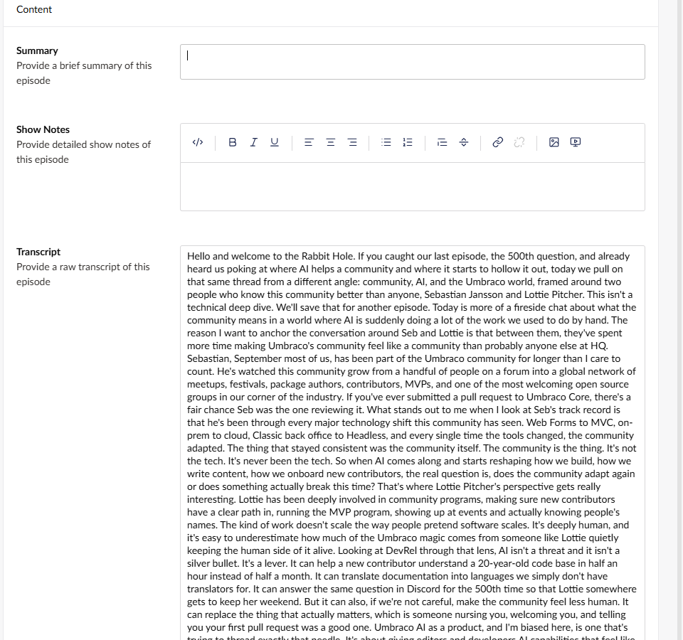
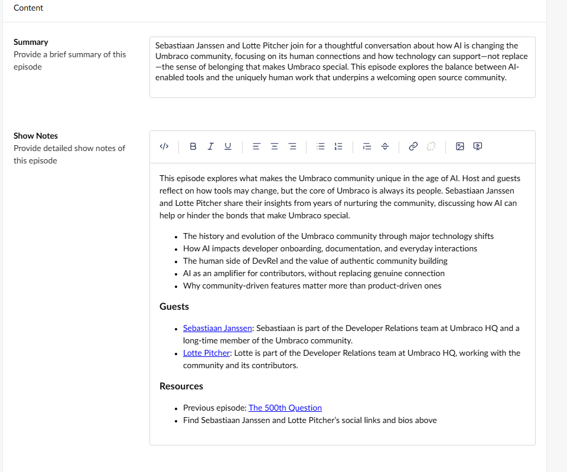
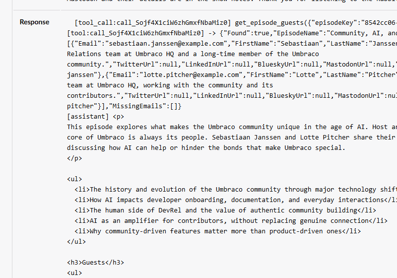

# Lesson 4: Episode guests tool

> ⏱️ **Timebox: ~16 minutes** · Starting branch: `lesson-3-end` · Finished branch: `lesson-4-end`

> [!TRACKER]
> ✅ Transcribe podcast audio · ✅ Generate a summary and show notes · ✅ Cross-link mentioned episodes · ⬜ Validate guest details

## Objective

Fix the last bug from Lesson 2. The show notes call the guests "Sebastian" and "Lottie", because speech-to-text writes
what it hears. The correct spellings, **Sebastiaan Janssen** and **Lotte Pitcher**, only exist in the client's CRM.

You'll write your first **tool**: a C# class the model can ask Umbraco AI to run (Lecture 5). `get_episode_guests` reads
the guest emails off the episode, looks them up in the CRM, and hands the canonical names back to the model. Then you'll
allow both chat calls to use it. By the end, all four boxes on the tracker are ticked.

## What you'll change

- `src/TheRabbitHole.Core/Tools/PodcastScope.cs` (new): a tool scope that groups our podcast tools
- `src/TheRabbitHole.Core/Tools/GetEpisodeGuestsTool.cs` (new): the tool and its arguments record
- `src/TheRabbitHole.Core/PodcastEpisodeTranscriber.cs`: allow the tool on both chat calls, and tell the model to use it
- **Backoffice:** no configuration this time. You'll just regenerate episode 5's summary and show notes.

## Steps

### Step 1: Stop the site and meet the "CRM"

Press **Ctrl+C** to stop the site.

Open **`src/TheRabbitHole.Core/Integrations/HubSpot/HubSpotGuestClient.cs`**. It's been in the repo since `init`: it's the
client's existing HubSpot integration. There's nothing to change, but take a quick look:

- **It's a stand-in.** The real client would call HubSpot's CRM search API
  (`POST https://api.hubapi.com/crm/v3/objects/contacts/search`). This one answers from a small in-memory contact list,
  so you don't need a HubSpot account. Its public surface matches the real client, so the code you write today can't tell
  the difference.
- **The lookup key is the guest's email.** That's why you entered `sebastiaan.janssen@example.com` and
  `lotte.pitcher@example.com` in the episode's **Guests** field in Lesson 2.
- **You'll call one method.** It returns a `GuestResult` for each contact it finds, with the canonical `FirstName` and
  `LastName`, a `Bio`, and social and website links:

```csharp
    public async Task<IReadOnlyList<GuestResult>> SearchByEmailsAsync(
        IReadOnlyList<string> emails,
        CancellationToken ct)
```

It's already registered for dependency injection in **`src/TheRabbitHole.Core/UmbracoBuilderExtensions.cs`**, so you can
inject it straight into your tool's constructor:

```csharp
        // HubSpot CRM client (Integrations/HubSpot) — looks up guest bios + socials by email
        builder.Services.AddOptions<HubSpotOptions>()
            .BindConfiguration(HubSpotOptions.SectionName);
        builder.Services.AddHttpClient<HubSpotGuestClient>();
```

Why a tool and not another context, like Lesson 3? A CRM is big and private, and we only need two people from it. A tool
lets the model look up exactly what it needs, at the moment it needs it.

### Step 2: Add a tool scope

Every tool belongs to a **scope**, a named group of related tools. Scopes are how tool permissions are granted: in Lesson 5
you'll give an agent the whole **Podcast** scope in one go, instead of picking tools one by one.

Create a new file **`src/TheRabbitHole.Core/Tools/PodcastScope.cs`** (the `Tools` folder doesn't exist yet, so create that too)
and add:

```csharp
using Umbraco.AI.Core.Tools.Scopes;

namespace TheRabbitHole.Core.Tools;

// A tool scope groups related tools so permissions can be granted to the whole group at once.
[AIToolScope("podcast", Icon = "icon-mic", Domain = "Podcast")]
public sealed class PodcastScope : AIToolScopeBase;
```

What's happening:

- `"podcast"` is the scope's ID. Tools join the scope with `ScopeId = "podcast"`.
- `Icon` and `Domain` control how the scope is shown and grouped in the backoffice. You'll see it on the agent's
  Governance tab in Lesson 5.
- There's no class body. `AIToolScopeBase` reads everything from the attribute, and Umbraco discovers the class at
  startup, just like your resource type in Lesson 3.

### Step 3: Build the `get_episode_guests` tool

A tool has two parts: an **arguments record** (what the model must send you) and a **tool class** (what you do with it).
You'll build it up in four small steps.

#### 3a. Scaffold the tool

Create a new file **`src/TheRabbitHole.Core/Tools/GetEpisodeGuestsTool.cs`** and add:

```csharp
using System.ComponentModel;
using TheRabbitHole.Core.Integrations.HubSpot;
using Umbraco.AI.Core.Tools;
using Umbraco.Cms.Core.Services;
using Umbraco.Extensions;

namespace TheRabbitHole.Core.Tools;

public sealed record GetEpisodeGuestsArgs(
    [property: Description("The Umbraco content key (GUID) of the podcast episode.")]
    Guid EpisodeKey);

public sealed class GetEpisodeGuestsTool : AIToolBase<GetEpisodeGuestsArgs>
{
    private readonly IContentService _contentService;
    private readonly HubSpotGuestClient _hubspot;

    public GetEpisodeGuestsTool(IContentService contentService, HubSpotGuestClient hubspot)
    {
        _contentService = contentService;
        _hubspot = hubspot;
    }

    public override string Description => "TODO";

    protected override Task<object> ExecuteAsync(
        GetEpisodeGuestsArgs args,
        CancellationToken cancellationToken = default)
    {
        throw new NotImplementedException();
    }
}
```

What's happening:

- **`GetEpisodeGuestsArgs`** is what the model must supply. Umbraco AI turns this record into a **JSON schema** and sends
  it with the request, so the model knows the tool takes one GUID. The `[Description]` is prompt guidance: it tells the
  model *which* GUID to send. (`[property: …]` puts the attribute on the record's generated property, which is where the
  schema generator looks.)
- **`AIToolBase<GetEpisodeGuestsArgs>`** does the plumbing. When the model calls the tool, Umbraco AI deserialises the
  JSON arguments into your record and calls `ExecuteAsync` with it.
- **The constructor** is ordinary dependency injection: `IContentService` to read the episode, and the
  `HubSpotGuestClient` from Step 1.
- `Description` and `ExecuteAsync` are placeholders for now. A couple of the usings are only needed later.

#### 3b. Give it an ID and a scope

Add the `[AITool]` attribute directly above the class declaration:

```csharp
[AITool("get_episode_guests", "Get Episode Guests", ScopeId = "podcast")]
public sealed class GetEpisodeGuestsTool : AIToolBase<GetEpisodeGuestsArgs>
```

What's happening:

- `"get_episode_guests"` is the tool's **ID**. It's the name the model uses to call the tool, and the name you'll use to
  allow it in Step 4. `"Get Episode Guests"` is its display name in the backoffice.
- `ScopeId = "podcast"` puts it in the scope from Step 2. Without it, the tool lands in a scope called `general`.
- **Discovered isn't the same as allowed.** With the attribute in place, Umbraco AI finds the tool at startup. But no
  chat call can use it until you allow it explicitly, by ID. That's a deliberate safe default (Lecture 5): you don't want
  every tool in the system offered to every prompt.

> [!WARNING]
> The attribute is required, not decoration. `AIToolBase` reads the ID and scope from it, and throws
> *"… is missing required [AITool] attribute"* when Umbraco creates the tool if it isn't there. The same goes for
> `[AIToolScope]` on `PodcastScope`.

#### 3c. Write the description (it's a prompt!)

Replace the placeholder `Description` property with:

```csharp
    public override string Description =>
        "Returns the authoritative guest details (canonical name spelling, bio, and social links including " +
        "Twitter/X, LinkedIn, Bluesky, Mastodon, website) for a podcast episode. " +
        "Call this whenever you need to refer to a guest by name or reference their socials — " +
        "episode transcripts often misspell names, so always resolve via this tool using the episode's content key.";
```

What's happening: this text goes to the model alongside the schema, and it's how the model decides **whether and when** to
call the tool. Notice it covers what the tool returns ("authoritative", "canonical name spelling"), when to call it
("whenever you need to refer to a guest by name"), and why ("transcripts often misspell names"). Write tool descriptions
like a brief for a colleague, not like an XML doc comment.

#### 3d. Implement `ExecuteAsync`

`ExecuteAsync` comes in three parts. It won't compile until you've added all three. That's expected.

**Part 1: load and check the episode.** Replace the whole `ExecuteAsync` method with:

```csharp
    protected override async Task<object> ExecuteAsync(
        GetEpisodeGuestsArgs args,
        CancellationToken cancellationToken = default)
    {
        var episode = _contentService.GetById(args.EpisodeKey);
        if (episode is null)
            return new { Found = false, Message = $"No content found for key {args.EpisodeKey}." };

        if (!episode.ContentType.Alias.Equals("podcastEpisode", StringComparison.OrdinalIgnoreCase))
            return new { Found = false, Message = $"Content {args.EpisodeKey} is not a podcastEpisode." };
    }
```

What's happening:

- The method is now `async`, because Part 3 awaits the CRM.
- The model chose the key, so check it. If it's wrong, **return an error object instead of throwing**. The model reads
  the result like any other and can react to "that isn't an episode". Throw instead, and the model learns nothing useful
  about what went wrong. The Umbraco AI docs recommend this pattern.
- Whatever you return is serialised to JSON and sent back to the model. Anonymous objects are fine.

**Part 2: read the guest emails.** Directly below the second `if`, add:

```csharp

        // The episode stores guest email addresses in a repeatable text string, one per line.
        var emails = (episode.GetValue<string>("guests")?.Split('\n') ?? [])
            .Select(e => e.Trim())
            .Where(e => !string.IsNullOrWhiteSpace(e))
            .ToList();

        if (emails.Count == 0)
            return new { Found = true, EpisodeName = episode.Name, Guests = Array.Empty<GuestResult>() };
```

What's happening:

- `guests` is a **Repeatable textstrings** property, stored as one value per line. So we split on newlines and trim
  (which also removes any stray `\r`).
- No emails means no guests. That's a valid answer, not an error, so return `Found = true` with an empty list. The model
  then knows not to credit anyone.

**Part 3: ask the CRM and shape the result.** Directly below that, just before the method's closing brace, add:

```csharp

        var guests = await _hubspot.SearchByEmailsAsync(emails, cancellationToken);

        var missing = emails
            .Where(e => !guests.Any(g => string.Equals(g.Email, e, StringComparison.OrdinalIgnoreCase)))
            .ToList();

        return new
        {
            Found = true,
            EpisodeName = episode.Name,
            Guests = guests,
            MissingEmails = missing,
        };
```

What's happening:

- One CRM call looks up all the emails at once.
- `Guests` carries the full `GuestResult` records (canonical names, bios, links), and the model picks what it needs.
- `MissingEmails` lists any emails the CRM doesn't know. Saying so explicitly beats leaving the model to guess.

<details>
<summary>Full file: GetEpisodeGuestsTool.cs</summary>

```csharp
using System.ComponentModel;
using TheRabbitHole.Core.Integrations.HubSpot;
using Umbraco.AI.Core.Tools;
using Umbraco.Cms.Core.Services;
using Umbraco.Extensions;

namespace TheRabbitHole.Core.Tools;

public sealed record GetEpisodeGuestsArgs(
    [property: Description("The Umbraco content key (GUID) of the podcast episode.")]
    Guid EpisodeKey);

[AITool("get_episode_guests", "Get Episode Guests", ScopeId = "podcast")]
public sealed class GetEpisodeGuestsTool : AIToolBase<GetEpisodeGuestsArgs>
{
    private readonly IContentService _contentService;
    private readonly HubSpotGuestClient _hubspot;

    public GetEpisodeGuestsTool(IContentService contentService, HubSpotGuestClient hubspot)
    {
        _contentService = contentService;
        _hubspot = hubspot;
    }

    public override string Description =>
        "Returns the authoritative guest details (canonical name spelling, bio, and social links including " +
        "Twitter/X, LinkedIn, Bluesky, Mastodon, website) for a podcast episode. " +
        "Call this whenever you need to refer to a guest by name or reference their socials — " +
        "episode transcripts often misspell names, so always resolve via this tool using the episode's content key.";

    protected override async Task<object> ExecuteAsync(
        GetEpisodeGuestsArgs args,
        CancellationToken cancellationToken = default)
    {
        var episode = _contentService.GetById(args.EpisodeKey);
        if (episode is null)
            return new { Found = false, Message = $"No content found for key {args.EpisodeKey}." };

        if (!episode.ContentType.Alias.Equals("podcastEpisode", StringComparison.OrdinalIgnoreCase))
            return new { Found = false, Message = $"Content {args.EpisodeKey} is not a podcastEpisode." };

        // The episode stores guest email addresses in a repeatable text string, one per line.
        var emails = (episode.GetValue<string>("guests")?.Split('\n') ?? [])
            .Select(e => e.Trim())
            .Where(e => !string.IsNullOrWhiteSpace(e))
            .ToList();

        if (emails.Count == 0)
            return new { Found = true, EpisodeName = episode.Name, Guests = Array.Empty<GuestResult>() };

        var guests = await _hubspot.SearchByEmailsAsync(emails, cancellationToken);

        var missing = emails
            .Where(e => !guests.Any(g => string.Equals(g.Email, e, StringComparison.OrdinalIgnoreCase)))
            .ToList();

        return new
        {
            Found = true,
            EpisodeName = episode.Name,
            Guests = guests,
            MissingEmails = missing,
        };
    }
}
```

</details>

### Step 4: Let both chat calls use the tool

The tool exists, but nothing is allowed to use it yet. Open **`src/TheRabbitHole.Core/PodcastEpisodeTranscriber.cs`**. In
`ProcessManualAsync`, find the summary block (it starts with `var summary =`) and replace the whole block with:

```csharp
        var summary = content.GetValue<string>("summary") ?? string.Empty;
        if (string.IsNullOrWhiteSpace(summary))
        {
            string summaryPrompt =
                "You are a podcast producer. Given a raw transcript, write a concise 1–2 sentence summary of the episode " +
                "suitable for a listing card. Respond with plain text only — no markdown, no HTML, no quotes.\n" +
                "\n" +
                "IMPORTANT do NOT rely on names that appear in the transcript. Use the get_episode_guests tool to " +
                "resolve guest names and details based on the episode's content key, and refer to guests by their " +
                "canonical names from the tool results.\n" +
                "\n" +
                "## Episode Context\n" +
                $"Episode Key: {contentKey} (use this to query the get_episode_guests tool)";

            var summaryResponse = await chat.GetChatResponseAsync(
                b => b.WithAlias("podcast-episode-summary")
                    .WithProfile("podcast-profile")
                    .WithTools("get_episode_guests"),
                [
                    new ChatMessage(ChatRole.System, summaryPrompt),
                    new ChatMessage(ChatRole.User, transcript)
                ], ct);

            summary = summaryResponse.Text;
            content.SetValue("summary", summary);
            contentHasChanged = true;
        }
```

Then find the show notes block directly below it (it starts with `var showNotes =`) and replace the whole block with:

```csharp
        var showNotes = content.GetValue<string>("showNotes") ?? string.Empty;
        if (IsRichTextEmpty(showNotes, jsonSerializer))
        {
            string showNotesPrompt =
                "You are a podcast producer. Given a raw transcript, write HTML show notes for publication: " +
                "a short overview paragraph, a bulleted list of key topics, and any resources or guests mentioned. " +
                "Respond with valid HTML only — no markdown, no code fences, no <html>/<body> wrappers.\n" +
                "\n" +
                "If a previous episode is mentioned, include it and link it to the show, but only if you know the URL.\n" +
                "\n" +
                "IMPORTANT do NOT rely on names that appear in the transcript. Use the get_episode_guests tool to " +
                "resolve guest names and details based on the episode's content key, and refer to guests by their " +
                "canonical names from the tool results.\n" +
                "\n" +
                "## Episode Context\n" +
                $"Episode Key: {contentKey} (use this to query the get_episode_guests tool)";

            var showNotesResponse = await chat.GetChatResponseAsync(
                b => b.WithAlias("podcast-episode-show-notes")
                    .WithProfile("podcast-profile")
                    .WithTools("get_episode_guests"),
                [
                    new ChatMessage(ChatRole.System, showNotesPrompt),
                    new ChatMessage(ChatRole.User, transcript)
                ], ct);

            showNotes = showNotesResponse.Text;
            content.SetValue("showNotes", showNotes);
            contentHasChanged = true;
        }
```

What changed, in both blocks:

- **`.WithTools("get_episode_guests")`** allows this call to use the tool, by ID. Umbraco AI sends the tool's schema and
  description with the request. When the model asks for the tool, Umbraco AI runs your `ExecuteAsync` and feeds the result
  back. That loop can go round several times inside one `GetChatResponseAsync` call.
- **The "IMPORTANT" instruction** tells the model not to trust names from the transcript. The tool's description says
  the same thing; saying it in the prompt as well makes the model more reliable about actually calling the tool.
- **The Episode Key line** now says what the key is for. Remember the `## Episode Context` section from Lesson 2? This is
  where it pays off: the model needs that key to call the tool.

> [!NOTE]
> `WithTools` isn't in the official docs yet; it's in the Umbraco AI source. The documented alternative is to build ad hoc
> functions with `AIFunctionFactory` from Microsoft.Extensions.AI and pass them in `ChatOptions.Tools`.

### Step 5: Run it and regenerate episode 5

```bash
dotnet run --project src/TheRabbitHole.Web
```

1. In the backoffice, open **Content → Home → Episodes → Community, AI, and the Umbraco Way**.
2. Clear the **Summary** and **Show Notes** fields. **Keep the Transcript.** It's correct, it's the slowest and most
   expensive step, and the code skips transcription when a transcript already exists.



3. Click **Save**.
4. Wait for the **Podcast episode processed** toast. It takes about 10 seconds: two chat calls, each with a quick trip to
   the CRM.
5. Refresh the page (**F5**) to load the new values.

Both the summary and the show notes now spell the guests **Sebastiaan Janssen** and **Lotte Pitcher**. The show notes
probably credit them with a short bio and a link to their page, too. That's data from the CRM, not from the transcript.
And the link to The 500th Question from Lesson 3 is still there.



## ✅ Checkpoint

- ⬜ The site starts without errors.
- ⬜ The new summary and show notes spell the guests **Sebastiaan Janssen** and **Lotte Pitcher**, not Sebastian or
  Lottie.
- ⬜ Any guest bios or links in the show notes match the CRM data (you'll see it in the log below).
- ⬜ The show notes still link to **The 500th Question**. Lesson 3's context is still doing its job.
- ⬜ The transcript is unchanged. It may still say "Sebastian" and "Lottie", and that's fine: it's a faithful record of
  what the audio sounds like.

That's the fourth box ticked. 🎉

## 🔍 Under the hood

Open **AI → Logs**. The two newest entries are the chat calls you just triggered, both **Inline-Chat**. Find the show
notes call by its Feature ID (the same ID it had in Lessons 2 and 3, `733e4fb6…` in the dry run) or by its **Tokens**:
it has the most output tokens. Click its timestamp to open **Audit Log Details**.

Look at **Tokens** first. In the dry run the show notes call's input jumped from about 1,300 tokens in Lesson 3 to about
3,100 now. The transcript didn't get longer. But the tool's schema and description, and later the tool's result, are now
part of the conversation, and the conversation goes to the model twice: once when it asks for the tool, and again when it
writes the notes with the result. You pay for all of it like any other text.

The **Prompt** looks like Lesson 3's, plus the new "IMPORTANT" instruction. The interesting part is the **Response**.
Instead of just HTML, it now records the whole exchange:

1. `[tool_call:…] get_episode_guests({"episodeKey":"…"})`: the model asking you to run the tool, passing the episode key
   from the prompt.
2. `[tool:…] -> {"Found":true,…}`: your tool's JSON result, with `"FirstName":"Sebastiaan"`, `"LastName":"Janssen"` and
   `"FirstName":"Lotte"`, `"LastName":"Pitcher"`, plus bios and links, and an empty `MissingEmails` list.
3. `[assistant]` and the final HTML, written with the names from step 2.



Look closely at the tool result: `MastodonUrl` is `null` for both guests. The CRM has no Mastodon profiles for them at
all, which confirms that any Mastodon links you saw in Lesson 2 were made up.

That's the loop from Lecture 5, written down for you: prompt and tool list → the model asks for a tool → your C# runs →
the result goes back → the model finishes. It's all one `GetChatResponseAsync` call; Umbraco AI's function-invoking
middleware runs the loop for you.

Now open the summary entry (the other Inline-Chat entry, `7df279d3…` in the dry run). Same pattern, which means the CRM
was asked for the same two guests **twice** per episode. The first stretch goal fixes that. Its input tokens went up by
about the same amount: together, the two calls now use roughly 6,000 input tokens per episode. Keep that number in mind
for Lesson 5.

## 🧯 Troubleshooting

<details>
<summary><strong>The names are still wrong, and the log shows no tool call</strong></summary>

- Check that **both** chat calls have `.WithTools("get_episode_guests")`, and that the ID matches the `[AITool]`
  attribute exactly.
- Check the "IMPORTANT" instruction made it into both prompts.
- Make sure you restarted the site after changing the code.
- LLMs are non-deterministic, so a model occasionally writes without calling the tool. Clear the Summary and Show Notes and
  save again.

</details>

<details>
<summary><strong>"AI tool with ID '…' is not registered" in the terminal</strong></summary>

You'll find it under `Failed to process podcast episode`. The ID passed to `WithTools` doesn't match any tool Umbraco
discovered. The message lists the IDs it *does* know, so compare them:

- a typo in `WithTools(...)` or in the `[AITool(...)]` attribute
- the `[AITool]` attribute is missing
- the site wasn't restarted after adding the tool

</details>

<details>
<summary><strong>An error says "… is missing required [AITool] attribute"</strong></summary>

The tool class has no `[AITool]` attribute. Add it (Step 3b). If the message mentions `AIToolScopeAttribute`, check the
attribute on `PodcastScope` (Step 2).

</details>

<details>
<summary><strong>The tool result has an empty <code>Guests</code> list</strong></summary>

The episode's **Guests** field is empty, so there's nothing to look up. Add `sebastiaan.janssen@example.com` and
`lotte.pitcher@example.com` as two separate entries (it's one of the Lesson 2 steps), clear the Summary and Show Notes, and
**Save**.

If the result lists an address under `MissingEmails`, it's probably a typo. The stand-in CRM only knows the example
addresses.

</details>

<details>
<summary><strong>Build errors</strong></summary>

- `AIToolBase<>` or `AITool` not found: add `using Umbraco.AI.Core.Tools;`
- `AIToolScopeBase` or `AIToolScope` not found: add `using Umbraco.AI.Core.Tools.Scopes;`
- `HubSpotGuestClient` or `GuestResult` not found: add `using TheRabbitHole.Core.Integrations.HubSpot;`
- `GetValue<string>` not found: add `using Umbraco.Extensions;`
- *"not all code paths return a value"*: you haven't added all three parts of `ExecuteAsync` yet.

Both new files use the namespace `TheRabbitHole.Core.Tools`.

</details>

<details>
<summary><strong>No toast appears</strong></summary>

See [Nothing happens after I save an episode](../troubleshooting.md#nothing-happens-after-i-save-an-episode).

</details>

## 🆘 Stuck?

Jump to the finished state of this lesson. Stop the site first (**Ctrl+C**), then:

```bash
git stash -u
```

```bash
git checkout lesson-4-end
```

```bash
dotnet run --project src/TheRabbitHole.Web
```

The branch includes the code *and* the backoffice configuration for this lesson (it's in the site's database), so you
can carry straight on with the next lesson. Your API key lives in user-secrets, so it comes with you.

## 🚀 Stretch goals

- **Cache the CRM lookup.** Both chat calls ask for the same guests. Inject Umbraco's `AppCaches` and check
  `_cache.RuntimeCache.Get(key)` before calling the CRM, then store the result with
  `_cache.RuntimeCache.Insert(key, () => result, TimeSpan.FromMinutes(5))`. *Hint: Matt's original used
  `AppCaches.RequestCache`, but our tool runs inside a background service where there's no HTTP request, so a request
  cache never gets a hit. Use the runtime cache with an expiry instead.*
- **Credit the guests properly.** Ask for an "About our guests" section with each guest's bio and website link in the
  show notes prompt. *Hint: the data is already in the tool result, so this is a prompt-only change.*
- **Prove the tool matters.** Temporarily remove `.WithTools("get_episode_guests")` from the show notes call, clear the
  show notes and save. *Hint: the model can't call a tool it wasn't offered, so the transcript's spellings creep back in,
  despite the "IMPORTANT" line. Put it back afterwards.*
