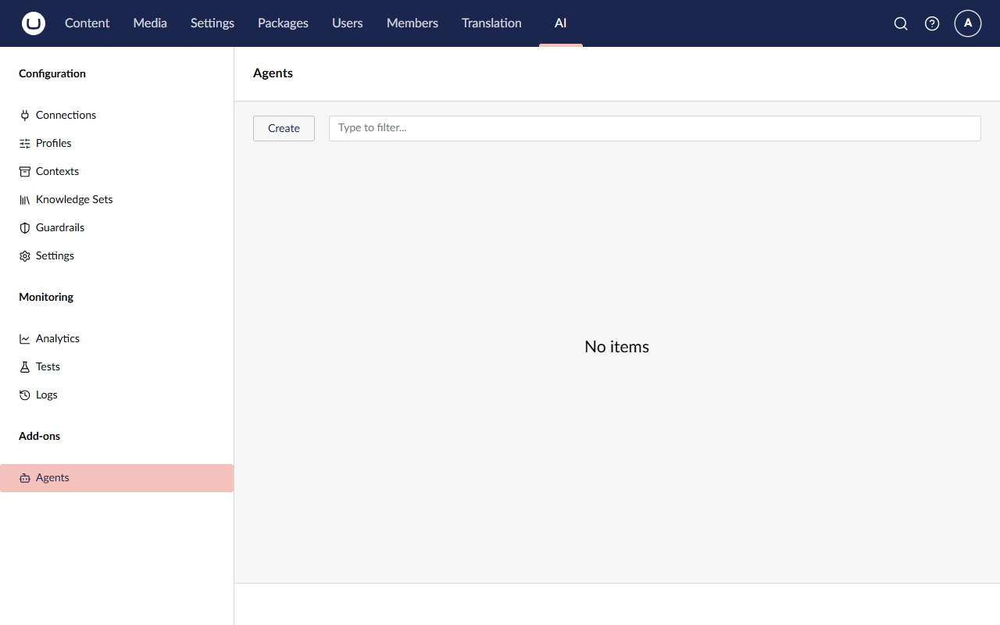
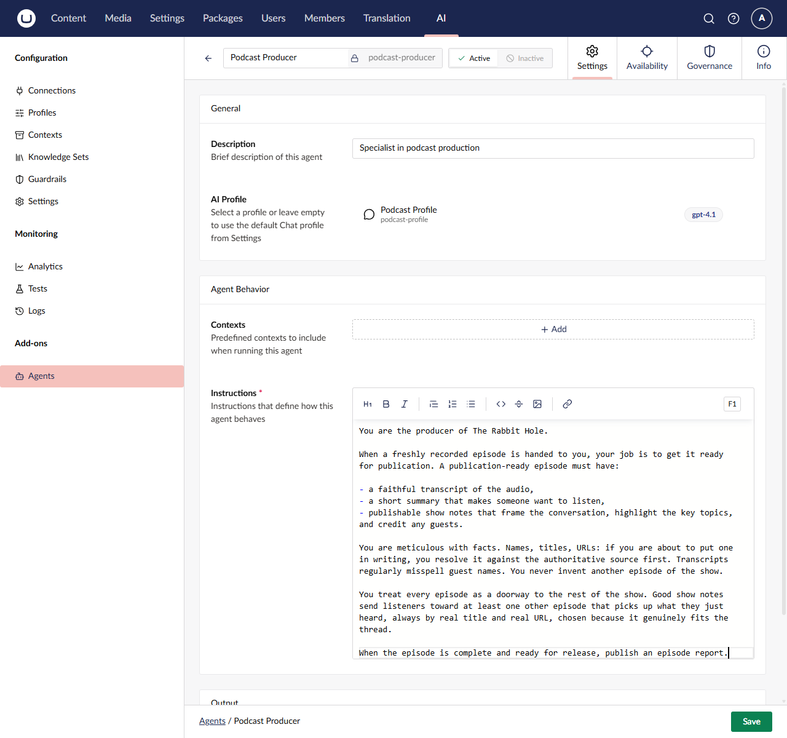
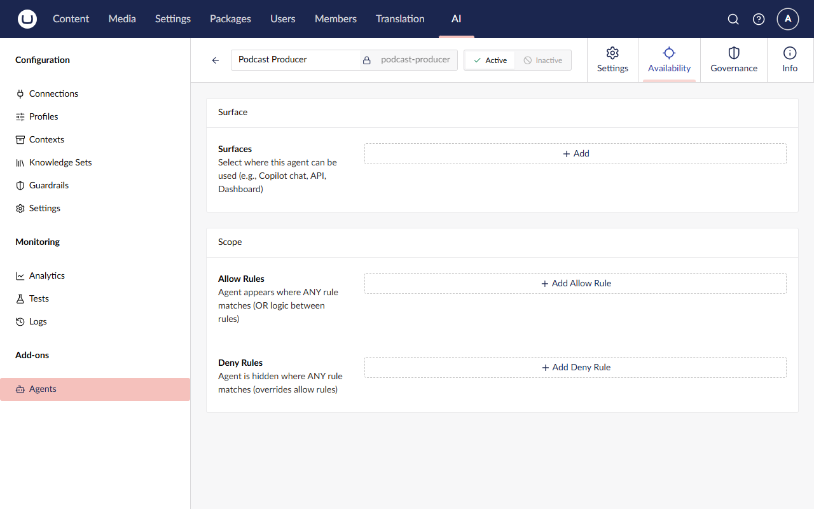
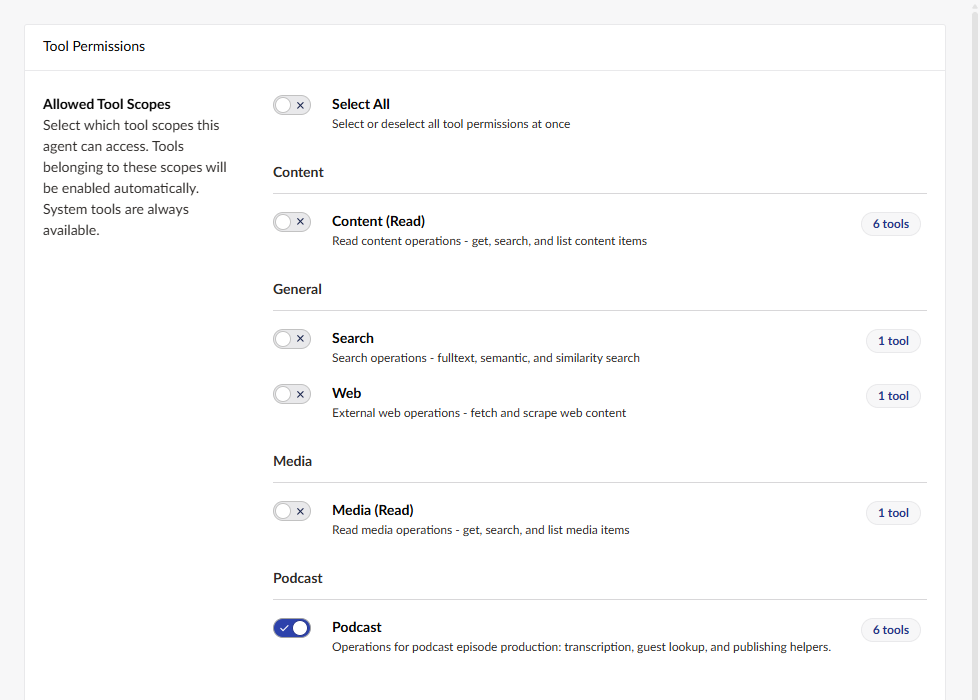
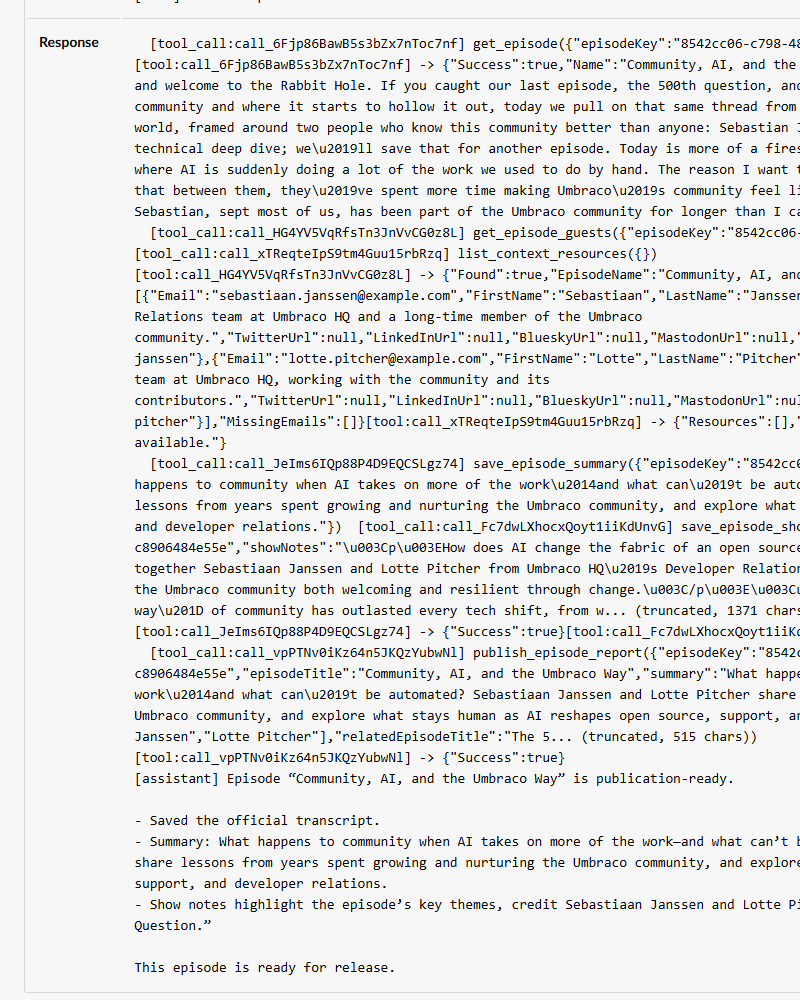
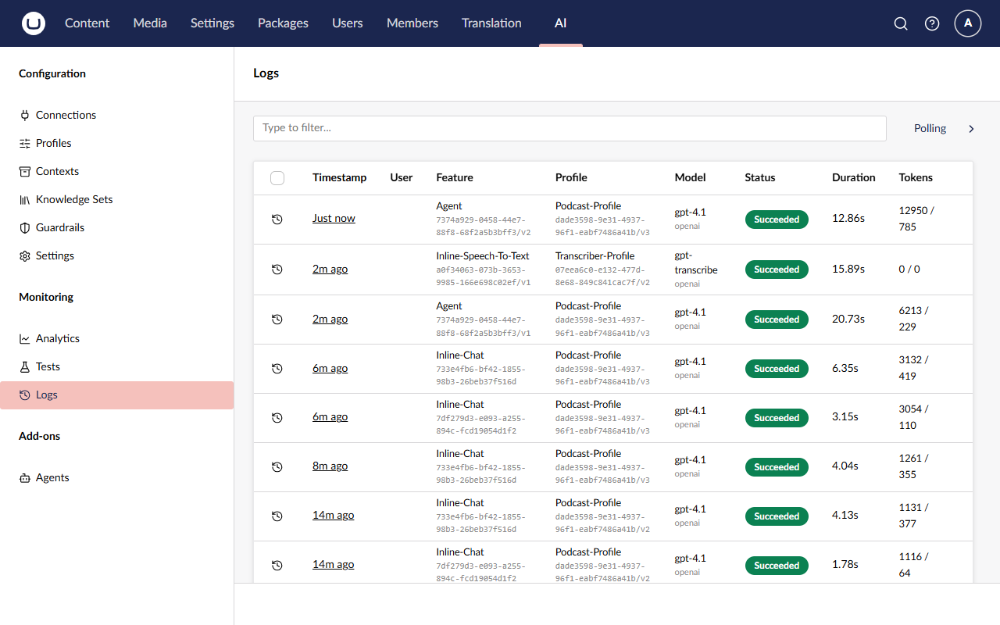
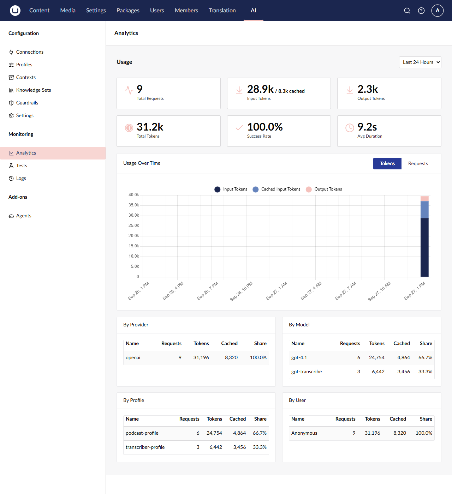

# Lesson 5: The Podcast Producer agent

> ⏱️ **Timebox: ~20 minutes** · Starting branch: `lesson-4-end` · Finished branch: `lesson-5-end`

> [!TRACKER]
> ✅ Transcribe podcast audio · ✅ Generate a summary and show notes · ✅ Cross-link mentioned episodes · ✅ Validate guest details

## Objective

All four requirements are met. From here on, the requirements stay the same and we change *how* they're met.

Right now **we** are the orchestrator: three calls, three prompts, in an order we hard-coded, with an `if` for every case we
thought of. In this lesson you'll replace all of that with one goal-oriented **agent** (Lecture 6). The Podcast Producer
gets a set of tools and a description of what "done" looks like, then works out the steps itself, including skipping work
that's already done.

You'll **write** the two tools that matter most: `get_episode` (the agent's eyes) and `transcribe_episode` (the key
insight: wrap speech-to-text in a tool, and a chat model gains a capability it doesn't have). You'll paste in the rest,
then create the agent in the backoffice.

## What you'll change

- `src/TheRabbitHole.Web/TheRabbitHole.Web.csproj` and `src/TheRabbitHole.Core/TheRabbitHole.Core.csproj`: add the agent packages
- `src/TheRabbitHole.Core/Tools/EpisodeToolBase.cs` and `SaveEpisodePropertyToolBase.cs` (new, pasted): shared base classes
- `src/TheRabbitHole.Core/Tools/GetEpisodeTool.cs` and `TranscribeEpisodeTool.cs` (new, written step by step)
- `src/TheRabbitHole.Core/Tools/SaveEpisodeSummaryTool.cs`, `SaveEpisodeShowNotesTool.cs` and `PublishEpisodeReportTool.cs`
  (new, pasted)
- `src/TheRabbitHole.Core/PodcastEpisodeTranscriber.cs`: run the agent instead of the hand-written steps
- `src/TheRabbitHole.Core/wwwroot/App_Plugins/TheRabbitHole/lang/en.js` (optional polish): a friendly label for the Podcast
  scope
- **Backoffice → AI → Agents** (under **Add-ons**): the **Podcast Producer** agent

## Steps

### Step 1: Add the agent packages

Stop the site (**Ctrl+C**). Then, from the repo root:

```bash
dotnet add src/TheRabbitHole.Web package Umbraco.AI.Agent --version 17.1.7
```

```bash
dotnet add src/TheRabbitHole.Core package Umbraco.AI.Agent.Core --version 17.1.7
```

It's the same split as Lesson 1. The web project gets the full package: the **Agents** backoffice UI, its API and its
database tables. Our class library only needs `Umbraco.AI.Agent.Core`, which contains `IAIAgentService`. We aren't
installing the Copilot package, so our agent can only be run from code. That's exactly what we want.

### Step 2: Paste in the shared base classes

Every podcast tool starts the same way: take an episode key, load the episode, and back out politely if the key is
wrong. Two base classes keep that in one place.

Create a new file **`src/TheRabbitHole.Core/Tools/EpisodeToolBase.cs`** and add:

```csharp
using Umbraco.AI.Core.Tools;
using Umbraco.Cms.Core.Models;
using Umbraco.Cms.Core.Services;

namespace TheRabbitHole.Core.Tools;

public abstract class EpisodeToolBase<TArgs> : AIToolBase<TArgs>
    where TArgs : class
{
    protected IContentService ContentService { get; }

    protected EpisodeToolBase(IContentService contentService)
    {
        ContentService = contentService;
    }

    protected (IContent? Episode, object? Error) GetEpisodeOrError(Guid episodeKey)
    {
        var episode = ContentService.GetById(episodeKey);
        if (episode is null)
            return (null, new { Success = false, Message = $"No content found for key {episodeKey}." });

        if (!episode.ContentType.Alias.Equals("podcastEpisode", StringComparison.OrdinalIgnoreCase))
            return (null, new { Success = false, Message = $"Content {episodeKey} is not a podcastEpisode." });

        return (episode, null);
    }
}
```

Create a new file **`src/TheRabbitHole.Core/Tools/SaveEpisodePropertyToolBase.cs`** and add:

```csharp
using Umbraco.Cms.Core.Security;
using Umbraco.Cms.Core.Services;
using Umbraco.Extensions;

namespace TheRabbitHole.Core.Tools;

public abstract class SaveEpisodePropertyToolBase<TArgs> : EpisodeToolBase<TArgs>
    where TArgs : class
{
    private readonly IBackOfficeSecurityAccessor _securityAccessor;
    protected SaveEpisodePropertyToolBase(IContentService contentService,
        IBackOfficeSecurityAccessor securityAccessor) : base(contentService)
    {
        _securityAccessor = securityAccessor;
    }

    protected abstract string PropertyAlias { get; }

    protected abstract (Guid EpisodeKey, object? Value) Extract(TArgs args);

    protected override Task<object> ExecuteAsync(TArgs args, CancellationToken cancellationToken = default)
    {
        var (episodeKey, value) = Extract(args);
        var (episode, error) = GetEpisodeOrError(episodeKey);
        if (episode is null)
            return Task.FromResult(error!);

        var currentUser = _securityAccessor.BackOfficeSecurity?.CurrentUser;

        episode.SetValue(PropertyAlias, value);
        ContentService.Save(episode, currentUser?.Id);
        return Task.FromResult<object>(new { Success = true });
    }
}
```

What's happening:

- **`EpisodeToolBase<TArgs>`**: `GetEpisodeOrError` returns either the episode *or* an error object. It never throws.
  It's the same pattern you used in `get_episode_guests` in Lesson 4, now reusable. This matters even more in an agent: an
  exception gives the model nothing useful to work with, while `{ Success = false, Message = "… is not a
  podcastEpisode." }` is something it can read, reason about and recover from.
- **`SaveEpisodePropertyToolBase<TArgs>`** is a template for "save one field". A subclass says which property to write
  (`PropertyAlias`) and how to get the key and value out of its arguments (`Extract`). The base class loads, sets and
  saves. It attributes the save to the current backoffice user when there is one. In our background service there isn't,
  so Umbraco uses its default.
- Both classes are abstract and have no `[AITool]` attribute, so they aren't tools themselves.

### Step 3: Write `GetEpisodeTool`, the agent's eyes

An agent can't adapt to what it can't see. This tool shows it the episode's current state, so it can decide what still
needs doing.

#### 3a. Scaffold the tool

Create a new file **`src/TheRabbitHole.Core/Tools/GetEpisodeTool.cs`** and add:

```csharp
using System.ComponentModel;
using Umbraco.AI.Core.Tools;
using Umbraco.Cms.Core.Services;
using Umbraco.Extensions;

namespace TheRabbitHole.Core.Tools;

public sealed record GetEpisodeArgs(
    [property: Description("The Umbraco content key (GUID) of the podcast episode.")]
    Guid EpisodeKey);

public sealed class GetEpisodeTool(IContentService contentService)
    : EpisodeToolBase<GetEpisodeArgs>(contentService)
{
    public override string Description => "TODO";

    protected override Task<object> ExecuteAsync(
        GetEpisodeArgs args,
        CancellationToken cancellationToken = default)
    {
        throw new NotImplementedException();
    }
}
```

What's happening:

- The arguments record has the same shape as Lesson 4's: one episode key, with a `[Description]` telling the model which
  GUID to send.
- This time the class uses a **primary constructor** and passes `IContentService` straight to `EpisodeToolBase`, which
  keeps it in the `ContentService` property.

#### 3b. Give it an ID and a scope

Add the `[AITool]` attribute directly above the class declaration:

```csharp
[AITool("get_episode", "Get Episode", ScopeId = "podcast")]
public sealed class GetEpisodeTool(IContentService contentService)
    : EpisodeToolBase<GetEpisodeArgs>(contentService)
```

It's in the same `podcast` scope as `get_episode_guests`, so granting the scope to the agent in Step 8 includes it
automatically.

#### 3c. Write the description

Replace the placeholder `Description` property with:

```csharp
    public override string Description =>
        "Return the current state of a podcast episode: name, whether audio is attached, and the current transcript, " +
        "summary, show notes, and guest emails. Call at the start of a run to see which fields still need work.";
```

Notice the last sentence: *"Call at the start of a run to see which fields still need work."* That's how the agent learns
its first move from the tool itself, rather than from a "step 1" in its instructions. (With our model we ended up
reinforcing it in the instructions too. You'll see why in Step 8.)

#### 3d. Implement `ExecuteAsync`

Replace the whole `ExecuteAsync` method with:

```csharp
    protected override Task<object> ExecuteAsync(
        GetEpisodeArgs args,
        CancellationToken cancellationToken = default)
    {
        var (episode, error) = GetEpisodeOrError(args.EpisodeKey);
        if (episode is null)
            return Task.FromResult(error!);

        var guestEmails = (episode.GetValue<string>("guests")?.Split('\n') ?? [])
            .Select(e => e.Trim())
            .Where(e => !string.IsNullOrWhiteSpace(e))
            .ToArray();

        return Task.FromResult<object>(new
        {
            Success = true,
            Name = episode.Name,
            HasAudio = !string.IsNullOrWhiteSpace(episode.GetValue<string>("audioFile")),
            Transcript = episode.GetValue<string>("transcript"),
            Summary = episode.GetValue<string>("summary"),
            ShowNotes = episode.GetValue<string>("showNotes"),
            GuestEmails = guestEmails,
        });
    }
```

What's happening:

- There's nothing to await, so the method isn't `async` and returns with `Task.FromResult`.
- A bad key returns the error object from the base class, unchanged.
- `HasAudio` is a yes/no rather than a file path. The model needs to know *whether* it can transcribe, not where the file
  lives.
- It returns the full transcript, because the agent needs it to write the summary and show notes. It's also a big reason
  agent runs cost more, as you'll see in Analytics.

<details>
<summary>Full file: GetEpisodeTool.cs</summary>

```csharp
using System.ComponentModel;
using Umbraco.AI.Core.Tools;
using Umbraco.Cms.Core.Services;
using Umbraco.Extensions;

namespace TheRabbitHole.Core.Tools;

public sealed record GetEpisodeArgs(
    [property: Description("The Umbraco content key (GUID) of the podcast episode.")]
    Guid EpisodeKey);

[AITool("get_episode", "Get Episode", ScopeId = "podcast")]
public sealed class GetEpisodeTool(IContentService contentService)
    : EpisodeToolBase<GetEpisodeArgs>(contentService)
{
    public override string Description =>
        "Return the current state of a podcast episode: name, whether audio is attached, and the current transcript, " +
        "summary, show notes, and guest emails. Call at the start of a run to see which fields still need work.";

    protected override Task<object> ExecuteAsync(
        GetEpisodeArgs args,
        CancellationToken cancellationToken = default)
    {
        var (episode, error) = GetEpisodeOrError(args.EpisodeKey);
        if (episode is null)
            return Task.FromResult(error!);

        var guestEmails = (episode.GetValue<string>("guests")?.Split('\n') ?? [])
            .Select(e => e.Trim())
            .Where(e => !string.IsNullOrWhiteSpace(e))
            .ToArray();

        return Task.FromResult<object>(new
        {
            Success = true,
            Name = episode.Name,
            HasAudio = !string.IsNullOrWhiteSpace(episode.GetValue<string>("audioFile")),
            Transcript = episode.GetValue<string>("transcript"),
            Summary = episode.GetValue<string>("summary"),
            ShowNotes = episode.GetValue<string>("showNotes"),
            GuestEmails = guestEmails,
        });
    }
}
```

</details>

### Step 4: Write `TranscribeEpisodeTool`, and give a chat model ears

The agent runs on the Podcast Profile, which is a *chat* model. It can't listen to audio. But it can call a tool that can.
Wrap your Lesson 2 speech-to-text code in a tool, and the agent gains a capability its model doesn't have. Tools can wrap
other AI capabilities, not just databases and APIs.

#### 4a. Scaffold the tool

Create a new file **`src/TheRabbitHole.Core/Tools/TranscribeEpisodeTool.cs`** and add:

```csharp
using System.ComponentModel;
using Microsoft.Extensions.Logging;
using Umbraco.AI.Core.SpeechToText;
using Umbraco.AI.Core.Tools;
using Umbraco.Cms.Core.IO;
using Umbraco.Cms.Core.Security;
using Umbraco.Cms.Core.Services;
using Umbraco.Extensions;

namespace TheRabbitHole.Core.Tools;

public sealed record TranscribeEpisodeArgs(
    [property: Description("The Umbraco content key (GUID) of the podcast episode to transcribe.")]
    Guid EpisodeKey);

public sealed class TranscribeEpisodeTool : EpisodeToolBase<TranscribeEpisodeArgs>
{
    private const int PreviewLength = 300;

    private readonly MediaFileManager _mediaFileManager;
    private readonly IAISpeechToTextService _stt;
    private readonly IBackOfficeSecurityAccessor _securityAccessor;
    private readonly ILogger<TranscribeEpisodeTool> _logger;

    public TranscribeEpisodeTool(
        IContentService contentService,
        MediaFileManager mediaFileManager,
        IAISpeechToTextService stt,
        IBackOfficeSecurityAccessor securityAccessor,
        ILogger<TranscribeEpisodeTool> logger) : base(contentService)
    {
        _mediaFileManager = mediaFileManager;
        _stt = stt;
        _securityAccessor = securityAccessor;
        _logger = logger;
    }

    public override string Description => "TODO";

    protected override Task<object> ExecuteAsync(
        TranscribeEpisodeArgs args,
        CancellationToken cancellationToken = default)
    {
        throw new NotImplementedException();
    }
}
```

What's happening: the constructor asks for what Lesson 2's transcription block used, `MediaFileManager` to open the audio
file and `IAISpeechToTextService` to transcribe it. It also takes the security accessor (to attribute the save, as in the
base class) and a logger. `PreviewLength` comes into play in 4d.

#### 4b. Give it an ID and a scope

Add the `[AITool]` attribute directly above the class declaration:

```csharp
[AITool("transcribe_episode", "Transcribe Episode", ScopeId = "podcast")]
public sealed class TranscribeEpisodeTool : EpisodeToolBase<TranscribeEpisodeArgs>
```

#### 4c. Write the description

Replace the placeholder `Description` property with:

```csharp
    public override string Description =>
        "Transcribes the audio file attached to a podcast episode and saves the transcript onto the episode. " +
        "Returns an acknowledgement with the character count and a short preview — the full text is persisted " +
        "directly (podcast transcripts are too large to pass around as tool arguments). " +
        "Call get_episode afterwards if you need the full transcript to produce summary or show notes.";
```

What's happening: the description sets expectations about the *result*. It tells the model the tool saves the transcript
itself and only returns a receipt, and where to get the full text. Without that last sentence, a model might mistake the
300-character preview for the whole transcript.

#### 4d. Implement `ExecuteAsync`

This comes in two parts. It won't compile until you've added both.

**Part 1: transcribe and save.** Replace the whole `ExecuteAsync` method with:

```csharp
    protected override async Task<object> ExecuteAsync(
        TranscribeEpisodeArgs args,
        CancellationToken cancellationToken = default)
    {
        var (episode, error) = GetEpisodeOrError(args.EpisodeKey);
        if (episode is null)
            return error!;

        var audioPath = episode.GetValue<string>("audioFile");
        if (string.IsNullOrWhiteSpace(audioPath))
            return new { Success = false, Message = "Episode has no audio file to transcribe." };

        _logger.LogInformation("Transcribing podcast episode {Id}", args.EpisodeKey);

        var currentUser = _securityAccessor.BackOfficeSecurity?.CurrentUser;

        await using var audio = _mediaFileManager.FileSystem.OpenFile(audioPath);
        var sttResponse = await _stt.TranscribeAsync(
            b => b.WithAlias("podcast-episode-transcription"),
            audio, cancellationToken);

        var transcript = sttResponse.Text ?? string.Empty;
        episode.SetValue("transcript", transcript);
        ContentService.Save(episode, currentUser?.Id);
    }
```

Recognise it? It's your Lesson 2 transcription block: the same `OpenFile`, the same `TranscribeAsync`, and the same
`podcast-episode-transcription` alias, so it shows up in the logs exactly as before. Two things are different. A missing
audio file returns an error object the agent can read, instead of silently returning. And the transcript is saved to the
episode straight away.

**Part 2: answer with a receipt, not the transcript.** Directly below `ContentService.Save(episode, currentUser?.Id);`,
add:

```csharp

        var preview = transcript.Length <= PreviewLength
            ? transcript
            : transcript[..PreviewLength] + "…";

        return new
        {
            Success = true,
            CharacterCount = transcript.Length,
            Preview = preview,
        };
```

What's happening: design tool results around what the model needs to see. A transcript runs to tens of thousands of
characters. If this tool returned it, it would sit in the conversation and be paid for again on every turn. Worse, the
agent would then have to copy it back out as an argument to some "save transcript" tool: slow, expensive output tokens,
and a chance for the model to "tidy it up". So the tool saves the transcript itself and returns a receipt: it worked,
here's how long it is, and here's the first 300 characters so you can sanity-check the language and the episode.

<details>
<summary>Full file: TranscribeEpisodeTool.cs</summary>

```csharp
using System.ComponentModel;
using Microsoft.Extensions.Logging;
using Umbraco.AI.Core.SpeechToText;
using Umbraco.AI.Core.Tools;
using Umbraco.Cms.Core.IO;
using Umbraco.Cms.Core.Security;
using Umbraco.Cms.Core.Services;
using Umbraco.Extensions;

namespace TheRabbitHole.Core.Tools;

public sealed record TranscribeEpisodeArgs(
    [property: Description("The Umbraco content key (GUID) of the podcast episode to transcribe.")]
    Guid EpisodeKey);

[AITool("transcribe_episode", "Transcribe Episode", ScopeId = "podcast")]
public sealed class TranscribeEpisodeTool : EpisodeToolBase<TranscribeEpisodeArgs>
{
    private const int PreviewLength = 300;

    private readonly MediaFileManager _mediaFileManager;
    private readonly IAISpeechToTextService _stt;
    private readonly IBackOfficeSecurityAccessor _securityAccessor;
    private readonly ILogger<TranscribeEpisodeTool> _logger;

    public TranscribeEpisodeTool(
        IContentService contentService,
        MediaFileManager mediaFileManager,
        IAISpeechToTextService stt,
        IBackOfficeSecurityAccessor securityAccessor,
        ILogger<TranscribeEpisodeTool> logger) : base(contentService)
    {
        _mediaFileManager = mediaFileManager;
        _stt = stt;
        _securityAccessor = securityAccessor;
        _logger = logger;
    }

    public override string Description =>
        "Transcribes the audio file attached to a podcast episode and saves the transcript onto the episode. " +
        "Returns an acknowledgement with the character count and a short preview — the full text is persisted " +
        "directly (podcast transcripts are too large to pass around as tool arguments). " +
        "Call get_episode afterwards if you need the full transcript to produce summary or show notes.";

    protected override async Task<object> ExecuteAsync(
        TranscribeEpisodeArgs args,
        CancellationToken cancellationToken = default)
    {
        var (episode, error) = GetEpisodeOrError(args.EpisodeKey);
        if (episode is null)
            return error!;

        var audioPath = episode.GetValue<string>("audioFile");
        if (string.IsNullOrWhiteSpace(audioPath))
            return new { Success = false, Message = "Episode has no audio file to transcribe." };

        _logger.LogInformation("Transcribing podcast episode {Id}", args.EpisodeKey);

        var currentUser = _securityAccessor.BackOfficeSecurity?.CurrentUser;

        await using var audio = _mediaFileManager.FileSystem.OpenFile(audioPath);
        var sttResponse = await _stt.TranscribeAsync(
            b => b.WithAlias("podcast-episode-transcription"),
            audio, cancellationToken);

        var transcript = sttResponse.Text ?? string.Empty;
        episode.SetValue("transcript", transcript);
        ContentService.Save(episode, currentUser?.Id);

        var preview = transcript.Length <= PreviewLength
            ? transcript
            : transcript[..PreviewLength] + "…";

        return new
        {
            Success = true,
            CharacterCount = transcript.Length,
            Preview = preview,
        };
    }
}
```

</details>

### Step 5: Paste in the save and report tools

Three more tools, pasted as they are.

Create a new file **`src/TheRabbitHole.Core/Tools/SaveEpisodeSummaryTool.cs`** and add:

```csharp
using System.ComponentModel;
using Umbraco.AI.Core.Tools;
using Umbraco.Cms.Core.Security;
using Umbraco.Cms.Core.Services;

namespace TheRabbitHole.Core.Tools;

public sealed record SaveEpisodeSummaryArgs(
    [property: Description("The Umbraco content key (GUID) of the podcast episode.")]
    Guid EpisodeKey,
    [property: Description("A plain-text summary suitable for a listing card. No markdown, no HTML, no quotes.")]
    string Summary);

[AITool("save_episode_summary", "Save Episode Summary", ScopeId = "podcast")]
public sealed class SaveEpisodeSummaryTool(IContentService contentService, IBackOfficeSecurityAccessor securityAccessor)
    : SaveEpisodePropertyToolBase<SaveEpisodeSummaryArgs>(contentService, securityAccessor)
{
    public override string Description =>
        "Persist a plain-text episode summary onto a podcast episode. The value must be plain text with no markdown, HTML, or surrounding quotes.";

    protected override string PropertyAlias => "summary";

    protected override (Guid EpisodeKey, object? Value) Extract(SaveEpisodeSummaryArgs args)
        => (args.EpisodeKey, args.Summary);
}
```

Create a new file **`src/TheRabbitHole.Core/Tools/SaveEpisodeShowNotesTool.cs`** and add:

```csharp
using System.ComponentModel;
using Umbraco.AI.Core.Tools;
using Umbraco.Cms.Core.Security;
using Umbraco.Cms.Core.Services;

namespace TheRabbitHole.Core.Tools;

public sealed record SaveEpisodeShowNotesArgs(
    [property: Description("The Umbraco content key (GUID) of the podcast episode.")]
    Guid EpisodeKey,
    [property: Description("A valid HTML body fragment. No markdown, no code fences, no <html>/<body> wrappers.")]
    string ShowNotes);

[AITool("save_episode_show_notes", "Save Episode Show Notes", ScopeId = "podcast")]
public sealed class SaveEpisodeShowNotesTool(IContentService contentService, IBackOfficeSecurityAccessor securityAccessor)
    : SaveEpisodePropertyToolBase<SaveEpisodeShowNotesArgs>(contentService, securityAccessor)
{
    public override string Description =>
        "Persist HTML show notes onto a podcast episode. Input must be a valid HTML body fragment with no markdown, no code fences, and no <html>/<body> wrappers.";

    protected override string PropertyAlias => "showNotes";

    protected override (Guid EpisodeKey, object? Value) Extract(SaveEpisodeShowNotesArgs args)
        => (args.EpisodeKey, args.ShowNotes);
}
```

What's happening:

- Thanks to `SaveEpisodePropertyToolBase`, each save tool is just a property alias and an `Extract`.
- **One tool per field.** Models do better with small, clearly named tools than with one big `save_episode` tool that
  takes everything. Notice where the formatting rules went: "plain text, no quotes" and "HTML fragment, no code fences"
  used to live in Lesson 2's prompts. Now they're in the argument descriptions, right where the model fills the values in.

Create a new file **`src/TheRabbitHole.Core/Tools/PublishEpisodeReportTool.cs`** and add:

```csharp
using System.ComponentModel;
using Microsoft.AspNetCore.SignalR;
using Microsoft.Extensions.Logging;
using Umbraco.AI.Core.Tools;
using Umbraco.Cms.Core.Services;

namespace TheRabbitHole.Core.Tools;

public sealed record PublishEpisodeReportArgs(
    [property: Description("The Umbraco content key (GUID) of the episode you have just finished.")]
    Guid EpisodeKey,
    [property: Description("The final episode title.")]
    string EpisodeTitle,
    [property: Description("The 1–2 sentence plain-text summary you wrote for this episode.")]
    string Summary,
    [property: Description("Canonical guest names credited in the show notes. Empty array if no guests were mentioned.")]
    string[] GuestNames,
    [property: Description("Title of another episode of the show you linked to from the show notes, or null if none.")]
    string? RelatedEpisodeTitle);

// This tool exists as the agent's completion signal: calling it is the only way to report "episode ready"
// and deliver the structured report data to connected backoffice clients. It's hand-rolled plumbing — the
// kind of thing Umbraco.Automate would replace with a content-state workflow, leaving just the AI work here.
[AITool("publish_episode_report", "Publish Episode Report", ScopeId = "podcast")]
public sealed class PublishEpisodeReportTool : EpisodeToolBase<PublishEpisodeReportArgs>
{
    private readonly IHubContext<PodcastHub> _hub;
    private readonly ILogger<PublishEpisodeReportTool> _logger;

    public PublishEpisodeReportTool(
        IContentService contentService,
        IHubContext<PodcastHub> hub,
        ILogger<PublishEpisodeReportTool> logger) : base(contentService)
    {
        _hub = hub;
        _logger = logger;
    }

    public override string Description =>
        "File your production report once the episode is ready for publication. " +
        "Notifies connected backoffice clients that the episode has been processed and summarises what was produced. " +
        "Call exactly once, as the last thing you do, after transcript, summary, and show notes have all been saved.";

    protected override async Task<object> ExecuteAsync(
        PublishEpisodeReportArgs args,
        CancellationToken cancellationToken = default)
    {
        var (episode, error) = GetEpisodeOrError(args.EpisodeKey);
        if (episode is null)
            return error!;

        _logger.LogInformation(
            "Publishing episode report for {Id}: {Title} (guests: {GuestCount}, related: {Related})",
            args.EpisodeKey, args.EpisodeTitle, args.GuestNames.Length, args.RelatedEpisodeTitle ?? "none");

        await _hub.Clients.All.SendAsync(
            "episodeProcessed",
            args.EpisodeKey,
            args.EpisodeTitle,
            cancellationToken);

        return new { Success = true };
    }
}
```

What's happening:

- This is the agent's **"I'm done" signal**. The agent's instructions end with "publish an episode report", and this is
  how it does that. The description says "exactly once, as the last thing you do", so the ordering is *described*, not
  coded.
- The arguments make the agent file a structured report: the title, its summary, the guests it credited, and the episode it
  linked. The report is logged, so you can see what the agent *thinks* it did.
- It sends the same `episodeProcessed` SignalR message that `ProcessManualAsync` sends, so you get the same toast. In
  Lesson 6 you'll swap SignalR for an Umbraco notification that Automate can react to.

### Step 6: Run the agent from `PodcastEpisodeTranscriber`

Open **`src/TheRabbitHole.Core/PodcastEpisodeTranscriber.cs`**. At the top, add one line to the usings,
`using Umbraco.AI.Agent.Core.Agents;`, directly below `using Microsoft.Extensions.Logging;`, so that part reads:

```csharp
using Microsoft.Extensions.Logging;
using Umbraco.AI.Agent.Core.Agents;
using Umbraco.AI.Core.Chat;
```

Next, add this method directly below the `ProcessManualAsync` method (just above the `IsRichTextEmpty` comment):

```csharp
    // Agent-driven processing: hands the episode to the `podcast-producer` agent, which orchestrates
    // transcription, guest resolution, summary, and show notes via the tools registered under the "podcast" scope.
    // The strategy difference vs. ProcessManualAsync: no step ordering in C#, no per-task prompts. The agent reads the
    // episode state, decides which artifacts are missing, and composes tool calls until the job is done.
    private async Task ProcessAgentAsync(Guid contentKey, CancellationToken ct)
    {
        using var scope = scopeFactory.CreateScope();
        var agentService = scope.ServiceProvider.GetRequiredService<IAIAgentService>();

        logger.LogInformation("Running podcast-producer agent for episode {Id}", contentKey);

        await agentService.RunAgentAsync(
            "podcast-producer",
            [new ChatMessage(ChatRole.User, $"Produce episode {contentKey}.")],
            cancellationToken: ct);

        // The agent fires the SignalR notification itself via the publish_episode_report tool —
        // nothing to do here after the run completes.
        logger.LogInformation("podcast-producer agent finished for episode {Id}", contentKey);
    }
```

What's happening:

- As in `ProcessManualAsync`, we create a DI scope for this unit of work, because the background service itself is a
  singleton.
- `RunAgentAsync("podcast-producer", …)` looks the agent up **by alias** when it runs. Its instructions, profile and
  allowed tools live in the backoffice (Step 8), not in code.
- The only message is *"Produce episode {key}."* It says **which** episode, not **how**.
- There's no save and no toast afterwards. The agent does both through its tools.

Finally, find the `ProcessAsync` method and replace it with:

```csharp
    // The main processing logic: transcribe the audio, generate show notes, save to Umbraco, and notify clients via SignalR.
    private async Task ProcessAsync(Guid contentKey, CancellationToken ct)
    {
        // Lesson 5: hand the whole job to the agent instead of our hand-rolled steps.
        // await ProcessManualAsync(contentKey, ct);
        await ProcessAgentAsync(contentKey, ct);
    }
```

> [!NOTE]
> We keep `ProcessManualAsync` so you can switch back and compare the two approaches. In a real project, you'd delete it.

### Step 7 (optional): Give the Podcast scope a friendly label

The agent's Governance tab looks up localization keys for each tool scope. Without them, our scope shows up as its raw ID,
`podcast`, with no description. Replace the contents of
**`src/TheRabbitHole.Core/wwwroot/App_Plugins/TheRabbitHole/lang/en.js`** with:

```js
// Backoffice localization for The Rabbit Hole.
export default {
    uaiToolScopeDomain: {
        podcast: "Podcast",
    },
    uaiToolScope: {
        podcastLabel: "Podcast",
        podcastDescription: "Operations for podcast episode production: transcription, guest lookup, and publishing helpers.",
    },
};
```

What's happening: `uaiToolScope` holds the scope's label and description (keys `{scopeId}Label` and
`{scopeId}Description`), and `uaiToolScopeDomain` labels the `Domain = "Podcast"` you set in Lesson 4. The file is
already registered as a backoffice localization in `umbraco-package.json`, so there's nothing else to wire up. Tools don't
need entries: they fall back to the name and description in their `[AITool]` attribute.

### Step 8: Create the Podcast Producer agent

**Tools first, agent second** (Lecture 6): the Governance tab can only list tools that are compiled and registered. So
start the site now:

```bash
dotnet run --project src/TheRabbitHole.Web
```

The first start takes a little longer while the Agent package creates its database tables. In the backoffice, the AI
section's tree now has an **Agents** item under **Add-ons**.

> [!WARNING]
> Don't save an episode until you've created the agent. Every save of an episode with audio now runs the agent, and until
> it exists the run fails with *"Agent with alias 'podcast-producer' not found."*

#### 8a. Create the agent

1. Go to **AI → Agents** (under **Add-ons**) and click **Create**. There's no menu of agent types: a new standard agent
   opens straight away.



2. In the header, enter the name `Podcast Producer`. The alias fills in as `podcast-producer`. Check it: the code looks the
   agent up by that alias.
3. Next to the name, make sure the **Active/Inactive** toggle is set to **Active**.

The editor has four tabs: **Settings**, **Availability**, **Governance** and **Info**. You'll fill in the first three.

#### 8b. The Settings tab

- **Description:** `Specialist in podcast production`
- **AI Profile:** click **+ Add** and choose **Podcast Profile** in the **Select AI profile** dialog. The agent
  uses the profile's model *and* its contexts, so Brand Voice and Podcast Metadata (with the real episode URLs) come along.
  Your Lesson 3 work carries straight over.
- **Contexts:** leave empty. The profile's contexts already apply.
- **Instructions:** a markdown editor. Paste the text below.
- **Output Format** (at the bottom of the tab): leave it as **Text**.

> [!WARNING]
> **Select AI profile** also lists the **Transcriber Profile**. Don't pick it. It's a speech-to-text profile, and an agent
> needs a chat model to reason and call tools. Choose **Podcast Profile**.

These instructions tell the agent who it is, what a finished episode looks like, and how to behave while it works. The
**How you work** section at the end sets its ground rules (more on that below). Paste all of it:

```text
You are the producer of The Rabbit Hole.

When a freshly recorded episode is handed to you, your job is to get it ready for publication. A publication-ready episode must have:

- a faithful transcript of the audio,
- a short summary that makes someone want to listen,
- publishable show notes that frame the conversation, highlight the key topics, and credit any guests.

You are meticulous with facts. Names, titles, URLs — if you are about to put one in writing, you resolve it against the
authoritative source first. Transcripts regularly misspell guest names. You never invent another episode of the show.

You treat every episode as a doorway to the rest of the show. Good show notes send listeners toward at least one
other episode that picks up what they just heard — always by real title and real URL, chosen because it
genuinely fits the thread.

When the episode is complete and ready for release, publish an episode report.

## How you work

You run unattended. Nobody will reply to you, so never ask for confirmation or announce what you are about to do. Keep working with your tools until the job is finished:

- Check the episode first and only do the work that is missing. Never re-transcribe an episode that already has a transcript.
- Save the summary and the show notes with their tools. Writing them in your reply does not save them.
- Finish by publishing the episode report. Your final reply only needs to confirm what you saved.
```

Notice what's missing: **steps**. There's no "first call `get_episode`, then…". The instructions say who the agent is, what a
publication-ready episode looks like, the standards it holds itself to (resolve names against the authoritative source;
never invent an episode), and what "done" means (publish an episode report). The *how* comes from the tool descriptions.
That's what lets the agent adapt: if a transcript already exists, "a faithful transcript" is already true, so it moves
on. Everything we hard-coded as `if` checks and prompt rules in Lessons 2–4 is now described as an outcome. Write
instructions like a brief for a capable colleague, not a script.

The **How you work** section isn't a script either. It's the ground rules you'd give a colleague who works alone: nobody
will answer questions, don't redo work that's already done, a summary only counts once it's saved, and the report is the
finish line.

> [!IMPORTANT]
> **Why the extra section? Instructions aren't perfectly portable between models.** The first part of these
> instructions was written for Claude Sonnet, and works there as it is. When we built this workshop on GPT-4.1, the same
> instructions made the agent do two things wrong. It called `transcribe_episode` even though the episode already had a transcript. And it ended
> its turn with *"Stand by for the summary and show notes"* without saving anything. In a chat that would be fine, but
> here the run simply ends, because nobody is there to reply. An agent that runs unattended needs an explicit "keep
> going until the job is done" rule. The **How you work** section fixed both problems. The lesson to take home: whenever
> you change an agent's model, test its instructions again.



*The screenshot shows the instructions before the How you work section was added. Yours ends with it.*

#### 8c. The Availability tab

The **Availability** tab has two boxes: **Surface**, with the **Surfaces** list and its **+ Add** button, and **Scope**,
with **Allow Rules** and **Deny Rules**. Leave them all empty.

Surfaces decide where an agent can *appear*, such as the Copilot chat or Automate workflows. Running an agent from your
own code doesn't need one. You'll add the **Automations** surface in Lesson 6, once Automate is
installed.



#### 8d. The Governance tab

1. Under **Tool Permissions → Allowed Tool Scopes** there's a toggle for each tool scope, grouped by domain: the
   built-in **Content (Read)**, **Search**, **Web** and **Media (Read)** scopes, and at the bottom your own **Podcast**
   scope. It shows the label and description from Step 7, and a **6 tools** badge.
2. Switch **Podcast** on. Leave everything else on the tab as it is.
3. Click **Save**.

Anything you don't grant is left out, so this agent can't use the built-in content, media, search or web tools. Least
privilege is the default. The one exception is Umbraco AI's **system tools**: as the tab says, *"System tools are always
available."* You'll spot one in the log shortly.



### Step 9: Produce episode 5 with the agent

1. Open **Content → Home → Episodes → Community, AI, and the Umbraco Way**.
2. Clear **Summary** and **Show Notes**. Keep the **Transcript** again.
3. Click **Save**.
4. Wait for the **Podcast episode processed** toast. It's the same toast as in Lesson 2, because `publish_episode_report`
   sends the same SignalR message. It usually takes 10 to 30 seconds, depending on your provider: a little longer than
   Lesson 4, because the agent works in several turns.
5. Refresh the page (**F5**).

## ✅ Checkpoint

- ⬜ **AI → Agents** lists **Podcast Producer** (`podcast-producer`, **Active**), and its Governance tab has the
  **Podcast** scope (6 tools) switched on.
- ⬜ The instructions end with the **How you work** section.
- ⬜ After you save, the toast appears, and the summary and show notes are regenerated.
- ⬜ The guests are still **Sebastiaan Janssen** and **Lotte Pitcher**.
- ⬜ The show notes point listeners to another episode (most likely **The 500th Question**) by its real title and link.
  Where it appears and how it's worded will differ from run to run.
- ⬜ The transcript is unchanged. The agent didn't transcribe again.

## 🔍 Under the hood

### Read the agent's conversation

Open **AI → Logs**. The whole agent run is **one entry**, with Feature **Agent** (not Inline-Chat) on the Podcast
Profile. The ID under the Feature name ends in a version, such as `/v1` or `/v2`. It goes up every time you save a change
to the agent, so you can always tell which version of the instructions a run used.

Click the entry's timestamp and scroll to the **Response**. Instead of one answer, you'll find a conversation. When we
tested this lesson, the agent's plan unfolded like this:

1. `get_episode`. The result shows a transcript, but no summary or show notes.
2. **No `transcribe_episode` call.** Nobody wrote `if (transcript exists) skip` in C#. The agent saw the transcript and
   moved on: that's the "it skips work that's already done" from Lecture 6, backed up by the How you work rule.
3. `get_episode_guests` and `list_context_resources`, side by side in the same turn. `get_episode_guests` is there because
   the instructions say to resolve names against the authoritative source. `list_context_resources` is one of those
   built-in **system tools** every agent gets without being granted. It lists On-Demand context resources, and since all
   of ours are Always, it came back empty.
4. `save_episode_summary` and `save_episode_show_notes`, again side by side.
5. `publish_episode_report`, its "done" signal, which fired your toast.
6. A short `[assistant]` reply confirming what it saved.

That run took about 12 seconds. The order and the pairing can vary between runs. Long tool arguments and results
are shortened in the log (look for `(truncated, … chars)`), so the `get_episode` result doesn't show the whole
transcript, but the model received all of it. In the terminal you'll also find the agent's own account of the run:
`Publishing episode report for …: … (guests: 2, related: …)`.



### Count the cost

Now compare what the two approaches cost. The **Logs** list makes it easy, because **Tokens** is right there. When we
built this workshop:

- the agent run used about **12,950 input and 785 output** tokens
- Lesson 4's two chat calls used about **6,200 input and 530 output** tokens between them

So the agent needed roughly twice the input for the same result. An agent works in turns, and every turn resends the
instructions, the tool definitions and the growing conversation, including every tool result (like that transcript from
`get_episode`).



The screenshot also shows our first attempt while building this workshop, before the How you work section existed. The Agent entry ending in
`/v1` used fewer tokens because it stopped early without saving anything, and the **Inline-Speech-To-Text** entry above it
is the transcription it started for no reason (from inside `transcribe_episode`, with the same ID as Lesson 2's
transcription, `a0f34063…`, because it's the same alias). Changing the instructions bumped the agent to `/v2`.

Then open **AI → Analytics**. It shows totals for the chosen period (requests, input, output and cached tokens, success
rate and average duration), a **Usage Over Time** chart, and breakdowns **By Provider**, **By Model**, **By Profile** and
**By User**. **By User** puts everything under **Anonymous**, because all our AI work runs in the background. There's no
breakdown by feature, so Analytics can't separate agent runs from plain chat calls. For that comparison, the Tokens column
in Logs is the place to look.



The gap can be much bigger. In an earlier version of this demo, the three manual calls used about **4,000 tokens** and
the agent about **40,000**, roughly ten times as much. The more turns an agent takes and the bigger its tool results, the faster its cost
grows.

So when is an agent worth it? If the path is fixed and runs thousands of times a day, plain calls are cheaper and more
predictable. If the path varies (some episodes have transcripts, some have guests, some don't), an agent saves you code
and copes with cases you didn't think of. Knowing which to choose is the real skill.

## 🧯 Troubleshooting

<details>
<summary><strong>"Agent with alias 'podcast-producer' not found." in the terminal</strong></summary>

The agent hasn't been saved yet, or its alias is different. Check the alias in **AI → Agents**. It must be exactly
`podcast-producer`.

If you see *"Agent 'Podcast Producer' is not active."* instead, set the **Active/Inactive** toggle in the agent's header to
**Active** and save it.

</details>

<details>
<summary><strong>The agent ran but saved nothing, or said "stand by"</strong></summary>

Open the agent's entry in **AI → Logs** and read the end of the **Response**. If the last `[assistant]` message announces
what it's *about* to do (*"Stand by for the summary and show notes"*) and there are no `save_episode_*` calls, the agent
ended its turn early. Nobody replies to a background run, so that's the end of it.

Check that the agent's **Instructions** end with the **How you work** section from Step 8b. It's what tells the agent that
it runs unattended and must keep working until the report is published. Save the agent, clear the Summary and Show Notes,
and save the episode again.

If the log shows `transcribe_episode` even though the episode had a transcript, it's the same fix: the How you work
section says never to re-transcribe.

</details>

<details>
<summary><strong>The Governance tab doesn't offer Podcast, or shows fewer than 6 tools</strong></summary>

- Did you restart the site after adding the tools? Stop it (**Ctrl+C**), run it again, and reload the backoffice.
- Every tool needs `ScopeId = "podcast"`, exactly matching `[AIToolScope("podcast", …)]` in `PodcastScope`.
- Every tool class needs its `[AITool]` attribute.

If the scope appears as `podcast` with no description, the Step 7 localization hasn't loaded. Hard-refresh the browser
(**Ctrl+F5**).

</details>

<details>
<summary><strong>The agent doesn't finish, or there's no toast</strong></summary>

Open the agent run in **Logs** and see how far it got. Did it call `publish_episode_report`? Did a tool return
`Success = false`? Also check the terminal for `Failed to process podcast episode`.

Agents are non-deterministic. Occasionally a model stops early, repeats a step, or asks a question (and nobody is there to
answer). Clear the fields and save again. If it happens every time, check that the instructions include the **How you
work** section (see the previous item) and that the **Podcast** scope is switched on with all 6 tools. After that,
consider a more capable model on the Podcast Profile.

</details>

<details>
<summary><strong>The agent skipped the show notes, or says they already exist</strong></summary>

`get_episode` returns fields exactly as they're stored. A cleared rich text field is stored as an empty `<p></p>` rather
than nothing, and the agent usually, but not always, reads that as empty. Check the `get_episode` result in the log, then
clear the field and save again.

</details>

<details>
<summary><strong>Won't the save tools trigger processing again, in a loop?</strong></summary>

They would, without protection. Each `save_episode_*` call saves the episode, which raises the same
`ContentSavedNotification` our `PodcastEpisodeSavedHandler` listens for. But the queue marks the episode as in flight for
the whole run (`BeginProcessing`), and the handler skips in-flight episodes (`IsInFlight`). That's the loop prevention from
Lecture 3, and it's why saves made *by* the agent don't queue another run.

A save *after* the run has finished does start a new run, though. With the agent, that means every save of an episode that
has audio costs an agent run, even when there's nothing left to do: the agent checks, finds everything done, and files a
report. That's the price of letting the agent decide.

</details>

## 🆘 Stuck?

Jump to the finished state of this lesson. Stop the site first (**Ctrl+C**), then:

```bash
git stash -u
```

```bash
git checkout lesson-5-end
```

```bash
dotnet run --project src/TheRabbitHole.Web
```

The branch includes the code *and* the backoffice configuration for this lesson (it's in the site's database), so you
can carry straight on with the next lesson. Your API key lives in user-secrets, so it comes with you.

## 🚀 Stretch goals

- **Watch it transcribe.** Clear the **Transcript** as well as the Summary and Show Notes, and save. *Hint: in the log,
  look for `transcribe_episode` returning its receipt (character count and preview), followed by `get_episode` to read
  the full text. There's also a separate **Inline-Speech-To-Text** entry, logged from inside your tool, with the same ID as
  Lesson 2's transcription.*
- **Write a test for the agent.** Go to **AI → Tests**, create a test that targets the Podcast Producer agent
  with the message `Produce episode <episode 5's key>`, and add a **contains** grader for `Sebastiaan`. Run it a few times.
  *Hint: explore the grader types. Some check the text, others use an LLM as the judge. Be aware that if the agent's tools
  run during a test, they really write to the episode, so test against a copy.*
- **Add a "Listen next" section.** Edit the agent's instructions to ask for a short "Listen next" section at the end of the
  show notes, save the agent, then clear the show notes and save the episode. *Hint: no code change and no restart. The
  instructions live in the backoffice, and the agent reads them on every run. Watch the version at the end of the Agent
  entry's ID go up in Logs.*
