# Lesson 6: Hand the pipeline to Automate

> ⏱️ **Timebox: ~20 minutes** · Starting branch: `lesson-5-end` · Finished branch: `lesson-6-end`

> [!TRACKER]
> ✅ Transcribe podcast audio · ✅ Generate a summary and show notes · ✅ Cross-link mentioned episodes · ✅ Validate guest details

## Objective

All four requirements are done. This lesson makes the pipeline ready for production. Remember the two worries from
Lecture 7:

- **The queue lives in memory.** If the site restarts mid-episode, the work is gone, with no retry and no record it
  ever happened.
- **Every new reaction means new code.** The "episode ready" toast is hard-coded SignalR. "Also post it to Slack" would
  mean another change and another deploy.

By the end of this lesson, Umbraco Automate owns the orchestration:

- A **Podcast Production** automation runs the Podcast Producer agent when an episode with audio is saved. Trigger
  events go into a database outbox, and every run is recorded step by step.
- Your own **Podcast Episode Produced** trigger turns the agent's report into a building block in the backoffice.
- A **Podcast Notification** automation reacts to it with the built-in **Notify Editor** action. You configure it
  instead of coding it.

## What you'll change

- `src/TheRabbitHole.Web/TheRabbitHole.Web.csproj`: add the `Umbraco.Automate` and `Umbraco.AI.Automate` packages
- `src/TheRabbitHole.Core/TheRabbitHole.Core.csproj`: add the `Umbraco.Automate.Core` package
- `src/TheRabbitHole.Web/appsettings.Development.json`: add the `umbracoAutomateDbDSN` connection string
- New: `src/TheRabbitHole.Core/PodcastEpisodeProducedNotification.cs`
- New: `src/TheRabbitHole.Core/Automate/Triggers/PodcastEpisodeProducedSettings.cs`, `PodcastEpisodeProducedOutput.cs` and
  `PodcastEpisodeProducedTrigger.cs`
- `src/TheRabbitHole.Core/Tools/PublishEpisodeReportTool.cs`: publish a notification instead of calling SignalR
- `src/TheRabbitHole.Core/PodcastEpisodeTranscriber.cs`: switch off the hand-rolled path
- Backoffice: the **Automations** surface on the **Podcast Producer** agent, the **Podcasting Workspace**, and the
  **Podcast Production** and **Podcast Notification** automations

## Steps

### Step 1: Add the Automate packages

Stop the site (**Ctrl+C**). Then add the engine and the AI bridge to the web project:

```bash
dotnet add src/TheRabbitHole.Web package Umbraco.Automate --version 17.4.0
```

```bash
dotnet add src/TheRabbitHole.Web package Umbraco.AI.Automate --version 17.0.0
```

Then add the core types to the class library:

```bash
dotnet add src/TheRabbitHole.Core package Umbraco.Automate.Core --version 17.4.0
```

What's happening:

- `Umbraco.Automate` is the automation engine. It brings the services, the **Automation** section, the Management API
  and the database migrations.
- `Umbraco.AI.Automate` connects Automate to Umbraco AI. It adds the **Run AI Agent** and **Transcribe Audio** actions,
  plus the **Automations** surface that agents can opt in to.
- `Umbraco.Automate.Core` goes in the class library, just like `Umbraco.AI.Core` did in Lesson 1. It has only the base
  classes and attributes you need to write a trigger, with no UI.

### Step 2: Give Automate its own database

In **`src/TheRabbitHole.Web/appsettings.Development.json`**, find the `ConnectionStrings` block and replace it with:

```json
  "ConnectionStrings": {
    "umbracoDbDSN": "Data Source=|DataDirectory|/Umbraco.sqlite.db;Cache=Shared;Foreign Keys=True;Pooling=True",
    "umbracoDbDSN_ProviderName": "Microsoft.Data.Sqlite",
    "umbracoAutomateDbDSN": "Data Source=|DataDirectory|/UmbracoAutomate.sqlite.db;Cache=Shared;Foreign Keys=True;Pooling=True",
    "umbracoAutomateDbDSN_ProviderName": "Microsoft.Data.Sqlite"
  },
```

What's happening:

- Automate keeps its own database: workspaces, automations and their versions, run history, and the **outbox**.
- The outbox is the durable replacement for our in-memory `Channel<Guid>`. A trigger event is written to a database
  table first, and a background worker runs the steps from there. A restart doesn't lose an event that's waiting.
- The docs recommend a dedicated database. Here it's a second SQLite file next to Umbraco's, created by the migrations on
  first start.

### Step 3: Create the domain event

Our report tool will announce "this episode has been produced". In Umbraco, you announce things with a notification.

Create a new file **`src/TheRabbitHole.Core/PodcastEpisodeProducedNotification.cs`** and add:

```csharp
using Umbraco.Cms.Core.Notifications;

namespace TheRabbitHole.Core;

public sealed class PodcastEpisodeProducedNotification(
    Guid episodeKey,
    string episodeTitle,
    string summary,
    string[] guestNames,
    string? relatedEpisodeTitle) : INotification
{
    public Guid EpisodeKey { get; } = episodeKey;
    public string EpisodeTitle { get; } = episodeTitle;
    public string Summary { get; } = summary;
    public string[] GuestNames { get; } = guestNames;
    public string? RelatedEpisodeTitle { get; } = relatedEpisodeTitle;
}
```

What's happening:

- It's a plain Umbraco `INotification`, the same mechanism as the `ContentSavedNotification` our save handler listens
  to. Nothing in it is Automate-specific.
- It carries the report the agent files through `publish_episode_report`: the key, title, summary, guest names and the
  related episode it linked.
- It describes something that happened in *our* domain. Whoever publishes it doesn't need to know who's listening.

### Step 4: Describe the trigger's settings and output

A trigger has two models, just like the context resource type in Lesson 3: **settings** (what someone configures) and
**output** (the data it produces).

Create a new file **`src/TheRabbitHole.Core/Automate/Triggers/PodcastEpisodeProducedSettings.cs`** and add:

```csharp
using Umbraco.Automate.Core.Settings;

namespace TheRabbitHole.Core.Automate.Triggers;

public sealed class PodcastEpisodeProducedSettings
{
    [Field(
        Label = "Only episodes with guests",
        Description = "Only fire when at least one guest was credited in the show notes.",
        EditorUiAlias = "Umb.PropertyEditorUi.Toggle")]
    public bool OnlyWithGuests { get; set; }
}
```

What's happening:

- `[Field]` is Automate's version of `[AIField]` from Lesson 3. Automate builds the settings UI from it, so
  `OnlyWithGuests` becomes a toggle labelled "Only episodes with guests" with no frontend code.
- Every automation that uses this trigger gets its own copy of these settings. One automation can filter while another
  doesn't. You'll apply the filter in Step 5.

Create a new file **`src/TheRabbitHole.Core/Automate/Triggers/PodcastEpisodeProducedOutput.cs`** and add:

```csharp
namespace TheRabbitHole.Core.Automate.Triggers;

public sealed class PodcastEpisodeProducedOutput
{
    public Guid EpisodeKey { get; init; }
    public string EpisodeTitle { get; init; } = string.Empty;

    public int GuestCount { get; init; } = 0;
}
```

What's happening:

- The output is what the trigger hands to the automation's steps. Every public property becomes a **binding**, in
  camelCase: `${ trigger.episodeKey }`, `${ trigger.episodeTitle }` and `${ trigger.guestCount }`.
- Output classes need no attributes. The properties are `init`-only because the output is set once, when the event is
  created.

### Step 5: Write the trigger

Now connect the three pieces. First, the bare minimum.

Create a new file **`src/TheRabbitHole.Core/Automate/Triggers/PodcastEpisodeProducedTrigger.cs`** and add:

```csharp
using Umbraco.Automate.Core.Triggers;

namespace TheRabbitHole.Core.Automate.Triggers;

public sealed class PodcastEpisodeProducedTrigger(TriggerInfrastructure infrastructure)
    : NotificationTriggerBase<PodcastEpisodeProducedSettings, PodcastEpisodeProducedOutput,
        PodcastEpisodeProducedNotification>(infrastructure)
{
    public override IEnumerable<TriggerEvent> MapEvent(PodcastEpisodeProducedNotification notification)
    {
        return [];
    }
}
```

What's happening:

- `NotificationTriggerBase` is the base class for triggers that fire on an Umbraco notification. Its three type
  arguments tie together the files from Steps 3 and 4: settings, output and notification.
- The primary constructor passes `TriggerInfrastructure` (the shared services the base class needs) straight through.
- `MapEvent` is the one method you must implement. For now it produces no events.

> [!WARNING]
> This compiles, but don't run the site yet. The base class reads the trigger's alias and name from a `[Trigger]`
> attribute, and Automate only discovers classes that have one. You'll add it next.

**Add the attribute.** Add this comment and attribute directly above the `public sealed class PodcastEpisodeProducedTrigger`
line:

```csharp
// Custom Umbraco.Automate trigger that fires when the AI production pipeline finishes an episode.
//
// This is a moment no built-in trigger can express: "Content Saved" fires on every save — including
// each intermediate field the podcast-producer agent writes mid-run — while this fires exactly once,
// when transcript, summary and show notes are all done. That's the point of a custom trigger: it
// surfaces *your* domain events in the Automate UI so editors can wire up reactions without code.
//
// No registration needed — Automate discovers [Trigger] classes via the TypeLoader and, because we
// extend NotificationTriggerBase, automatically subscribes to PodcastEpisodeProducedNotification for us.
[Trigger("theRabbitHole.episodeProduced", "Podcast Episode Produced",
    Description = "Fires when the AI production pipeline finishes an episode — transcript, summary and show notes are ready.",
    Group = "Podcast",
    Icon = "icon-mic")]
public sealed class PodcastEpisodeProducedTrigger(TriggerInfrastructure infrastructure)
```

What's happening:

- The first argument is the **alias**. Make it unique and prefix it with your project (the built-ins use
  `umbracoAutomate.*`). Automations store it, so don't rename it later.
- The name, description and icon appear in the **Select Trigger** picker, under the **Podcast** group.
- There's no registration step. Compare it with `PodcastEpisodeSavedHandler`, which needed `AddNotificationAsyncHandler`
  in `UmbracoBuilderExtensions`. Automate finds `[Trigger]` classes at startup, and `NotificationTriggerBase` subscribes to
  the notification for you.

**Map the notification to an event.** Replace the scaffold `MapEvent` method with:

```csharp
    // Maps the domain notification to a trigger event. No idempotency key: the publish_episode_report
    // tool's contract is "call exactly once per production run", so there's no duplicate source to dedupe.
    public override IEnumerable<TriggerEvent> MapEvent(PodcastEpisodeProducedNotification notification)
    {
        yield return new TriggerEvent<PodcastEpisodeProducedOutput>
        {
            TriggerAlias = Alias,
            InitiatorType = TriggerInitiatorType.System,
            InitiatorId = notification.EpisodeKey.ToString(),
            Output = new PodcastEpisodeProducedOutput
            {
                EpisodeKey = notification.EpisodeKey,
                EpisodeTitle = notification.EpisodeTitle,
                GuestCount = notification.GuestNames.Length
            },
        };
    }
```

What's happening:

- One notification becomes one trigger event. The method returns a sequence because some notifications, such as a batch
  save, carry several items.
- `TriggerAlias = Alias` uses the alias from the attribute. `InitiatorType` and `InitiatorId` record who or what started
  the run, and they show up in the run history.
- `Output` fills in the model from Step 4. `GuestCount` comes from the guest names the agent reported.
- Automate writes the event to its outbox and returns straight away, so the agent's tool call never waits for the
  reactions. The runs happen in the background.
- The comment explains the missing `IdempotencyKey`. Built-in content triggers set one so that duplicate notifications
  collapse into one event in the outbox. We don't need one.

**Filter per automation.** Add this method directly below `MapEvent`:

```csharp
    // Applies each automation's own settings to the event — the same event can fire one automation
    // and be filtered out by another.
    protected override bool CanHandle(PodcastEpisodeProducedOutput output, PodcastEpisodeProducedSettings? settings)
        => settings is not { OnlyWithGuests: true } || output.GuestCount > 0;
```

What's happening:

- Automate calls `CanHandle` once for each automation that uses this trigger, passing *that automation's* settings. If
  it returns `false`, that automation doesn't run.
- `settings is not { OnlyWithGuests: true }` is true when there are no settings or the toggle is off, so the automation
  always fires. When the toggle is on, it fires only if the agent credited at least one guest.

<details>
<summary>Full file so far</summary>

```csharp
using Umbraco.Automate.Core.Triggers;

namespace TheRabbitHole.Core.Automate.Triggers;

// Custom Umbraco.Automate trigger that fires when the AI production pipeline finishes an episode.
//
// This is a moment no built-in trigger can express: "Content Saved" fires on every save — including
// each intermediate field the podcast-producer agent writes mid-run — while this fires exactly once,
// when transcript, summary and show notes are all done. That's the point of a custom trigger: it
// surfaces *your* domain events in the Automate UI so editors can wire up reactions without code.
//
// No registration needed — Automate discovers [Trigger] classes via the TypeLoader and, because we
// extend NotificationTriggerBase, automatically subscribes to PodcastEpisodeProducedNotification for us.
[Trigger("theRabbitHole.episodeProduced", "Podcast Episode Produced",
    Description = "Fires when the AI production pipeline finishes an episode — transcript, summary and show notes are ready.",
    Group = "Podcast",
    Icon = "icon-mic")]
public sealed class PodcastEpisodeProducedTrigger(TriggerInfrastructure infrastructure)
    : NotificationTriggerBase<PodcastEpisodeProducedSettings, PodcastEpisodeProducedOutput,
        PodcastEpisodeProducedNotification>(infrastructure)
{
    // Maps the domain notification to a trigger event. No idempotency key: the publish_episode_report
    // tool's contract is "call exactly once per production run", so there's no duplicate source to dedupe.
    public override IEnumerable<TriggerEvent> MapEvent(PodcastEpisodeProducedNotification notification)
    {
        yield return new TriggerEvent<PodcastEpisodeProducedOutput>
        {
            TriggerAlias = Alias,
            InitiatorType = TriggerInitiatorType.System,
            InitiatorId = notification.EpisodeKey.ToString(),
            Output = new PodcastEpisodeProducedOutput
            {
                EpisodeKey = notification.EpisodeKey,
                EpisodeTitle = notification.EpisodeTitle,
                GuestCount = notification.GuestNames.Length
            },
        };
    }

    // Applies each automation's own settings to the event — the same event can fire one automation
    // and be filtered out by another.
    protected override bool CanHandle(PodcastEpisodeProducedOutput output, PodcastEpisodeProducedSettings? settings)
        => settings is not { OnlyWithGuests: true } || output.GuestCount > 0;
}
```

</details>

### Step 6: Announce the event from the report tool

In Lesson 5, `publish_episode_report` pushed a SignalR message itself. Now it announces the domain event, and the
reactions become automations.

In **`src/TheRabbitHole.Core/Tools/PublishEpisodeReportTool.cs`**, replace the `using` lines at the top of the file with
these. The SignalR `using` goes, and `Umbraco.Cms.Core.Events` comes in:

```csharp
using System.ComponentModel;
using Microsoft.Extensions.Logging;
using Umbraco.AI.Core.Tools;
using Umbraco.Cms.Core.Events;
using Umbraco.Cms.Core.Services;
```

Next, replace everything from the `// This tool exists…` comment down to the end of the constructor with:

```csharp
// This tool exists as the agent's completion signal: calling it is the only way to report "episode ready"
// and deliver the structured report data. Rather than pushing a SignalR message itself (Lesson 5), it now
// announces a domain event. The PodcastEpisodeProducedTrigger surfaces that event in Umbraco Automate, so the
// reactions (toasts, emails, Slack…) become automations that editors compose in the UI.
[AITool("publish_episode_report", "Publish Episode Report", ScopeId = "podcast")]
public sealed class PublishEpisodeReportTool : EpisodeToolBase<PublishEpisodeReportArgs>
{
    private readonly IEventAggregator _eventAggregator;
    private readonly ILogger<PublishEpisodeReportTool> _logger;

    public PublishEpisodeReportTool(
        IContentService contentService,
        IEventAggregator eventAggregator,
        ILogger<PublishEpisodeReportTool> logger) : base(contentService)
    {
        _eventAggregator = eventAggregator;
        _logger = logger;
    }
```

Finally, replace the `ExecuteAsync` method with:

```csharp
    protected override async Task<object> ExecuteAsync(
        PublishEpisodeReportArgs args,
        CancellationToken cancellationToken = default)
    {
        var (episode, error) = GetEpisodeOrError(args.EpisodeKey);
        if (episode is null)
            return error!;

        _logger.LogInformation(
            "Publishing episode report for {Id}: {Title} (guests: {GuestCount}, related: {Related})",
            args.EpisodeKey, args.EpisodeTitle, args.GuestNames.Length, args.RelatedEpisodeTitle ?? "none");

        // Announce the domain event. This code no longer knows or cares what the reactions are —
        // that's configured in the Automation section.
        await _eventAggregator.PublishAsync(
            new PodcastEpisodeProducedNotification(
                args.EpisodeKey,
                args.EpisodeTitle,
                args.Summary,
                args.GuestNames,
                args.RelatedEpisodeTitle),
            cancellationToken);

        return new { Success = true };
    }
```

What's happening:

- `IEventAggregator` is Umbraco's notification publisher, the same pipeline `ContentSavedNotification` goes through.
  `PublishAsync` hands our notification to every subscriber, including the one `NotificationTriggerBase` set up for our
  trigger.
- The tool no longer injects `IHubContext<PodcastHub>`. Adding a Slack message or an email is now a backoffice change,
  not a code change.
- Nothing changes for the agent. The tool's name, arguments and description are the same, so the Podcast Producer calls
  it exactly as before.

<details>
<summary>Full file so far</summary>

```csharp
using System.ComponentModel;
using Microsoft.Extensions.Logging;
using Umbraco.AI.Core.Tools;
using Umbraco.Cms.Core.Events;
using Umbraco.Cms.Core.Services;

namespace TheRabbitHole.Core.Tools;

public sealed record PublishEpisodeReportArgs(
    [property: Description("The Umbraco content key (GUID) of the episode you have just finished.")]
    Guid EpisodeKey,
    [property: Description("The final episode title.")]
    string EpisodeTitle,
    [property: Description("The 1–2 sentence plain-text summary you wrote for this episode.")]
    string Summary,
    [property: Description("Canonical guest names credited in the show notes. Empty array if no guests were mentioned.")]
    string[] GuestNames,
    [property: Description("Title of another episode of the show you linked to from the show notes, or null if none.")]
    string? RelatedEpisodeTitle);

// This tool exists as the agent's completion signal: calling it is the only way to report "episode ready"
// and deliver the structured report data. Rather than pushing a SignalR message itself (Lesson 5), it now
// announces a domain event. The PodcastEpisodeProducedTrigger surfaces that event in Umbraco Automate, so the
// reactions (toasts, emails, Slack…) become automations that editors compose in the UI.
[AITool("publish_episode_report", "Publish Episode Report", ScopeId = "podcast")]
public sealed class PublishEpisodeReportTool : EpisodeToolBase<PublishEpisodeReportArgs>
{
    private readonly IEventAggregator _eventAggregator;
    private readonly ILogger<PublishEpisodeReportTool> _logger;

    public PublishEpisodeReportTool(
        IContentService contentService,
        IEventAggregator eventAggregator,
        ILogger<PublishEpisodeReportTool> logger) : base(contentService)
    {
        _eventAggregator = eventAggregator;
        _logger = logger;
    }

    public override string Description =>
        "File your production report once the episode is ready for publication. " +
        "Notifies connected backoffice clients that the episode has been processed and summarises what was produced. " +
        "Call exactly once, as the last thing you do, after transcript, summary, and show notes have all been saved.";

    protected override async Task<object> ExecuteAsync(
        PublishEpisodeReportArgs args,
        CancellationToken cancellationToken = default)
    {
        var (episode, error) = GetEpisodeOrError(args.EpisodeKey);
        if (episode is null)
            return error!;

        _logger.LogInformation(
            "Publishing episode report for {Id}: {Title} (guests: {GuestCount}, related: {Related})",
            args.EpisodeKey, args.EpisodeTitle, args.GuestNames.Length, args.RelatedEpisodeTitle ?? "none");

        // Announce the domain event. This code no longer knows or cares what the reactions are —
        // that's configured in the Automation section.
        await _eventAggregator.PublishAsync(
            new PodcastEpisodeProducedNotification(
                args.EpisodeKey,
                args.EpisodeTitle,
                args.Summary,
                args.GuestNames,
                args.RelatedEpisodeTitle),
            cancellationToken);

        return new { Success = true };
    }
}
```

</details>

### Step 7: Switch off the hand-rolled path

Automate will run the agent from now on. If our queue ran it too, every save would produce the episode twice.

In **`src/TheRabbitHole.Core/PodcastEpisodeTranscriber.cs`**, find the `ProcessAsync` method and replace it with:

```csharp
    // The main processing logic: transcribe the audio, generate show notes, save to Umbraco, and notify clients via SignalR.
    private async Task ProcessAsync(Guid contentKey, CancellationToken ct)
    {
        // Lesson 6: Umbraco Automate now runs the agent (see the "Podcast Production" automation),
        // so this hand-rolled path is switched off. In a real project you'd delete the queue,
        // the save handler and the SignalR hub at this point.
        // await ProcessManualAsync(contentKey, ct);
        // await ProcessAgentAsync(contentKey, ct);
        await Task.CompletedTask;
    }
```

What's happening:

- The save handler still queues episodes and the background service still reads the queue, but `ProcessAsync` now does
  nothing.
- `await Task.CompletedTask;` keeps the method `async` without a compiler warning about a missing `await`.

> [!NOTE]
> In a real project you'd delete `PodcastEpisodeQueue`, `PodcastEpisodeSavedHandler`, `PodcastHub` and the toast script at
> this point. We keep them so the earlier lessons still make sense when you read their branches.

### Step 8: Run the site and find the Automation section

```bash
dotnet run --project src/TheRabbitHole.Web
```

On first start, Automate runs its migrations and creates `umbraco/Data/UmbracoAutomate.sqlite.db`. It also gives the
**Administrators** group access to its section. You'll see it in the terminal: *"The Umbraco Automate section has been
assigned to the Admin group"*.

Open the backoffice (reload it if it was already open) and click the new **Automation** section in the top
navigation. It opens on **Welcome to Umbraco Automate**, with a **Create a Workspace** button.

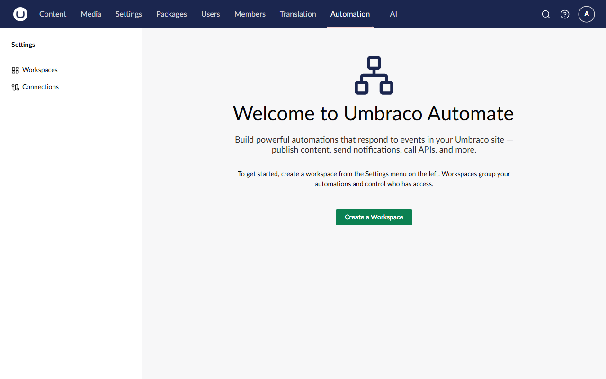

> [!NOTE]
> Logged in as someone who isn't an Administrator? Add the **Automation** section to your user group under **Users → User
> Groups**, save, and reload the page.

### Step 9: Let the agent run in automations

The **Run AI Agent** action only lists agents that have opted in to the **Automations** surface. Surfaces decide where an
agent can appear (Lecture 6). In Lesson 5 we ran the agent from code, which doesn't need a surface.

1. Go to **AI → Agents** (under **Add-ons**) and open **Podcast Producer**.
2. Open the **Availability** tab.
3. Under **Surfaces**, click **+ Add**. In the **Select Surface** dialog, choose **Automations** (*"Make this agent
   available to Umbraco Automate workflows."*) and click **Select**.
4. Click **Save**.

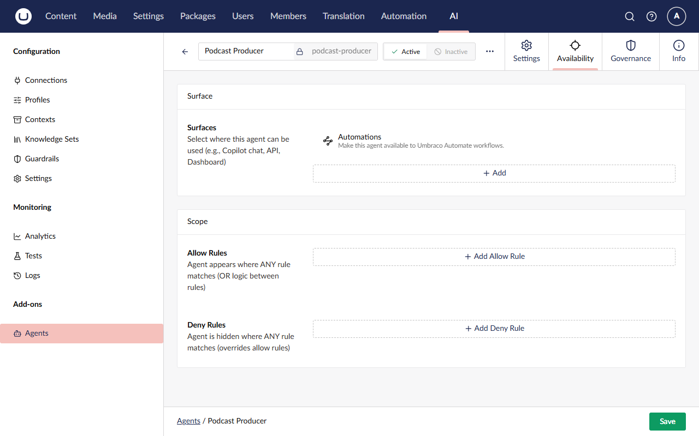

### Step 10: Create the workspace

A **workspace** groups automations and sets the security boundary. Its automations run as the workspace's service account.

1. On the Automation section's welcome screen, click **Create a Workspace**. (As the welcome text says, you can also
   create one from **Workspaces** under **Settings** in the tree.)
2. Name it **Podcasting Workspace**. The alias fills in as `podcasting-workspace`.
3. In the **Membership** box, set:
   - **Service Account Key:** click **Choose** and pick **Administrator** in the user picker.
   - **User Groups:** click **Choose**, select **Administrators**, and click **Choose** again.
   - **Allowed Connections:** leave empty.
4. Click **Save**.

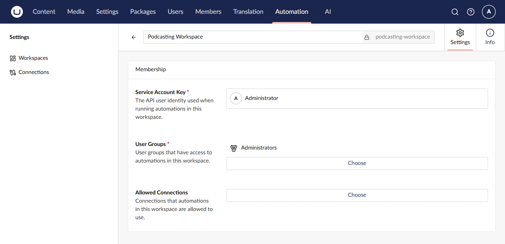

The tree now shows **Automations → Podcasting Workspace**. Click **Automation** in the top navigation again: the
section's front page now has three tabs, **Overview**, **Runs** and **Approvals**, and tells you the workspace is ready.

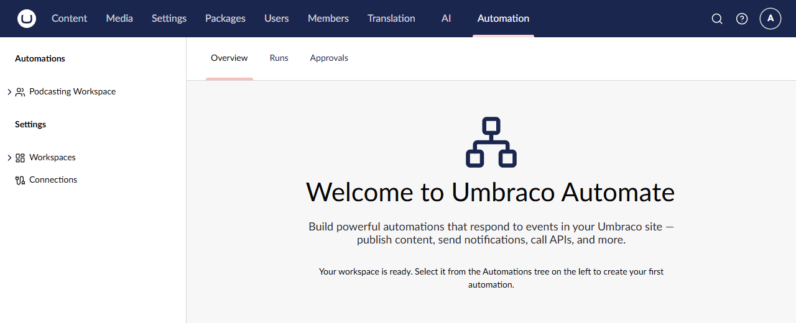

What's happening:

- The **service account** is *"the API user identity used when running automations in this workspace"*, including the
  agent in Run AI Agent. Steps check its section access and permissions. We use the Administrator today; on a real
  project, give it a dedicated user with only the access it needs.
- **User groups** decide who can see, edit and run the workspace's automations.

### Step 11: Build the "Podcast Production" automation

This automation replaces our save handler, queue and `ProcessAgentAsync`: when an episode is saved, get its content and,
if it has audio, run the Podcast Producer.

**Create it.** In the tree, open **Podcasting Workspace** (under **Automations**), click **Create** and choose
**Automation**. (The other option, **Folder…**, is for organising automations.) The designer opens: a name and a
description at the top, **Design** and **Info** tabs, an empty canvas with **+ ADD TRIGGER**, and **Save** and **Save and
publish** buttons. Name it **Podcast Production**. The description is optional; we used *Produce podcast episode content
from the recording*.

**The trigger.** Click **+ ADD TRIGGER** on the canvas. The **Select Trigger** dialog groups the triggers: **AI** (AI
Agent Request, AI Agent Run Completed, AI Agent Run Failed), **Content** (including **Content Saved**), **Core** (Manual
Trigger, Scheduled Trigger, Webhook) and, further down, your own **Podcast** group. Choose **Content Saved**.

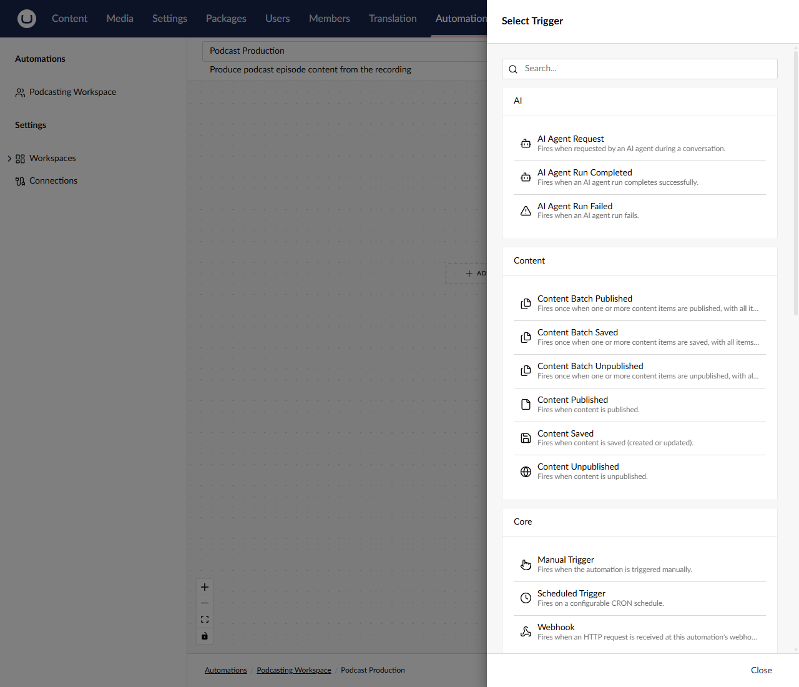

In the **Content Saved** settings:

- **Content Types:** click **Choose** and pick **Podcast Episode**.
- **When triggered by another automation** (under **Advanced**): leave it on **Skip if this would loop**, the default.

Then click **Save**.

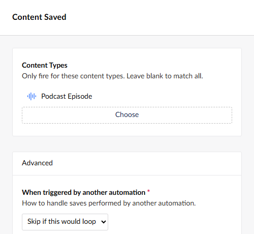

That second setting is Automate's loop guard. Remember the in-flight set from Lecture 3? The agent saves the same episode
once per `save_episode_*` tool, and each save raises Content Saved again. Automate tracks which automation caused an
event, and **Skip if this would loop** stops Podcast Production's own saves from starting Podcast Production again. You'll
see it in Step 13: one **Save and publish**, exactly one Podcast Production run.

> [!WARNING]
> Close every trigger and step panel with its **Save** button. Pressing **Escape** discards the step.

**How to add a step.** Click the small handle at the bottom of a node. A **+** appears; click it to open **Select
Action**. The actions are grouped too: **AI** (Run AI Agent, Transcribe Audio), **Content** (Find Content, Get Content, Get
Content Property, Notify Editor, Publish/Unpublish Content, Update Content Property), **Control Flow** (For Each, If,
Parallel…) and more.

**First action: Get Content.** Add a step below the trigger node and choose **Get Content** (in the **Content** group).
Set:

- **Name:** leave it as **Get Content**. Its alias, **getContent**, shows next to it. Later bindings refer to it.
- **Error Behavior:** leave it on **Terminate**.
- **Content Key:** `${ trigger.contentKey }`
- **Culture:** leave empty. Our episodes are invariant.

Click **Save**.

The trigger only knows the episode's key. Get Content loads its properties, so the next connection can check whether
there's an audio file. It reads the **published** version, which matters when you test.

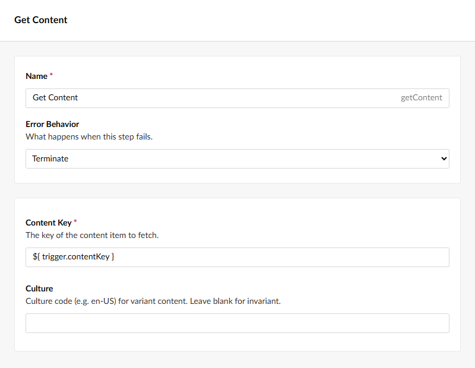

**Second action: Run AI Agent.** Add a step below **Get Content** and choose **Run AI Agent** (in the **AI** group). Set:

- **Agent:** click **+ Add**. The **Select Agent** dialog lists only **Podcast Producer**, because it's the only agent on
  the Automations surface (Step 9). Choose it.
- **Message:** `Produce episode ${ trigger.contentKey }`

Keep the step alias **runAgent**, and click **Save**.

It's the same message `ProcessAgentAsync` sent in Lesson 5, with the key now coming from a binding. The agent still does
all the work through its tools, and it runs as the workspace's service account.

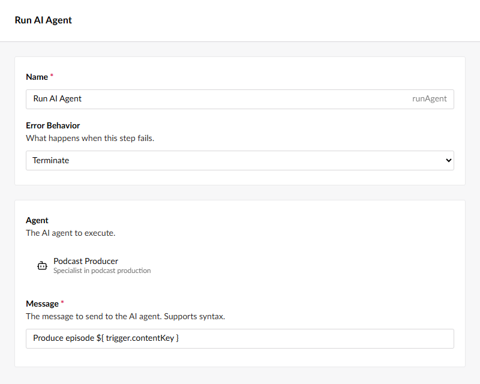

**The edge condition.** Click the dashed line between **Get Content** and **Run AI Agent**. The **Edge Conditions** panel
opens, saying there are no conditions yet. Click **Add condition**, and in **Edit condition** set:

- **Left value:** `${ steps.getContent.properties.audioFile }`
- **Operator:** **is not empty** (the **Right value** field disappears; you don't need it)

Click **Save** in **Edit condition**, then **Save** in **Edge Conditions**.

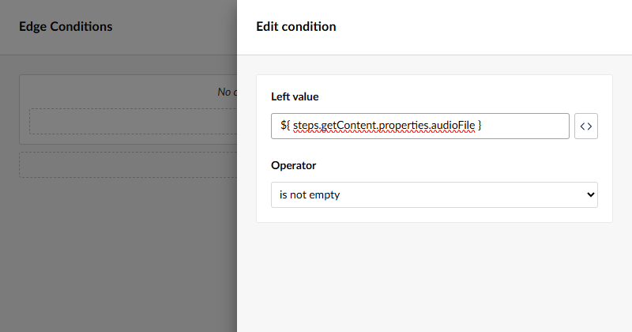

The connection is only followed when the condition is true. An episode without audio stops after Get Content and never
reaches the agent, so you don't burn tokens (remember what an agent run cost in Lesson 5). It's the same audio-file check
our save handler did in code. `steps.getContent` is the step alias, and `audioFile` is the property alias. The other
operators are equals, not equals, contains, not contains, starts with, ends with, greater than, less than, >=, <= and is
empty.

> [!NOTE]
> The canvas doesn't mark a connection that has a condition: it looks just like one without. To check a condition, click
> the line again.

**Publish it.** Click **Save and publish**. Only the published version responds to triggers; a draft never runs.

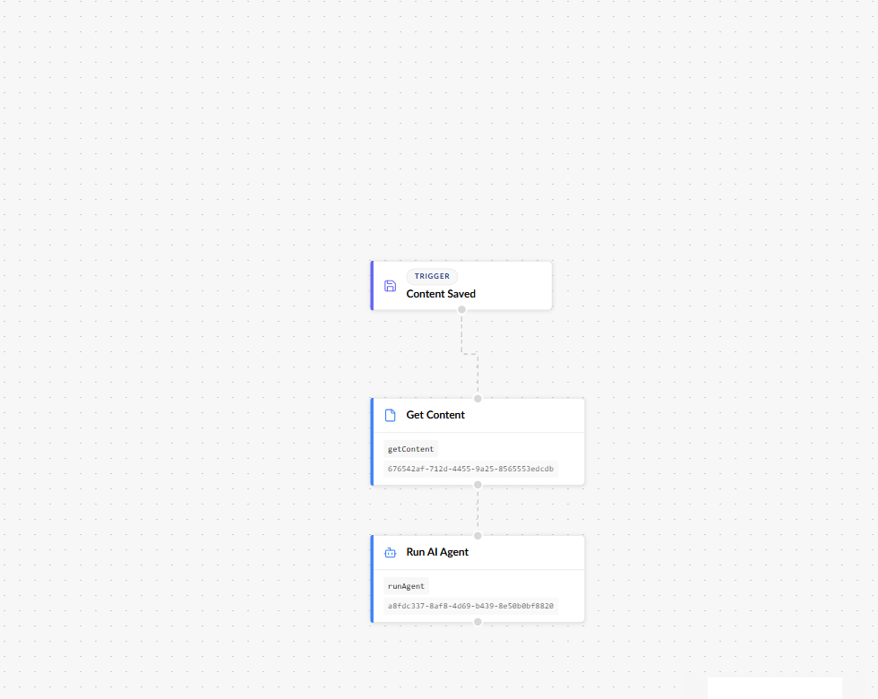

### Step 12: Build the "Podcast Notification" automation

This one replaces the SignalR hub and the toast script, with no code at all.

1. In **Podcasting Workspace**, create another automation (**Create → Automation**) named **Podcast Notification**.
2. Click **+ ADD TRIGGER**. Scroll down to the **Podcast** group, or type `Podcast` in the search box, and choose
   **Podcast Episode Produced**. That's your trigger from Step 5, with the name, description and icon from its
   `[Trigger]` attribute.

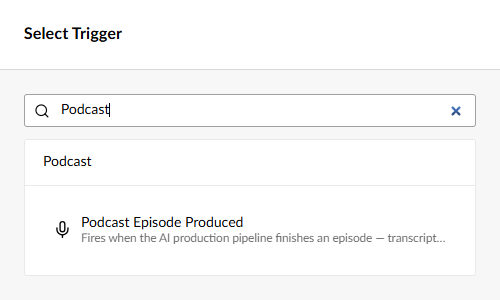

3. The trigger's settings show one toggle, **Only episodes with guests**. That's the `[Field]` from Step 4, turned into UI
   with no frontend code. Leave it off and click **Save**.
4. Add a step below the trigger, choose **Notify Editor** (in the **Content** group), and set:
   - **Content Key:** `${ trigger.episodeKey }`
   - **Title:** `Episode produced`
   - **Message:** `${ trigger.episodeTitle } now has a transcript, summary and show notes.`
   - **Severity:** **Positive**. The options are Default, Positive, Warning and Danger, and they set the toast's colour.

   Click **Save**.
5. Click **Save and publish**.

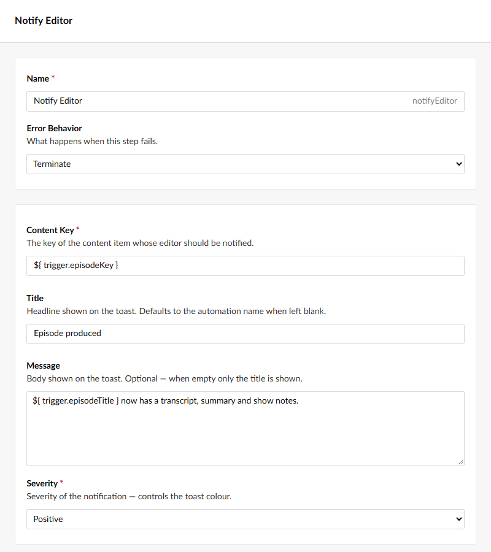

What's happening:

- **Notify Editor** is a built-in action (`umbracoAutomate.notifyEditor`). It sends a realtime toast to any backoffice
  user who currently has that content item open. It ships with Automate, so there's nothing to write.
- The Content Key binding is `${ trigger.episodeKey }`, the camelCase name of `EpisodeKey` on your output model. It isn't
  `trigger.contentKey`: that's Content Saved's output, and our trigger doesn't have it.
- The **Message** is bound too, on purpose, to show off what your custom trigger gives you. `${ trigger.episodeTitle }`
  is the title the agent passed to `publish_episode_report`: the tool published the notification, `MapEvent` copied the
  title into your output model, and Automate made it a binding. Nobody wrote UI for any of it.
- Both text fields are optional. Leave **Title** blank and it defaults to the automation name; leave **Message** blank
  and the toast shows only the title.

> [!TIP]
> Your output model has a third property, `guestCount`. Once it works, try a message such as
> `${ trigger.episodeTitle } is ready with ${ trigger.guestCount } guest(s).`

### Step 13: Test it

1. Go to **Content → Home → Episodes** and open episode 5.
2. Clear the **Summary** and **Show Notes** fields.
3. Click **Save and publish**, not just Save.
4. Stay on the page. Within about 30 seconds, depending on your provider, **one** green toast appears: **Episode produced**, *"Community, AI, and
   the Umbraco Way now has a transcript, summary and show notes."* That's your Notify Editor step, with the episode title
   filled in from your trigger's output.

   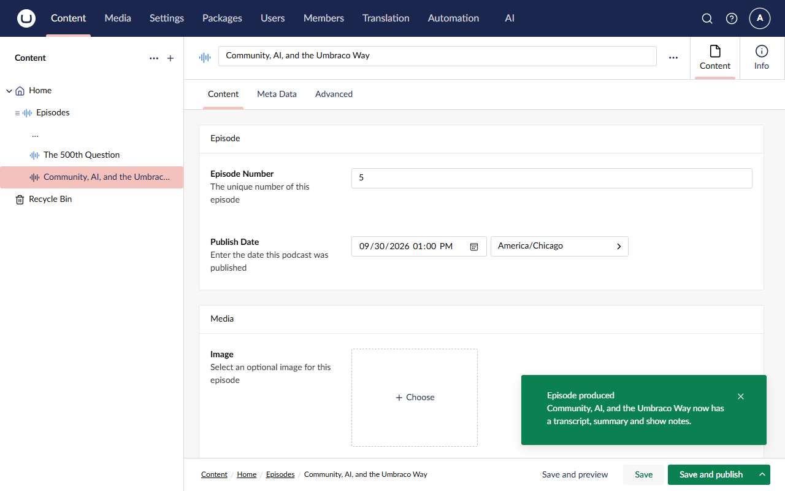

5. Reload the page. The summary and show notes are back.
6. Go to the **Automation** section. Its **Overview** dashboard counts your automations (**2** under **Published**) and
   lists the latest runs under **Recent Activity**: **Podcast Notification** and **Podcast Production**, both
   **Completed**.

   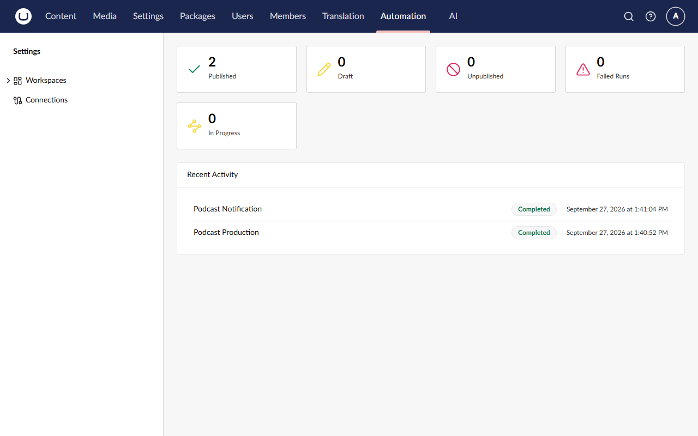

> [!IMPORTANT]
> **Save and publish** matters here. Get Content reads the *published* version of the episode. If you only save, it takes
> its "not found" route (or sees the old published values), and Run AI Agent never runs.

You won't see Lesson 5's "Podcast episode processed" toast any more. Nothing sends it now, so the Notify Editor toast is
the only one.

## ✅ Checkpoint

- ⬜ The **Automation** section shows **Podcasting Workspace** with **Podcast Production** and **Podcast Notification**,
  both published.
- ⬜ **Podcast Producer** has the **Automations** surface.
- ⬜ Saving and publishing episode 5 with an empty summary shows exactly **one** green **Episode produced** toast within
  about 30 seconds, and after a reload the summary and show notes are filled in again.
- ⬜ **Recent Activity** on the Overview (or the **Runs** tab) shows a completed **Podcast Production** run and a
  completed **Podcast Notification** run.
- ⬜ The Podcast Production run's steps, **Get Content** and **Run AI Agent**, are both **Completed**.
- ⬜ There's one Podcast Production run per Save and publish, not one per agent save.

The agent saves its changes as a draft, just as in Lessons 2 to 5. Publish the episode again if you want the website to
show the new summary and show notes.

## 🔍 Under the hood

In Lesson 5, the only record of a run was the AI logs. Now you have a second view: Automate's run history.

**The Overview dashboard.** Besides **Recent Activity**, its cards count your automations (**Published**, **Draft**,
**Unpublished**) and your runs (**Failed Runs**, **In Progress**). The **Runs** tab lists every run, and **Approvals** is
where runs wait for a human (see the Stretch goals).

**The run detail.** Click the **Podcast Production** run. A **Run** panel opens (titled with the start of the run's ID),
with two boxes:

- **Steps:** each step with its duration and status. When we built this workshop, **Get Content** took about 31 ms and **Run AI
  Agent** about 12 seconds, both **Completed**. Expand a step to see when it **Started** and **Completed**, and its
  **Retry Count**.
- **Run Info:** the run's **Status**, **Started** and **Completed** times, **Initiated By** (`system` for this run) and
  the **Automation Version** that ran.

There's also a **Replay** button, which runs it again.

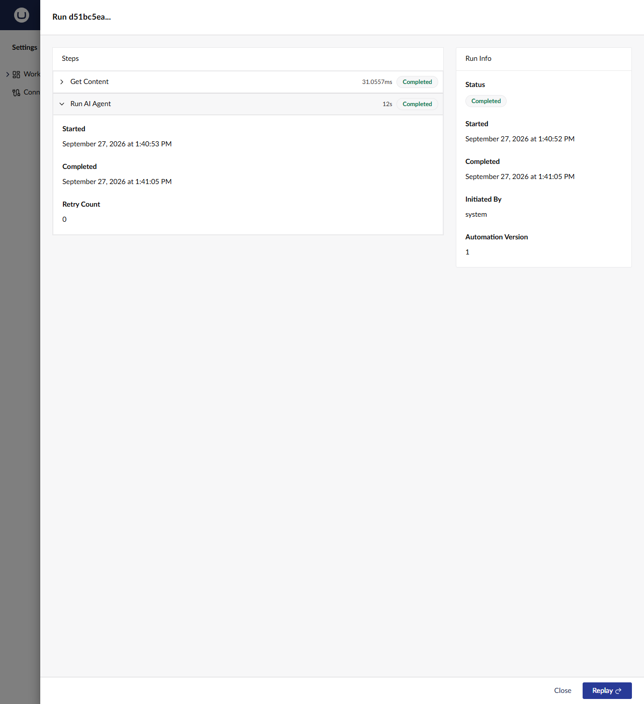

The run view is a record of **timing and status**, not a debugger: it doesn't show the resolved inputs or outputs of each
step. That's still useful. It tells you *whether* each step ran, how long it took, and whether it had to retry. For
*what* the agent did, go to the AI logs (below). Steps can still use each other's outputs while they run, as your edge
condition did with `${ steps.getContent.properties.audioFile }`.

**One run, not three.** The agent saved the episode twice (`save_episode_summary` and `save_episode_show_notes`), and each
save raised Content Saved. Yet Recent Activity shows a single Podcast Production run. Automate knew those saves came from
Podcast Production itself, and **Skip if this would loop** dropped them.

**The server log.** The terminal tells the same story in three lines:

```text
Starting run for automation podcast-production … from trigger umbracoAutomate.contentSaved
Executing AI agent …
Starting run for automation podcast-notification … from trigger theRabbitHole.episodeProduced
```

The last line is your custom trigger at work: `theRabbitHole.episodeProduced` is the alias from your `[Trigger]`
attribute.

**The edge condition at work.** Episodes 1 to 3 have no audio file. Save and publish one of them, and the new Podcast
Production run stops after Get Content. Run AI Agent never runs, and no tokens are spent.

**The AI logs.** Go to **AI → Logs**. The agent's conversation is still all there, as one **Agent** entry: the tool calls,
the skipped transcription and the report. Automate only records that Run AI Agent completed and how long it took; the AI
section sees every turn. The difference is who started it. It's no longer our background service but Automate's Run AI
Agent step, running as the workspace's service account. Open the entry and look at **User**: it now says **Administrator**
(the service account you chose for the workspace), where Lesson 5's runs said **Anonymous**. That's the audit trail
working: every automated AI call is attributable to an identity you control.

## 🧯 Troubleshooting

<details>
<summary><strong>The Agent picker in Run AI Agent is empty</strong></summary>

The **Select Agent** dialog only lists agents on the **Automations** surface. Repeat Step 9, make sure you clicked **Save**
on the agent, then close and reopen the Run AI Agent step.

</details>

<details>
<summary><strong>A step I just added disappeared</strong></summary>

You probably closed its settings panel with **Escape**, which discards the step. Add it again, and close the panel with
its **Save** button.

</details>

<details>
<summary><strong>The run stops after Get Content, or Get Content says "not found"</strong></summary>

Get Content reads the **published** version of the episode, so an item that has only been saved isn't found. It also
sees the last *published* properties, so an audio file you added but haven't published doesn't count.

- Test with **Save and publish**, not Save.
- Check the edge condition's left value is exactly `${ steps.getContent.properties.audioFile }`, and that the Get Content
  step's alias is `getContent`.
- Then clear the summary and show notes and **Save and publish** again.

</details>

<details>
<summary><strong>Runs stay in Pending and never start</strong></summary>

Automate runs steps in the background, and it only does that once Umbraco knows its own application URL. `init` already
sets `Umbraco:CMS:WebRouting:UmbracoApplicationUrl` to `https://localhost:44339` in
`appsettings.Development.json`.

If you run the site on a different port (see [Lesson 0's troubleshooting](lesson-0.md#-troubleshooting)), update that
value to match and restart. The
**Automation Execution Eligibility** health check (**Settings → Health Checks**, group **Umbraco Automate**) tells you
whether this node can run automations.

</details>

<details>
<summary><strong>"Podcast Episode Produced" isn't in the trigger list</strong></summary>

- Check that the class has the `[Trigger(...)]` attribute from Step 5. Without it, Automate doesn't discover the class.
- Stop the site, then run it again so it rebuilds. If that doesn't help, run `dotnet clean` first.
- Hard-refresh the browser (**Ctrl+F5**). The backoffice caches the list of triggers.

</details>

<details>
<summary><strong>The agent runs twice for one save</strong></summary>

- Check Step 7. If `ProcessAsync` still calls `ProcessAgentAsync`, our old queue runs the agent as well as Automate. The
  console log shows `Running podcast-producer agent for episode …` when the old path runs.
- Check you haven't published two copies of Podcast Production.
- Check the trigger's **When triggered by another automation** setting is **Skip if this would loop**.

</details>

<details>
<summary><strong>No Notify Editor toast</strong></summary>

- Is **Podcast Notification** published? Only published automations run.
- Is **Content Key** exactly `${ trigger.episodeKey }`? `${ trigger.contentKey }` resolves to nothing for this trigger.
- Did you stay on episode 5's editor page? The toast only shows to people who have that content item open.
- Did the agent call `publish_episode_report` this time? Check **AI → Logs**. LLMs vary: if it skipped the report, clear
  the summary and show notes and **Save and publish** again.
- Is there a Podcast Notification run at all? If not, look at Podcast Production's run first.

</details>

## 🆘 Stuck?

Jump to the finished state of this lesson. Stop the site first (**Ctrl+C**), then:

```bash
git stash -u
```

```bash
git checkout lesson-6-end
```

```bash
dotnet run --project src/TheRabbitHole.Web
```

The branch includes the code *and* the backoffice configuration for this lesson (it's in the site's database), so you
can carry straight on with the next lesson. Your API key lives in user-secrets, so it comes with you.

## 🚀 Stretch goals

**Put a human in the loop.** In Podcast Production, add **Request Approval** after Run AI Agent, with a **Prompt** such as
`Review the AI's summary and show notes for ${ trigger.contentName }`. From its **Approved** handle, add **Publish
Content** with **Content Key** `${ trigger.contentKey }`. Both actions are built in. *Hint:* the run pauses until someone
approves it on the Automation section's **Approvals** tab. The AI drafts, a person signs off, and Automate publishes.

**Try "Only episodes with guests".** Turn it on in the Podcast Notification trigger, save and publish, and produce an
episode whose report credits no guests. *Hint:* `CanHandle` runs before a run is created, so a filtered-out event leaves
no row in **Runs** at all. Check the `guestNames` the agent passed to `publish_episode_report` in **AI → Logs**.

**Transcribe with zero code.** Umbraco.AI.Automate ships a **Transcribe Audio** action. Set its **Audio source** to
`${ steps.getContent.properties.audioFile }`, then add **Update Content Property** with **Content Key**
`${ trigger.contentKey }`, **Property Alias** `transcript` and **Value** `${ steps.transcribeAudio.text }`. Compare it
with the code you wrote in Lesson 2. When is configuration enough, and when do you want code? *(This one's an experiment:
the action accepts a media key, a media picker value or a file path. Check the step's result in the run to see whether
it understood the upload field.)*

**Write a custom action.** Notify Editor is built in, but you can write your own action the same way you wrote the
trigger: a settings class with `[Field]`, an output class, and a class with an `[Action]` attribute that derives from
`ActionBase<TSettings, TOutput>`. This skeleton for a "Log guest appearance in CRM" action isn't on any branch. It's a
starting point:

```csharp
using Umbraco.Automate.Core.Actions;
using Umbraco.Automate.Core.Settings;

namespace TheRabbitHole.Core.Automate.Actions;

public sealed class LogGuestAppearanceSettings
{
    [Field(Label = "Episode Key", Description = "The episode whose guests should be logged.", SupportsBindings = true)]
    public string EpisodeKey { get; set; } = string.Empty;
}

public sealed class LogGuestAppearanceOutput
{
    public int GuestsLogged { get; init; }
}

[Action("theRabbitHole.logGuestAppearance", "Log Guest Appearance in CRM",
    Description = "Records each credited guest's appearance against their CRM contact.",
    Group = "Podcast", Icon = "icon-users")]
public sealed class LogGuestAppearanceAction(ActionInfrastructure infrastructure)
    : ActionBase<LogGuestAppearanceSettings, LogGuestAppearanceOutput>(infrastructure)
{
    public override Task<ActionResult> ExecuteAsync(ActionContext context, CancellationToken cancellationToken)
    {
        // Bindings such as ${ trigger.episodeKey } are already resolved here.
        var settings = context.GetSettings<LogGuestAppearanceSettings>();
        if (!Guid.TryParse(settings.EpisodeKey, out var episodeKey))
        {
            return Task.FromResult(ActionResult.Failed(
                new ArgumentException("A valid Episode Key is required."), StepRunErrorCategory.Validation));
        }

        // TODO: read the episode's guest emails, look them up with HubSpotGuestClient and log the appearance.
        return Task.FromResult(Success(new LogGuestAppearanceOutput { GuestsLogged = 0 }));
    }
}
```

*Hint:* return `Failed(..., StepRunErrorCategory.Validation)` for bad configuration so Automate doesn't retry pointlessly,
and let network errors throw so the step's retry settings apply. Restart, and the action appears under **Podcast** in the
**Select Action** picker. Add it to Podcast Notification with **Episode Key** `${ trigger.episodeKey }`.
